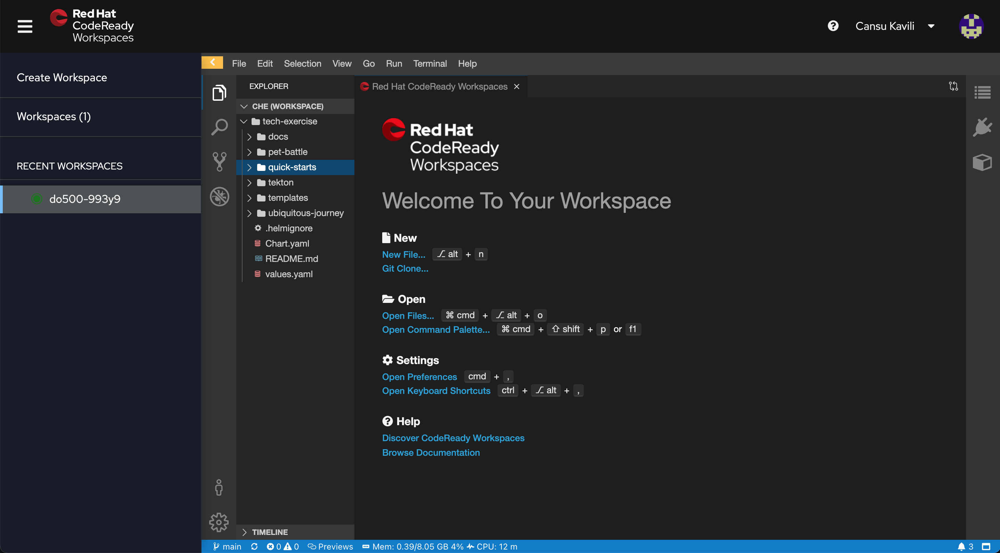
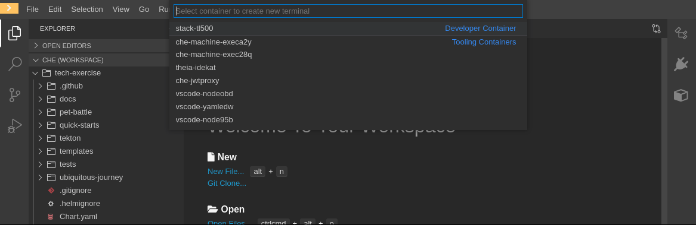
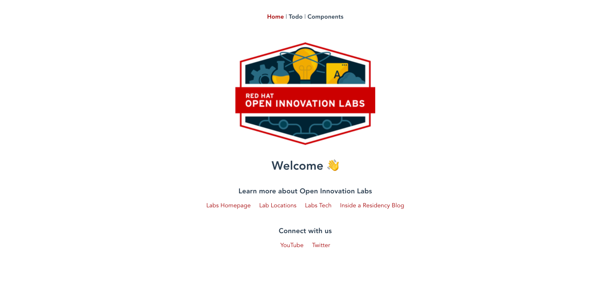

## 🐌 基本 - CRW、OCP、Helm

## CodeReady Workspaces のセットアップ

1. CodeReadyWorkspace (CRW) エディターにログインします。これへのリンクは、インストラクターによって提供されます。

    

     <p class="warn">ワークスペースが設定されていない場合は、この devfile から作成できます。 CodeReady ワークスペースでは、"Create Workspace &gt; Custom Workspace" を選択します。 OpenShift 4.9、4.10 の場合 - 次の URL を入力して TL500 スタックをロードします。<span style="color:blue;"></span><a id="crw_dev_filelocation" href=""></a> DevSpaces ワークスペースでは、"Add Workspace &gt; Import from Git"を実行します。 OpenShift 4.11+ の場合 - 次の URL を入力して TL500 スタックをロードします。<span style="color:blue;"></span><a id="crw_dev_filelocation_4.11" href=""></a></p>
    

2. IDE で (開くのに時間がかかる場合があります ... ⏰☕️)、メニューから`Terminal > Open Terminal in Specific Container > stack-tl500`をクリックして、新しいターミナルを開きます。

    

3. stack-tl500 コンテナーの気の利いたデフォルト シェルは、swish と韻を踏む`zsh`であることに注意してください。また、きちんとしたショートカットとプラグインもあります - さらに、すべてのクールな子供たちがそれを使用しています 😎! `bash`に切り替えたい場合に備えて`~/.zshrc`と`~/.bashrc`の両方で環境変数を設定します。

4. 以下のコマンドを実行して、CodeReadyWorkspace の環境で`TEAM_NAME`名をセットアップします。演習全体で`TEAM_NAME`変数を使用するため、セッションに保存すると、演習全体でこの変数の変更が少なくなります 💪. <strong data-md-type="double_emphasis">`TEAM_NAME`が小文字の英数字または「-」のみで構成されていることを確認し、英数字で開始および終了する必要があります (例: 「my-name」または「123-abc.」)。</strong>

    ```bash#test
    echo export TEAM_NAME="<TEAM_NAME>" | tee -a ~/.bashrc -a ~/.zshrc
    ```

5. `CLUSTER_DOMAIN`を環境に追加します。

    ```bash#test
    echo export CLUSTER_DOMAIN="<CLUSTER_DOMAIN>" | tee -a ~/.bashrc -a ~/.zshrc
    ```

6. `GIT_SERVER`環境に追加します。

    ```bash#test
    echo export GIT_SERVER="<GIT_SERVER>" | tee -a ~/.bashrc -a ~/.zshrc
    ```

7. 設定した変数を確認します。

    ```zsh#test
    source ~/.zshrc
    echo ${TEAM_NAME}
    echo ${CLUSTER_DOMAIN}
    echo ${GIT_SERVER}
    ```

8. OpenShift に接続できるかどうかを確認します。以下のコマンドを実行します。

     <p class="tip">⛷️<b>ヒント</b>⛷️ - Enter キーを押す前に、チームのログイン情報と一致するようにユーザー名とパスワードを変更してください。パスワードに特殊文字が含まれている場合は、一重引用符で囲みます。例: <strong>'A8y?Rpm!9+A3B/KG'</strong></p>

    ```bash
    oc login --server=https://api.${CLUSTER_DOMAIN##apps.}:6443 -u <USER_NAME> -p <PASSWORD>
    ```

9. チームの`ci-cd`プロジェクトを作成して、OpenShift でのユーザー権限を確認します。

    ```bash#test
    oc new-project ${TEAM_NAME}-ci-cd || true
    ```

    

     <p class="warn">⛷️<b>注</b>⛷️ - チームとして作業していて、同じ TEAM_NAME を使用している場合、このプロジェクトが既に存在するというメッセージが表示される場合があります。チーム メイトの 1 人がすでにこのプロジェクトを作成しているはずです。問題ありません！</p>
    

### Helm 入門

> Helm は Kubernetes のパッケージ マネージャーです。アプリケーションを定義する Kubernetes YAML のテンプレートを作成する方法を提供します。 `DeploymentConfig` 、 `Route` &amp; `Service`などの Kubernetes リソースは、テンプレートに`values`指定することで処理できます。 Helm ランドでは、これを行う方法がいくつかあります。テンプレートとそのデフォルト値を含むパッケージは`chart`と呼ばれます。

Helm を使用して簡単なアプリケーションをデプロイしてみましょう。

1. Helm チャートはパッケージ化され、リポジトリに保存されます。これらは、他のチャートの依存関係として追加するか、直接使用できます。チャート リポジトリを追加しましょう。チャート リポジトリには、チャートのバージョン履歴とパッケージ化された tar ファイルが保存されます。

    ```bash#test
    helm repo add tl500 https://rht-labs.com/todolist/
    ```

2. このリポジトリからチャートをインストールしましょう。まずリポジトリを検索して、利用可能なものを確認します。

    ```bash#test
    helm search repo todolist
    ```

    ここで最新バージョンをインストールします。 Helm は各インストールにリリースを与えるのが好きです。便宜上、私たちのものを`my`に設定しました。これにより、作成されるすべてのリソースに`my-`のプレフィックスが追加されます。

    ```bash#test
    helm install my tl500/todolist --namespace ${TEAM_NAME}-ci-cd || true
    ```

3. ブラウザでアプリケーションを開き、アプリケーションが稼働中であることを確認します。これは、アプリのアドレスを取得するための便利なワンライナーです。

    ```bash#test
    echo https://$(oc get route/my-todolist -n ${TEAM_NAME}-ci-cd --template='{{.spec.host}}')
    ```

    

4. コマンドラインからチャートのデフォルト<span style="color:blue;"><a href="https://github.com/rht-labs/todolist/blob/master/chart/values.yaml">値</a></span>を上書きできます。これを示すために、デプロイをアップグレードしてみましょう。値を簡単に変更して、アプリをスケールアップします。デフォルトでは、レプリカ(アプリケーションのプロセス数)は 1 つだけです。

    ```bash#test
    oc get pods -n ${TEAM_NAME}-ci-cd
    ```

    デフォルトでは、アプリケーションのレプリカは 1 つだけです。 helm を使用してこれを 5 に設定しましょう。

    ```bash#test
    helm upgrade my tl500/todolist --set replicas=5 --namespace ${TEAM_NAME}-ci-cd
    ```

    デプロイが 5 つのレプリカにスケールアップされたことを確認します。

    ```bash#test
    oc get pods -n ${TEAM_NAME}-ci-cd
    ```

5. #amazing-todolist-app で遊び終わったら、チャートを削除して作業を整理しましょう。これを行うには、helm uninstall を実行してチャートのリリースを削除します。

    ```bash#test
    helm uninstall my --namespace ${TEAM_NAME}-ci-cd
    ```

    クリーンアップを確認します。

    ```bash#test
    oc get pods -n ${TEAM_NAME}-ci-cd | grep todolist
    ```

6. 本当に興味のある方のために、これは Helm チャートの構造です。 <span style="color:blue;"><a href="https://github.com/rht-labs/todolist">ここで見つける</a></span>ことができますが、基本的な構造は次のとおりです。

     <div class="highlight" style="background: #f7f7f7">
     <pre><code class="language-bash">
        todolist/chart
        ├── Chart.yaml
        ├── templates
        │   ├── _helpers.tpl
        │   ├── deploymentconfig.yaml
        │   ├── route.yaml
        │   └── service.yaml
        └── values.yaml
        </code></pre>
    </div>


    以下が説明になります。

    - `Chart.yaml` - チャートのマニフェストです。チャートの名前、バージョン、および依存関係を定義します。
    - `values.yaml` - グラフが機能するための適切なデフォルトであり、テンプレートに渡される変数が含まれています。コマンドラインでこれらの値を上書きできます。
    - `templates/*.yaml` - これらは k8s リソースです。
    - `_helpers.tpl` - 再利用可能な変数のコレクションであり、すべての k8s リソースに均一に適用される yaml スニペットです。たとえば、ラベルはここで定義され、必要に応じて各 k8s リソース ファイルに含まれます。

🪄🪄 さて、さらにエキサイティングなツールを続けましょう... !🪄🪄
