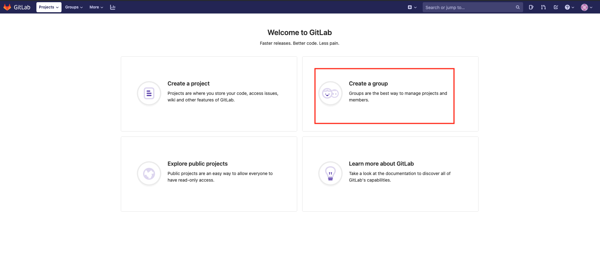
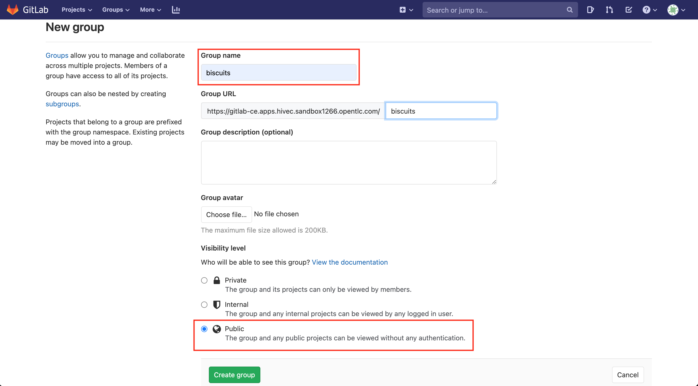
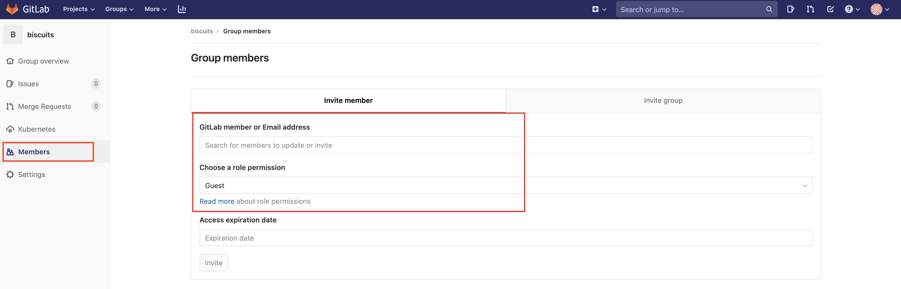
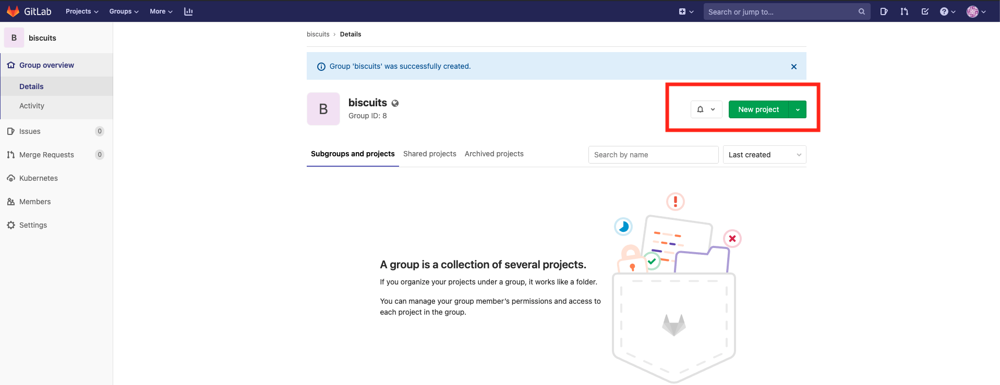
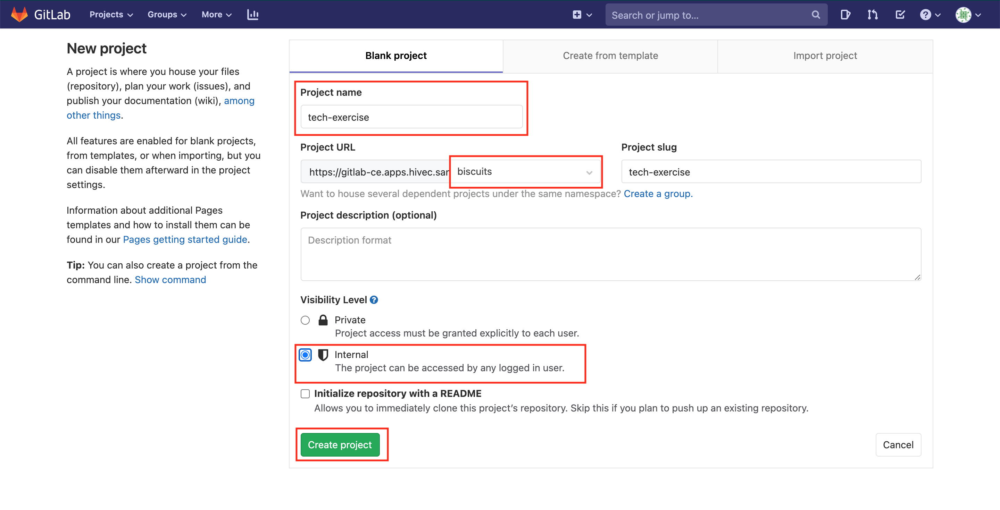
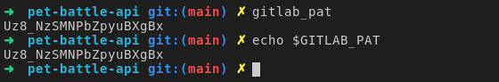
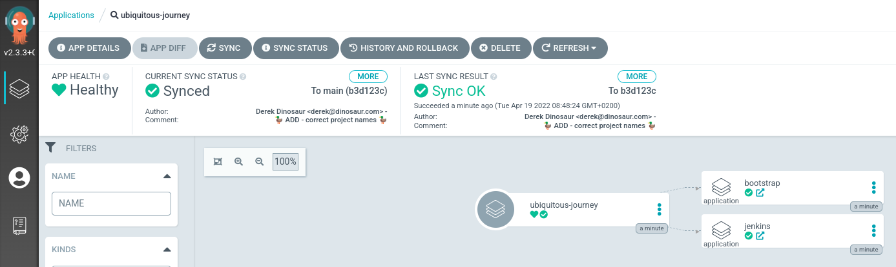

## 🔥🦄ユビキタスジャーニー

Red Hat Open Innovation Labs では、セットアップとオンボーディングを加速するために、Labs Residency CICD ツールのブートストラップを自動化しました。コード リポジトリは**ユビキタス ジャーニー(Ubiquitous Journey )**(🔥🦄) と呼ばれます。ここでユビキタス ジャーニーのライト バージョンを作成しました。このリポジトリを探索し、それを使用して技術基盤をセットアップします。

このリポジトリは、Red Hat Labs GitHub 組織 ( <span style="color:blue;">https://github.com/rht-labs/ubiquitous-journey</span> ) で入手できます。Ubiquitous Journey を使用すると、開発者にとって使いやすい方法ですべての要素をまとめることができます。

- **拡張可能**- 私たちのコードベースは、新しいツールや方法論をサポートするために進化させ、簡単に拡張できるコードの*ツール ボックス*です。
- **追跡可能**- 変更がどこで発生したかを簡単に確認でき、最も重要なのは、どの環境でどの git タグ/コミットが行われているかを正確に追跡できることです。
- **発見可能**- ソース コードを簡単に追跡できるようにし、サポートおよびインライン ドキュメントを使用することで、新しいチーム メンバーは、アプリケーションがどのように構築、テスト、展開されているかを簡単に発見できます。
- **監査可能**- Git のログと履歴は、ソフトウェアを構築するための唯一の信頼できる情報源です。コンプライアンス レポートを作成し、ツールセットを簡単に拡張して、必要に応じてすべてのパイプライン ステップのコード署名や証明書などのより高度な手法をサポートできます。
- **再利用可能**- CICD の多くの部分は再利用可能です。良い例は、再利用可能なパイプラインとタスクです。コードだけでなく、ビルド ワンス、タグ付け、ライフサイクルを通じたコードのプロモートなどの堅実な基本プラクティスを成文化することができます。
- **柔軟性**- 製品チームは、多くの場合、標準ツールの両方を使用し、新しいツールを試してみたいと考えています。*ツール ボックスの*考え方は非常に役立ちます。そのため、チームとして使い慣れたツールを使用して作業できます。 Jenkins と Tekton でこれを実際に見ていきます。

これらの特性はすべて、必要なときにいつでも高品質のコードをビルドして複数の環境にリリースできるという 1 つの結果につながります。

### GitLab を GitOps 用に準備する

> この演習では、コードと構成を保存するように git プロジェクトをセットアップします。次に、ArgoCD (gitOps コントローラー) をこの git リポジトリに接続して、GitOps ワークフローを有効にします。ツールはチームのメンバー全員で共有されるので、この演習はモブプログラミングとして行ってください!

1. 資格情報を使用して GitLab にログインします。 GitLab の URL:

    ```bash
    https://<GIT_SERVER>
    ```

    &lt;TEAM_NAME&gt; として GitLab にグループを作成する必要があります。画面のCreate a groupをクリックします。 

2. TEAM_NAME ( `<TEAM_NAME>` ) をグループ名として入力し、Visibility levelで**Public**を選択して、Create group をクリックします。これは、コードを簡単に共有し、他のチームのアクティビティを表示できるようにするためです。

3. チームとして作業している場合は、チーム メンバーをこのグループに追加する必要があります。これにより、このグループで作成されたプロジェクトで作業する権限が付与されます。左側のパネルから Memberを選択し、Invite member オプションからチーム メンバーを招待します。 MaintainerまたはOwnerロールのアクセス許可を必ず選択してください。チームで作業していない場合は、この手順を無視できます。 

4. 次に、 <span style="color:purple;">GIT</span> Ops の目的で使用する git リポジトリを作成しましょう。 `tech-exercise`ツール構成とアプリケーション定義およびその他のものの両方を保持する単独のリポジトリとして機能します。現実の世界では、これらを別々のリポジトリに分けたいと思うかもしれません!とにかく、右側の`New project`ボタンを押します

5. 新しいビューで、 `tech-exercise` Project Name として使用し、Visibility level で**Internal**を選択して、Create project をクリックします。プロジェクトがユーザー名ではなく、以前に作成したグループにあることを確認してください。

6. Gitlab Personal Access Token (PAT) を作成します。トークンは、後でスクリプトから Gitlab にアクセスするためのより安全で信頼性の高い方法です。参考までに、Gitlab Web UI の User &gt; Settings &gt; Access Tokens で PAT を生成することもできます。ここではヘルパー スクリプトを使用して、そのプロセスを自動化します。トークンを生成するには、ターミナルを開いていない場合は開き、次のコマンドを実行します。

    Gitlab ユーザー名をエクスポートします。

    ```bash
    export GITLAB_USER=<YOUR_GITLAB_USER>
    ```

    Gitlab パスワードをエクスポートします。

    ```bash
    export GITLAB_PASSWORD=<YOUR_GITLAB_PASSWORD>
    ```

    <p class="tip">⛷️<b>ヒント</b>⛷️ - パスワードに特殊文字が含まれている場合は、一重引用符で囲みます。例: <strong>'A8y?Rpm!9+A3B/KG'</strong></p>

    Gitlab PAT を生成します。

    ```bash
    gitlab_pat
    ```

    `GITLAB_PAT`環境変数を出力します。

    ```bash
    echo $GITLAB_PAT
    ```

    コマンド ラインに出力された PAT を確認できます。これは、 `GITLAB_PAT`という環境変数にも格納されています。

    

7. コードを GitLab サーバーにプッシュしましょう。ターミナルから CodeReady ワークスペースに戻ります

    ```bash#test
    cd /projects/tech-exercise
    git remote set-url origin https://${GIT_SERVER}/${TEAM_NAME}/tech-exercise.git
    ```

    パスワードの入力を求められたら、上記の`GITLAB_PAT`を使用します (これはキャッシュされます)。

    ```bash#test
    cd /projects/tech-exercise
    git add .
    git commit -am "🐙 ADD - argocd values file 🐙"
    git push -u origin --all
    ```

    Git プロジェクトを作成し、構成をプッシュしたので、GitOps の旅を始めましょう 🧙‍♀️🦄!

     <p class="tip">⛷️<b>ヒント</b>⛷️ - 資格情報が正しくキャッシュされていない場合は、次を使用してキャッシュをクリアしてみてください: <strong>git credential-cache exit</strong></p>
    

### ユビキタスジャーニーのデプロイ🔥🦄

> この演習では、繰り返し可能なパターンである GitOps を使用して、最初のnamespaceとツールを作成します。

1. ユビキタス ジャーニー (🔥🦄) は、ArgoCD で App of Apps を作成するための非常にきちんとしたパターンが組み込まれた別の Helm チャートです。早速始めましょう - IDE で、プロジェクトのルートにある`values.yaml`ファイルを開きます。作成したばかりの git リポジトリとチーム名を参照するように更新します。この値ファイルはチャートのデフォルト ファイルであり、作成するこのチャートのすべてのインスタンスに適用されます。チャートのテンプレートは、以前に使用したチャート ( `services` 、 `deployments` &amp; `routes` ) とは異なりますが、前の演習で ArgoCD の UI にアプリをデプロイしたときに手動で作成したものと同じように、ArgoCD アプリケーション定義です。

    ```yaml
    source: "https://<GIT_SERVER>/<TEAM_NAME>/tech-exercise.git"
    team: <TEAM_NAME>
    ```

    非常に面倒な場合は、このコードを実行して置換を行うこともできます。

    ```bash#test
    yq eval -i '.team=env(TEAM_NAME)' /projects/tech-exercise/values.yaml
    yq eval ".source = \"https://$GIT_SERVER/$TEAM_NAME/tech-exercise.git\"" -i /projects/tech-exercise/values.yaml
    ```

2. `values.yaml`ファイルは`ubiquitous-journey/values-tooling.yaml`を参照します。ここには、CI/CD パイプラインに必要なすべての定義が格納されています。 Jenkins、Nexus、Sonar などの定義は最終的にすべてここに格納されますが、2 つのオブジェクトから始めましょう。 1 つは、いくつかのnamespaceとアクセス許可を使用してクラスターをブートストラップするためのものです。もう 1 つは、Jenkins をデプロイすることです。ブートストラップ セクションで`\<TEAM_NAME\>`を次のように変更して、 `ubiquitous-journey/values-tooling.yaml`を更新します。

    ```bash
            - name: jenkins
              kind: ServiceAccount
              role: admin
              namespace: <TEAM_NAME>-ci-cd
          namespaces:
            - name: <TEAM_NAME>-ci-cd
              bindings: *binds
              operatorgroup: true
            - name: <TEAM_NAME>-dev
              bindings: *binds
              operatorgroup: true
            - name: <TEAM_NAME>-test
              bindings: *binds
              operatorgroup: true
            - name: <TEAM_NAME>-stage
              bindings: *binds
              operatorgroup: true
    ```

    非常に面倒な場合は、このコードを実行して置換を行うこともできます。

    ```bash#test
    sed -i "s|TEAM_NAME|$TEAM_NAME|" /projects/tech-exercise/ubiquitous-journey/values-tooling.yaml
    ```

3. これが GITOPS です。つまり、変更に影響を与えるには、コミットする必要があります。 ArgoCDに変更を同期するように指示する前に、構成をgitに取得しましょう。

    ```bash#test
    cd /projects/tech-exercise/
    git add .
    git commit -m  "🦆 ADD - correct project names 🦆"
    git push
    ```

  <p class="warn">⛷️<b>注</b>⛷️ - ブートストラップ ステップは、必要なロール バインディングも提供します。つまり、同じチーム内の他のユーザーが<b></b>{team_name2}{/team_name2}環境にアクセスできるようになりました</p>


1. ArgoCD が git リポジトリからの変更を同期するためには、git リポジトリへのアクセスを提供する必要があります。シークレットをクラスターにデプロイします。今は*コードとして実行しません*が、次のラボではシークレットをコードとして追加し、暗号化して Git に保存します。

    Secret をクラスターに追加します。

    ```bash#test
    cat <<EOF | oc apply -n ${TEAM_NAME}-ci-cd -f -
      apiVersion: v1
      data:
        password: "$(echo -n ${GITLAB_PAT} | base64 -w0)"
        username: "$(echo -n ${GITLAB_USER} | base64 -w0)"
      kind: Secret
      type: kubernetes.io/basic-auth
      metadata:
        annotations:
          tekton.dev/git-0: https://${GIT_SERVER}
          sealedsecrets.bitnami.com/managed: "true"
        labels:
          credential.sync.jenkins.openshift.io: "true"
        name: git-auth
    EOF
    ```

2. ユビキタス ジャーニーにツールをインストールします (この段階ではブートストラップと Jenkins のみ..)。コマンドが実行されたら、ArgoCD UI を開いて、作成中のリソースを表示します。最初の AppOfApps をデプロイしました。

    ```bash#test
    cd /projects/tech-exercise
    helm upgrade --install uj --namespace ${TEAM_NAME}-ci-cd .
    ```

    

3. ArgoCD 同期のリソースとして、クラスターでそれらを確認できます。

    ```bash#test
    oc get projects | grep ${TEAM_NAME}
    ```

    ```bash#test
    oc get pods -n ${TEAM_NAME}-ci-cd
    ```

🪄🪄素晴らしい！これで、(git を介して) 反復可能で監査可能な方法でツールとプロジェクトを足場にするアプリのアプリをデプロイしました。次に、ツールを追加してユビキタス ジャーニーを拡張します 🪄🪄
