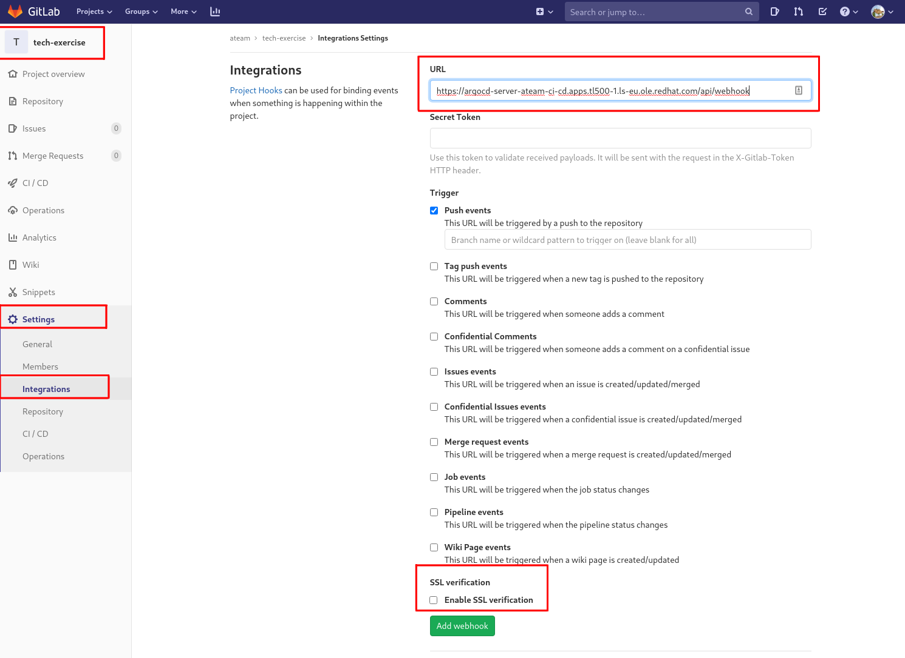
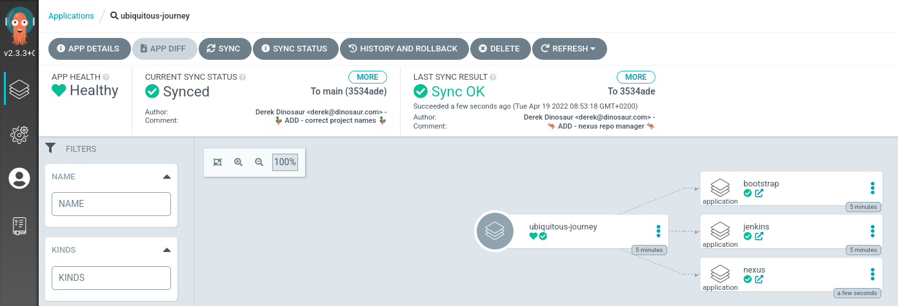
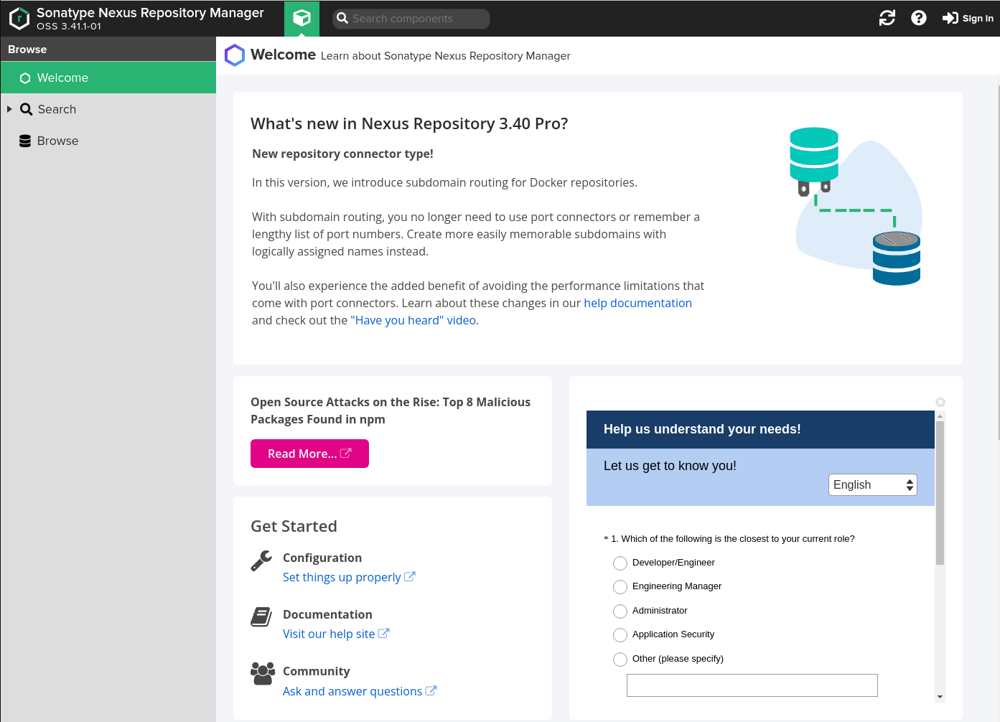

## UJをNexusなどの別のツールで拡張する

これで、プロジェクト、必要なロールバインディング、および Jenkins が稼働してました。さらに、アーティファクトを管理および保存するためのリポジトリも必要です。Nexusが助けに来ました！ Nexus helm チャートを使用してデプロイできます。これは GitOps なので、UJ を拡張するだけです。それが Git にない場合、それは実在しないからです! ;)

<p class="warn">⛷️<b>注</b>⛷️ - 別の CodeReady Workspaces 環境に切り替える場合は、先に進む前に以下のコマンドを実行してください。</p>

```bash
cd /projects/tech-exercise
git remote set-url origin https://<GIT_SERVER>/<TEAM_NAME>/tech-exercise.git
git pull
```

### GitLab から ArgoCD Webhook を追加する

> ArgoCD のサイクル タイムは約 3 分です。これは私たちには遅すぎるため、git リポジトリにヒットしたらすぐに変更を ArgoCD に同期させることができます。

1. ArgoCD を`ubiquitous-journey`プロジェクトに接続するための Webhook を追加しましょう。次のように ArgoCD の URL を取得します。

    ```bash#test
    echo https://$(oc get route argocd-server --template='{{ .spec.host }}'/api/webhook  -n ${TEAM_NAME}-ci-cd)
    ```

2. GitLab の`tech-exercise` git リポジトリに移動します。左側のパネルから`Settings > Integrations`に移動し、端末からコピーしたばかりの URL を追加して、WebHook を有効にします。これで、Git で変更が行われるたびに、ArgoCD は即座に調整 (reconcile) を行い、クラスターの現在の状態と git の目的の状態の違いを適用します🪄。 `Add webhook`をクリックします。

    

### ツールボックスに Nexus を追加

> この演習では、Sonatype の Nexus リポジトリ マネージャーをツールに追加します。このツールは、アプリケーション バイナリと Helm チャートをホストするために使用されます。

1. `ubiquitous-journey/values-tooling.yaml`を更新して、Nexusを適切なデフォルト値で取り込むようにします。この例では、ArgoCD 構成をヘルム チャートに向けているだけです。 `# Nexus`プレースホルダーの下のファイルに以下を追加します。

    ```yaml
      # Nexus
      - name: nexus
        enabled: true
        source: https://redhat-cop.github.io/helm-charts
        chart_name: sonatype-nexus
        source_ref: "1.1.10"
        values:
          includeRHRepositories: false
          service:
            name: nexus
    ```

    非常に面倒な場合は、このコードを実行して置換を行うこともできます。

    ```bash#test
    if [[ $(yq e '.applications[] | select(.name=="nexus") | length' /projects/tech-exercise/ubiquitous-journey/values-tooling.yaml) < 1 ]]; then
        yq e '.applications += {"name": "nexus","enabled": true,"source": "https://redhat-cop.github.io/helm-charts","chart_name": "sonatype-nexus","source_ref": "1.1.10","values":{"includeRHRepositories": false,"service": {"name": "nexus"}}}' -i /projects/tech-exercise/ubiquitous-journey/values-tooling.yaml
    fi
    ```

2. ArgoCD によって自動的にロールアウトされるように、変更を git リポジトリにプッシュします。

    ```bash#test
    cd /projects/tech-exercise
    git add .
    git commit -m  "🦘 ADD - nexus repo manager 🦘"
    git push
    ```

3. ArgoCD は`ubiquitous-journey/values-tooling.yaml`の変更を検出し、クラスタ内の git にあるものと一致させるために Nexus をデプロイします。 ArgoCD UI でも見ることができます。

4. Webhook が配置されていれば、利用可能になるまでに数秒しかかかりません。ただし、Nexus の URL を新しいタブで開くと、すべてが機能していることを確認できます (admin / admin123 がデフォルトの資格情報です)。

    ```bash#test
    echo https://$(oc get route nexus --template='{{ .spec.host }}' -n ${TEAM_NAME}-ci-cd)
    ```

    
