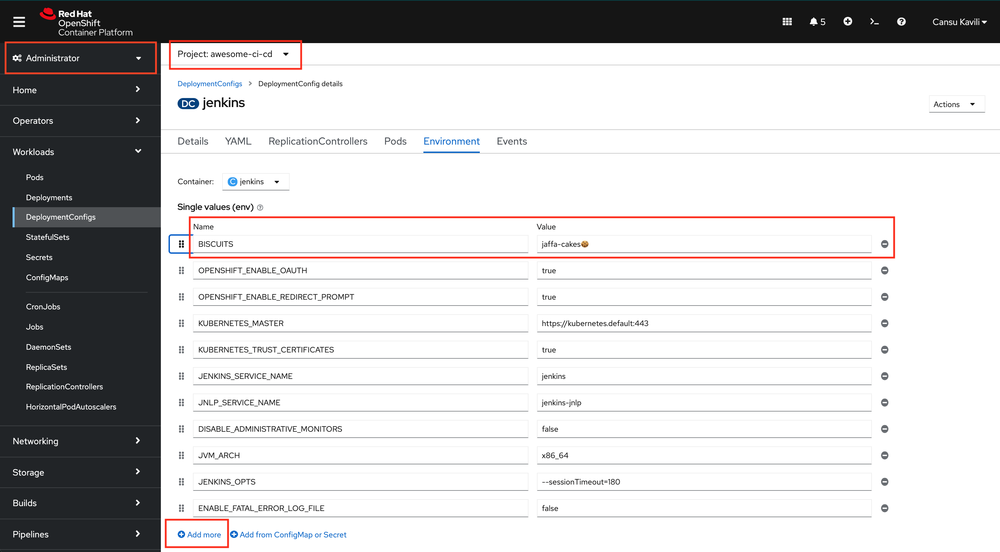

## GitOps を検証する

> GitOps は、Git を介してすべてのシステム、環境、およびアプリケーションを管理する単純なプロセスです。 Git は、すべてのアプリケーション、ツール、さらにはクラスター構成の信頼できる唯一の情報源です。これらの変更は、自動化されたプロセスが適用される前に、プルリクエストとして議論することができます。試してみましょう - この演習では、OpenShift UI を手動で変更し、上書きします - 行け行け！ GITOPS 💪

<p class="warn">⛷️<b>注</b>⛷️ - 別の CodeReady Workspaces 環境に切り替える場合は、先に進む前に以下のコマンドを実行してください。</p>

```bash
cd /projects/tech-exercise
git remote set-url origin https://${GIT_SERVER}/${TEAM_NAME}/tech-exercise.git
git pull
```

1. OpenShift UI で、 `<TEAM_NAME>-ci-cd`プロジェクトに移動します。 `Workloads > DeploymentConfigs > jenkins`に移動します。

2. `Environment`タブで、新しい変数を追加します。たとえば、 `➕ Add more`をクリックし、テキスト ボックスに何か新しいものやランダムなものを入力します。たとえば、名前が`BISCUITS`で、値が`jaffa-cakes`などです。保存を押してください！

*注: 開発者ビューの場合は、左上から管理者ビューに切り替えることができます*

数秒待てば (私のように怠け者なら、ページを更新することもできます)、*BISCUITS変数はどこへ行った*!?!😱😱😱

そうです、ArgoCD が git で構成を取得し、それを上に適用して上書きしたのです。 `BISCUITS` 変数は git に **ない** ため、削除されました。変数を永続化したい場合は、もちろんそれを git リポジトリに追加できます!

1. `ubiquitous-journey/values-tooling.yaml`ファイルを開き、以下に示すように、新しい環境変数を Jenkins 定義の`values`プロパティに追加します。

    ```yaml
              - name: BISCUITS
                value: 'jaffa-cakes🍪'
    ```

    `ubiquitous-journey/values-tooling.yaml`では、次のようになります。

     <div class="highlight" style="background: #f7f7f7">
     <pre><code class="language-yaml">
        # more yaml ...
              deployment:
                env_vars:
                  - name: GITLAB_DEFAULT_BRANCH
                    value: 'main'
                  - name: GITLAB_HOST
                    value: ''
                  - name: GITLAB_GROUP_NAME
                    value: ''
                  - name: BISCUITS
                    value: 'jaffa-cakes🍪'
        # more yaml ...
        </code></pre>
    </div>

    非常に面倒な場合は、このコードを実行して置換を行うこともできます。

    ```bash#test
    if [[ $(yq e '.applications.[].values.deployment.env_vars[] | select(.name=="BISCUITS") | length' /projects/tech-exercise/ubiquitous-journey/values-tooling.yaml) < 1 ]]; then
        yq e '.applications.[1].values.deployment.env_vars += {"name": "BISCUITS", "value": "jaffa-cakes"}' -i /projects/tech-exercise/ubiquitous-journey/values-tooling.yaml
    fi
    ```

2. その変更を Git コミットし、ArgoCD UI を開いて、新しい変数が同期されていることを確認します。

    ```bash#test
    cd /projects/tech-exercise
    git add .
    git commit -m  "🍪 ADD - Jenkins environment variable 🍪"
    git push
    ```

    

3. OpenShift では、変数が永続化されていることがわかります。 


🪄🪄 GitOps がいかに強力で優れているかを体験できました!アプリケーション開発でそれをどのように利用するか見ていきましょう! 🪄🪄
