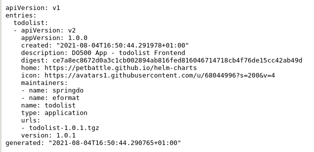

## ドラゴンが来た！


### 拡張🔥🦄

- $SOMETHING を redhat-cop/helm-charts リポジトリから UJ に追加します。

### Helmの詳細

<a>基本</a>演習の`helm repo add`および<code>helm install</code>コマンドには、ちょっとした魔法が隠されています。ホストされた helm リポジトリには、パッケージ化されたチャートと`index.yaml`ファイルが保持されます。

私たちがデプロイする`todolist`アプリケーションについては、<span style="color:blue;"><a href="https://rht-labs.com/todolist/index.yaml">ここ</a></span>を参照してファイルを確認できます。<span></span>



これには、helm リポジトリに含まれるバージョンと詳細が一覧表示されます。そのため、 `helm repo add`と、リポジトリの URL がオペレーティング システムに依存する構成ファイルに追加されます。これは`man helm`から:

```bash
| Operating System | Cache Path                | Configuration Path             | Data Path               |
|------------------|---------------------------|--------------------------------|-------------------------|
| Linux            | $HOME/.cache/helm         | $HOME/.config/helm             | $HOME/.local/share/helm |
| macOS            | $HOME/Library/Caches/helm | $HOME/Library/Preferences/helm | $HOME/Library/helm      |
| Windows          | %TEMP%\helm               | %APPDATA%\helm                 | %APPDATA%\helm          |
```

OpenShift では、WebUI に入力する`HelmChartRepository`オブジェクトを作成できます。詳細については<span style="color:blue;"><a href="https://docs.openshift.com/container-platform/4.9/applications/working_with_helm_charts/configuring-custom-helm-chart-repositories.html">、こちらを</a></span>参照してください。

helm チャートを名前空間にインストールすると、helm コマンド ラインは実際に完全なチャートをアップロードし、OpenShift クラスターの Helm コントローラーが操作できるシークレットに格納します。

<div class="highlight" style="background: #f7f7f7">
<pre><code class="language-bash">
$ oc get secrets -l owner=helm
NAME                           TYPE                 DATA   AGE
sh.helm.release.v1.argocd.v1   helm.sh/release.v1   1      3d
sh.helm.release.v1.argocd.v2   helm.sh/release.v1   1      3d
sh.helm.release.v1.my.v1       helm.sh/release.v1   1      7m39s
sh.helm.release.v1.uj.v1       helm.sh/release.v1   1      2d23h
sh.helm.release.v1.uj.v2       helm.sh/release.v1   1      2d23h
</code></pre>
</div>

### 環境

- 上記の学習を使用して、コードから`uat`環境を作成します。

### ArgoCD をより安全にする

`FIXME` - これらのトピックについていくつかの例を挙げて書いてください。

- ArgoCD RBAC、プロジェクトの使用
- Red Hat GitOps Operator + Keycloak RBAC の使用
- argocd の親/子
- サービス アカウントの制限、最小権限

### ArgoCD - 実行時にリポジトリを追加

デプロイ後、ArgoCD は ConfigMap でリポジトリを管理します`oc get cm argocd-cm -o yaml`

`ssh|https`経由で`Git|Helm`リポジトリを追加できます。

GitLab リポジトリを追加しましょう。

```bash
export GITLAB_USER=<your gitlab user>
export GITLAB_PAT=<your gitlab pat token>
```

とりあえず、Kubernetes シークレットを介して git 資格情報を入力しましょう。**これは、後の演習でSealed Secretを使用して修正します。**

```bash
cat <<EOF | oc apply -f -
apiVersion: v1
data:
  password: "$(echo -n ${GITLAB_PAT} | base64 -w0)"
  username: "$(echo -n ${GITLAB_USER} | base64 -w0)"
kind: Secret
type: kubernetes.io/basic-auth
metadata:
  annotations:
    tekton.dev/git-0: https://${GIT_SERVER}
    sealedsecrets.bitnami.com/managed: "true"
  labels:
    credential.sync.jenkins.openshift.io: "true"
  name: git-auth
EOF
```

リポジトリ リストにパッチを適用します。必ず`GITLAB_URL`を使用してください

```bash
oc -n ${TEAM_NAME}-ci-cd patch cm argocd-cm --patch "
data:
  repositories: |
    - name: ubiquitous-journey
      url: https://github.com/rht-labs/ubiquitous-journey.git
    - name: redhat-cop
      type: helm
      url: https://redhat-cop.github.io/helm-charts
    - url: https://${GIT_SERVER}/${TEAM_NAME}/tech-exercise.git
      type: git
      insecure: false
      insecureIgnoreHostKey: true
      passwordSecret:
        key: password
        name: git-auth
      usernameSecret:
        key: username
        name: git-auth
"
```

### ArgoCD - インストール時にリポジトリを追加

**余分なマイルを行く**

インストール時にリポジトリを追加することもできます。必ず`GITLAB_URL`を使用してください。

```bash
export GITLAB_USER=<your gitlab user>
export GITLAB_PAT=<your gitlab pat token>
```

シークレットを介して git creds を許可します ( **UJ this** )

```bash
cat <<EOF | oc apply -n ${TEAM_NAME}-ci-cd -f -
apiVersion: v1
data:
  password: "$(echo -n ${GITLAB_PAT} | base64 -w0)"
  username: "$(echo -n ${GITLAB_USER} | base64 -w0)"
kind: Secret
type: kubernetes.io/basic-auth
metadata:
  annotations:
    tekton.dev/git-0: https://${GIT_SERVER}
    sealedsecrets.bitnami.com/managed: "true"
  labels:
    credential.sync.jenkins.openshift.io: "true"
  name: git-auth
EOF
```

構成を作成します。必ず`GITLAB_URL`を使用してください。

```bash
cat <<'EOF' > /tmp/initial-repos.yaml
- name: ubiquitous-journey
  url: https://github.com/rht-labs/ubiquitous-journey.git
- name: redhat-cop
  type: helm
  url: https://redhat-cop.github.io/helm-charts
- name: tl500-git
  url: https://${GIT_SERVER}/${TEAM_NAME}/tech-exercise.git
  type: git
  insecure: true
  insecureIgnoreHostKey: true
  passwordSecret:
    name: git-auth
    key: password
  usernameSecret:
    name: git-auth
    key: username
EOF

cat <<'EOF' > /tmp/initial-creds.yaml
- name: git-auth
  passwordSecret:
    name: git-auth
    key: password
  usernameSecret:
    name: git-auth
    key: username
  type: git
  url: https://${GIT_SERVER}
EOF
```

新しい初期設定を使用して ArgoCD を再インストールします。

```bash
helm upgrade --install argocd \
  --namespace ${TEAM_NAME}-ci-cd \
  --set namespace=${TEAM_NAME}-ci-cd \
  --set argocd_cr.applicationInstanceLabelKey=rht-labs.com/${TEAM_NAME} \
  --set argocd_cr.initialRepositories="$(cat /tmp/initial-repos.yaml)" \
  --set argocd_cr.repositoryCredentials="$(cat /tmp/initial-creds.yaml)" \
  redhat-cop/argocd-operator
```
