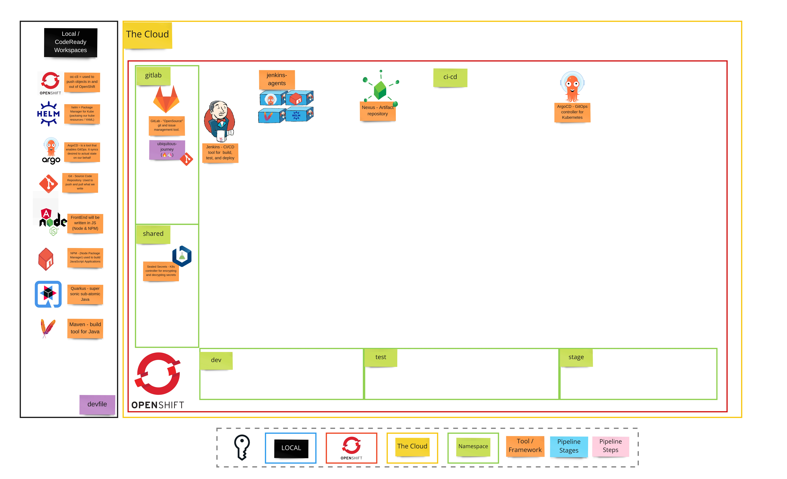

# 演習 1 - 手動の脅威

> デプロイを実行および自動化するための GitOps アプローチ。

## 👨‍🍳演習の紹介

この演習では、GitOps を使用して作業環境をセットアップします。次の演習では、Git プロジェクトをセットアップし、OpenShift で`dev` 、 `test`および`stage`プロジェクトを作成し、Jenkins や Nexus などのツールをデプロイして CI/CD を有効にします。そのために、 *GitOps*と呼ばれる一般的なアプローチを使用します。

## 🖼️ Big Picture

## 🔮 学習成果

- GitOps アプローチから得られる利点を理解します
- Helm チャートを手動でデプロイします
- GitOps によるツールのインストールを促進します

## 🔨 この演習で使用するツール

- <a href="https://helm.sh/">Helm</a> - Kubernetes アプリケーションの定義、インストール、およびアップグレードを支援します。
- <a href="https://argoproj.github.io/argo-cd/">ArgoCD</a> - アプリケーションを継続的に監視し、現在の状態を目的の状態と比較するコントローラー
- <a href="https://www.sonatype.com/nexus-repository-sonatype">Nexus</a> - 多くのアプリケーション タイプを格納するためのリポジトリ マネージャー. `npm`および`Docker`レジストリーもホストできます。
- <a href="https://jenkins.io/">Jenkins</a> - OpenSource ビルド自動化サーバー.プラグインによる高度なカスタマイズ。
