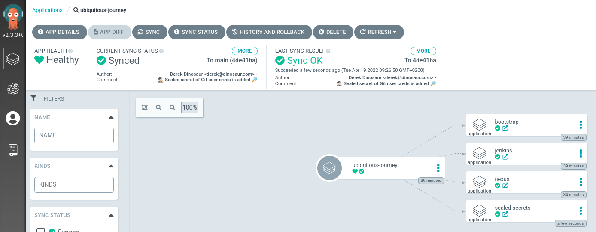
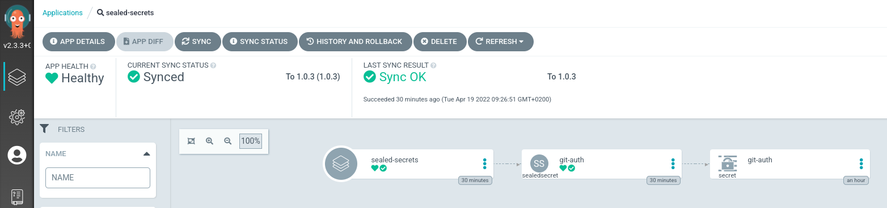
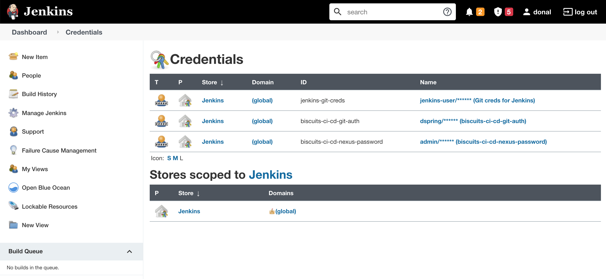

## 暗号化されたシークレット

GitOps と言うと、 *「Git になければ本物ではない」*と言いますが、資格情報などの機密データを、多くの人がアクセスできる Git リポジトリにどのように保存するのでしょうか?!確かに、Kubernetes はシークレットを管理する方法を提供しますが、問題は機密情報を base64 文字列として保存することです。誰でも base64 文字列をデコードできます! したがって、 `Secret`マニフェスト ファイルを公開された場所に保存することはできません。この問題に対処するために、Sealed Secrets と呼ばれるオープンソース ツールを使用します。

Sealed Secrets を使用すると、 <code>kubeseal</code>というユーティリティを使用して Kubernetes シークレットを<em>暗号化</em>できます。 `SealedSecrets` 、コントローラーのみが復号化できる暗号化された`Secret`オブジェクトを含む Kubernetes リソースです。したがって、 `SealedSecret`はパブリックリポジトリに格納しても安全です。

<p class="warn">⛷️<b>注</b>⛷️ - 別の CodeReady Workspaces 環境に切り替える場合は、先に進む前に以下のコマンドを実行してください。</p>

```bash
cd /projects/tech-exercise
git remote set-url origin https://${GIT_SERVER}/${TEAM_NAME}/tech-exercise.git
git pull
```

### 暗号化されたシークレットの実践

1. 注意深い人は、前の演習で git のシークレットを作成し、それを git に配置せずにクラスターに追加したことに気づいたでしょう...😳 これを修正し、Git 資格情報を暗号化して、安全にチェックインできるようにすることから始めましょう。コードに。まず、tmp ディレクトリにシークレットを作成します。前の演習で使用した gitlab ユーザーと PAT が環境に設定されていることを確認してください。

    ```bash
    echo ${GITLAB_USER}
    echo ${GITLAB_PAT}
    ```

2. このコマンドを実行して、後で Tekton と Jenkins に必要な適切なラベルを持つ Kubernetes シークレット オブジェクトを`/tmp`に生成します。

    ```bash#test
    cat << EOF > /tmp/git-auth.yaml
    kind: Secret
    apiVersion: v1
    data:
      username: "$(echo -n ${GITLAB_USER} | base64 -w0)"
      password: "$(echo -n ${GITLAB_PAT} | base64 -w0)"
    type: kubernetes.io/basic-auth
    metadata:
      annotations:
        tekton.dev/git-0: https://${GIT_SERVER}
        sealedsecrets.bitnami.com/managed: "true"
      labels:
        credential.sync.jenkins.openshift.io: "true"
      name: git-auth
    EOF
    ```

3. `kubeseal`コマンド ラインを使用して、シークレットの定義を暗号化します。これはクラスタ内部で動作するコントローラに格納されている証明書を使用してシークレットを暗号化します。クラスターごとに 1 つのインスタンスしか存在できないため、これは既にデプロイされています。

     <p class="warn">⛷️<b>注意</b>⛷️ - Kubeseal コマンドを実行して"Error: cannot get sealed secret service: Unauthorized" というエラーが表示された場合は、OpenShift に再度ログインして、コマンドを再度実行してください。</p>

    ```bash
    oc login --server=https://api.${CLUSTER_DOMAIN##apps.}:6443 -u <USER_NAME> -p <PASSWORD>
    ```

    ```bash#test
    kubeseal < /tmp/git-auth.yaml > /tmp/sealed-git-auth.yaml \
        -n ${TEAM_NAME}-ci-cd \
        --controller-namespace tl500-shared \
        --controller-name sealed-secrets \
        -o yaml
    ```

4. シークレットが暗号化されていることを確認します。

    ```bash#test
    cat /tmp/sealed-git-auth.yaml
    ```

    シークレットが暗号化されていることがわかるはずなので、リポジトリに安全に保存できます。このように見えるはずですが、実際にはパスワードとユーザー名の出力はもっと長くなります。

     <div class="highlight" style="background: #f7f7f7">
     <pre><code class="language-yaml">
            apiVersion: bitnami.com/v1alpha1
            kind: SealedSecret
            metadata:
              creationTimestamp: null
              name: git-auth
              namespace: biscuits-ci-cd
            spec:
              encryptedData:
                username: AgAtnYz8U0AqIIaqYrj...
                password: AgAj3JQj+EP23pnzu...
            ...
            </code></pre>
    </div>


5. この暗号化の作業の結果から、特に`encryptedData`を取得し、gitに追加できるようにしたいと思います。暗号化されたシークレットを反復可能な方法でクラスターに追加するために使用できる<span style="color:blue;"><a href="https://github.com/redhat-cop/helm-charts/tree/master/charts/helper-sealed-secrets">ヘルパー Helm チャートを</a></span>既に作成しています。次のステップで、このチャートに`encryptedData`値を提供します。

    ```bash#test
    cat /tmp/sealed-git-auth.yaml | grep -E 'username|password'
    ```

     <div class="highlight" style="background: #f7f7f7">
     <pre><code class="language-yaml">
                username: AgAtnYz8U0AqIIaqYrj...
                password: AgAj3JQj+EP23pnzu...
            </code></pre>
    </div>
    

6. `ubiquitous-journey/values-tooling.yaml`で、 `# Sealed Secrets`の下にこのヘルパー チャートのエントリを追加します。前のコマンドからの`username`と`password`の出力をコピーし、それに応じて値を更新します。**データが正しくインデントされていることを確認してください**。

    ```yaml
      # Sealed Secrets
      - name: sealed-secrets
        enabled: true
        source: https://redhat-cop.github.io/helm-charts
        chart_name: helper-sealed-secrets
        source_ref: "1.0.3"
        values:
          secrets:
            # Additional secrets will be added to this list along the exercises.
            - name: git-auth
              type: kubernetes.io/basic-auth
              annotations:
                tekton.dev/git-0: https://<GIT_SERVER>
              labels:
                credential.sync.jenkins.openshift.io: "true"
              data:
                username: <YOUR_SEALED_SECRET_USERNAME>
                password: <YOUR_SEALED_SECRET_PASSWORD>
    ```

    非常に面倒な場合は、このコードを実行して置換を行うこともできます。

    ```bash#test
    if [[ $(yq e '.applications[] | select(.name=="sealed-secrets") | length' /projects/tech-exercise/ubiquitous-journey/values-tooling.yaml) < 1 ]]; then
        yq e '.applications += {"name": "sealed-secrets","enabled": true,"source": "https://redhat-cop.github.io/helm-charts","chart_name": "helper-sealed-secrets","source_ref": "1.0.3","values": {"secrets": [{"name": "git-auth","type": "kubernetes.io/basic-auth","annotations": {"tekton.dev/git-0": "https://GIT_SERVER","sealedsecrets.bitnami.com/managed": "true"},"labels": {"credential.sync.jenkins.openshift.io": "true"},"data": {"username": "SEALED_SECRET_USERNAME","password": "SEALED_SECRET_PASSWORD"}}]}}' -i /projects/tech-exercise/ubiquitous-journey/values-tooling.yaml
        SEALED_SECRET_USERNAME=$(yq e '.spec.encryptedData.username' /tmp/sealed-git-auth.yaml)
        SEALED_SECRET_PASSWORD=$(yq e '.spec.encryptedData.password' /tmp/sealed-git-auth.yaml)
        sed -i "s|GIT_SERVER|$GIT_SERVER|" /projects/tech-exercise/ubiquitous-journey/values-tooling.yaml
        sed -i "s|SEALED_SECRET_USERNAME|$SEALED_SECRET_USERNAME|" /projects/tech-exercise/ubiquitous-journey/values-tooling.yaml
        sed -i "s|SEALED_SECRET_PASSWORD|$SEALED_SECRET_PASSWORD|" /projects/tech-exercise/ubiquitous-journey/values-tooling.yaml
    fi
    ```

7. ファイルを更新したので、更新を検出するために ArgoCD のリポジトリに変更をプッシュする必要があります。それはGitOpsだからです:)

    ```bash#test
    cd /projects/tech-exercise
    git add ubiquitous-journey/values-tooling.yaml
    git commit -m "🕵🏻‍♂️ Sealed secret of Git user creds is added 🔎"
    git push
    ```

    🪄 🪄 ArgoCD にログインします。ArgoCD UI に SealedSecret チャートが表示されます。通常のk8sシークレットとして展開されます🪄🪄

8. ArgoCD UIの`SealedSecret` を詳しく調べると、`git-auth` のシークレットが自動的に同期されたことがわかります。

    

9. `Jenkins -> Manage Jenkins -> Manage Credentials`開いて`<TEAM_NAME>-ci-cd-git-auth`を表示することで、Jenkins に同期されていることを確認することもできます。

    ```bash#test
    echo https://$(oc get route jenkins --template='{{ .spec.host }}' -n ${TEAM_NAME}-ci-cd)
    ```

    
