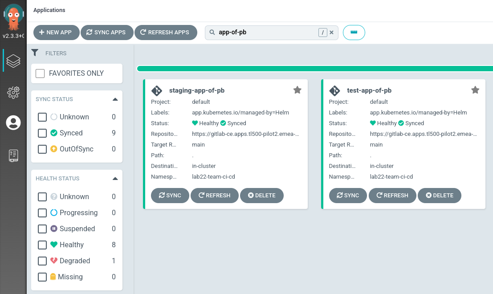
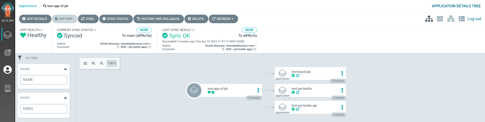
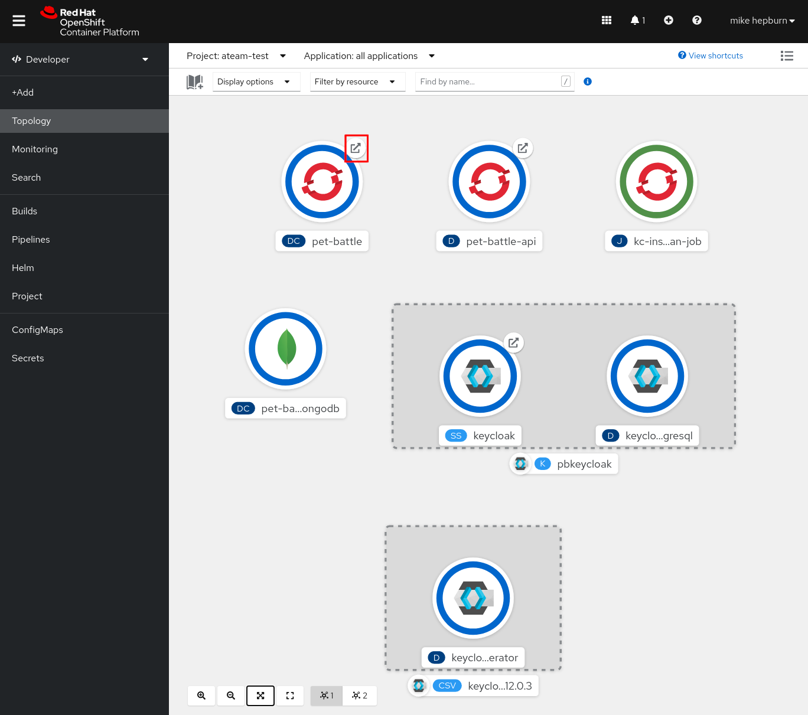
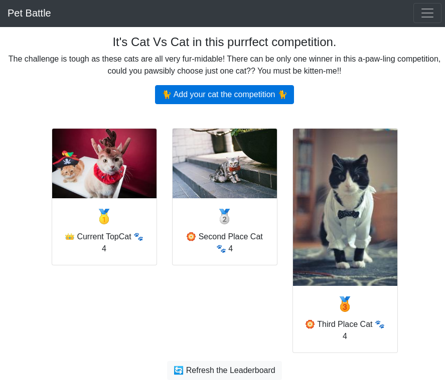

## App of Appsのデプロイ

私たちのすべてのアプリケーションをバンドルして、各環境にデプロイする方法が必要です。各 PetBattle アプリケーションには独自の Git リポジトリと Helm チャートがあり、他のアプリとは独立してコーディングやデプロイをすることが容易になります。

開発者は、完全に自動化されたパイプラインとして`helm install`を使用して、アプリケーション チャートをインストールするのと同じ経験と最終結果を得ることができます。これは、ユーザビリティの観点から重要です。 Argo CD は、Kubernetes のデプロイ、 `Kustomize` 、 `Helm` 、および生の YAML ファイルに適したあらゆる種類のパッケージ形式をサポートしています。 Helm はテンプレート言語であるため、Helm チャート テンプレートとその生成された Kubernetes オブジェクトをさまざまな値で変更して、環境ごとの構成で設定できます。

Argo CD `application`定義を使用して、各アプリケーションをデプロイします。アプリケーションをデプロイするすべての環境に対して、1 つの Argo CD `application`定義を使用します。 `app of apps pattern`を使用して、これらすべてをまとめます。これをアプリケーション スイートまたはシステムと呼ぶ人もいます。 PetBattle では、Helm チャートを使用して app-of-apps 定義を生成します。

### Pet BattleへのKeycloakのデプロイ

> この演習では、同じパターンを使用して、PetBattle とそれが使用するサポート技術のひとつ (Keycloak) をデプロイします。 `pet-battle/stage/values.yaml`と `pet-battle/test/values.yaml`で値ファイルを構成することにより、PetBattle を`test`と`stage`の 2 つの環境にデプロイします。

1. IDE で、このプロジェクトのルートにある`tech-exercises/values.yaml`ファイルを開き、app-of-pb 定義ごとに以下に示すように、 <code>enabled: false</code>を`enabled: true`に<strong>入れ替えます</strong>。

     <div class="highlight" style="background: #f7f7f7">
     <pre><code class="language-yaml">
          # Test app of app
          - name: test-app-of-pb
            enabled: true
            source_path: "."
            helm_values:
              - pet-battle/test/values.yaml
          # Staging App of Apps
          - name: staging-app-of-pb
            enabled: true
            source_path: "."
            helm_values:
              - pet-battle/stage/values.yaml
        </code></pre>
    </div>


    非常に面倒な場合は、このコードを実行して置換を行うこともできます。

    ```bash#test
    yq e '(.applications[] | (select(.name=="test-app-of-pb").enabled)) |=true' -i /projects/tech-exercise/values.yaml
    yq e '(.applications[] | (select(.name=="staging-app-of-pb").enabled)) |=true' -i /projects/tech-exercise/values.yaml
    ```

2. 私たちのアプリは N 個のアプリで構成されています。 `pet-battle/test/values.yaml`の`applications`プロパティでデプロイするアプリのリストを定義します。次のように追加して、このリストに keycloak サービスを追加しましょう。これにより、リポジトリから helm-chart が取得され、 `values`セクションから追加の構成が適用されます。*テキストが既存のプレースホルダー コメントに揃うように設定されていることを確認してください。*

    ```yaml
      # Keycloak
      keycloak:
        name: keycloak
        enabled: true
        source: https://github.com/petbattle/pet-battle-infra
        source_ref: main
        source_path: keycloak
        values:
          app_domain: <CLUSTER_DOMAIN>
    ```

    非常に面倒な場合は、このコードを実行して置換を行うこともできます。

    ```bash#test
    if [[ $(yq e '.applications[] | select(.name=="keycloak") | length' /projects/tech-exercise/pet-battle/test/values.yaml) < 1 ]]; then
        yq e '.applications.keycloak = {"name": "keycloak","enabled": true,"source": "https://github.com/petbattle/pet-battle-infra","source_ref": "main","source_path": "keycloak","values": {"app_domain": "CLUSTER_DOMAIN"}}' -i /projects/tech-exercise/pet-battle/test/values.yaml
        sed -i "s|CLUSTER_DOMAIN|$CLUSTER_DOMAIN|" /projects/tech-exercise/pet-battle/test/values.yaml
    fi
    ```

3. もちろん、これをデプロイしましょう。git にない限り、本物ではありません。

    ```bash#test
    cd /projects/tech-exercise
    git add .
    git commit -m  "🐰 ADD - app-of-apps and keycloak to test 🐰"
    git push
    ```

4. 値を有効にして、 ArgoCD に対してテスト環境にリストされた最初のアプリケーションを使用して、これらの環境への変更の検出を開始するよう指示しましょう。これを行うには、最初の演習のはじめにインストールしたヘルム チャートを更新するだけです。

    ```bash#test
    cd /projects/tech-exercise
    helm upgrade --install uj --namespace ${TEAM_NAME}-ci-cd .
    ```

5. ArgoCDでは、このあたりから少しずつ賑やかになっていくはずです。

### Pet Battleのデプロイ

> PetBattle のインフラが稼働中になったので、PetBattle 自体をデプロイしましょう。各環境フォルダー (テスト / ステージ) には、OpenShift の対応するプロジェクトの構成が含まれています。変更をクラスターに同期(sync)するには、 `applications`のリストを拡張または編集するだけです。この方法を使用して、テスト環境の構成をステージングまたは本番環境から分離することもできます。

1. IDE で、 `pet-battle/test/values.yaml`ファイルを開き、以下をコピーします。

    ```yaml
      # Pet Battle Apps
      pet-battle-api:
        name: pet-battle-api
        enabled: true
        source: https://petbattle.github.io/helm-charts  # http://nexus:8081/repository/helm-charts
        chart_name: pet-battle-api
        source_ref: 1.2.1 # helm chart version
        values:
          image_name: pet-battle-api
          image_version: latest # container image version
          hpa:
            enabled: false

      pet-battle:
        name: pet-battle
        enabled: true
        source: https://petbattle.github.io/helm-charts  # http://nexus:8081/repository/helm-charts
        chart_name: pet-battle
        source_ref: 1.0.6 # helm chart version
        values:
          image_version: latest # container image version
    ```

    非常に面倒な場合は、このコードを実行して置換を行うこともできます。

    ```bash#test
    if [[ $(yq e '.applications[] | select(.name=="pet-battle-api") | length' /projects/tech-exercise/pet-battle/test/values.yaml) < 1 ]]; then
        yq e '.applications.pet-battle-api = {"name": "pet-battle-api","enabled": true,"source": "https://petbattle.github.io/helm-charts","chart_name": "pet-battle-api","source_ref": "1.2.1","values": {"image_name": "pet-battle-api","image_version": "latest", "hpa": {"enabled": false}}}' -i /projects/tech-exercise/pet-battle/test/values.yaml
    fi
    if [[ $(yq e '.applications[] | select(.name=="pet-battle") | length' /projects/tech-exercise/pet-battle/test/values.yaml) < 1 ]]; then
        yq e '.applications.pet-battle = {"name": "pet-battle","enabled": true,"source": "https://petbattle.github.io/helm-charts","chart_name": "pet-battle","source_ref": "1.0.6","values": {"image_version": "latest"}}' -i /projects/tech-exercise/pet-battle/test/values.yaml
    fi
    sed -i '/^$/d' /projects/tech-exercise/pet-battle/test/values.yaml
    sed -i '/^# Keycloak/d' /projects/tech-exercise/pet-battle/test/values.yaml
    sed -i '/^# Pet Battle Apps/d' /projects/tech-exercise/pet-battle/test/values.yaml
    ```

2. フロントエンドには、何らかの構成を適用する必要があります。これは Helm チャートにパッケージ化するか、イメージとして作成できますが、実際には構成を*コード*として適用する必要があります。実行時に提供される構成を使用して多くの環境で初期化できるように、アプリケーションを一度ビルドする必要があります。フロントエンドの場合、これは API がどこに存在するかという情報を提供することを意味します。 私たちはArgoCDを使ってアプリケーションのデプロイメントを管理しているので、このチャートに供給される値もそのように更新する必要があります。

    ```bash#test
    export JSON="'"'{
            "catsUrl": "https://pet-battle-api-'${TEAM_NAME}'-test.'${CLUSTER_DOMAIN}'",
            "tournamentsUrl": "https://pet-battle-tournament-'${TEAM_NAME}'-test.'${CLUSTER_DOMAIN}'",
            "matomoUrl": "https://matomo-'${TEAM_NAME}'-ci-cd.'${CLUSTER_DOMAIN}'/",
            "keycloak": {
              "url": "https://keycloak-'${TEAM_NAME}'-test.'${CLUSTER_DOMAIN}'/auth/",
              "realm": "pbrealm",
              "clientId": "pbclient",
              "redirectUri": "http://localhost:4200/tournament",
              "enableLogging": true
            }
          }'"'"
    yq e '.applications.pet-battle.values.config_map = env(JSON) | .applications.pet-battle.values.config_map style="single"' -i /projects/tech-exercise/pet-battle/test/values.yaml
    ```

3. `pet-battle/test/values.yaml`ファイルは次のようになります (ただし、あなたのチーム名とドメインが表示されます)。

     <div class="highlight" style="background: #f7f7f7">
     <pre><code class="language-yaml">
          pet-battle:
            name: pet-battle
            enabled: true
            source: https://petbattle.github.io/helm-charts  # http://nexus:8081/repository/helm-charts
            chart_name: pet-battle
            source_ref: 1.0.6 # helm chart version
            values:
              image_version: latest # container image version
              config_map: '{
                "catsUrl": "https://pet-battle-api-&lt;TEAM_NAME&gt;-test.&lt;CLUSTER_DOMAIN&gt;",
                "tournamentsUrl": "https://pet-battle-tournament-&lt;TEAM_NAME&gt;-test.&lt;CLUSTER_DOMAIN&gt;",
                "matomoUrl": "https://matomo-&lt;TEAM_NAME&gt;-ci-cd.&lt;CLUSTER_DOMAIN&gt;/",
                "keycloak": {
                  "url": "https://keycloak-&lt;TEAM_NAME&gt;-test.&lt;CLUSTER_DOMAIN&gt;/auth/",
                  "realm": "pbrealm",
                  "clientId": "pbclient",
                  "redirectUri": "http://localhost:4200/tournament",
                  "enableLogging": true
                }
              }'
        </code></pre>
    </div>
    

4. ステージング環境をデプロイするために`pet-battle/stage/values.yaml`ファイルに対して同じことを繰り返します (フロントエンド構成の`<TEAM_NAME>-test`を`<TEAM_NAME>-stage`のように更新します)。変更をリポジトリにプッシュします。  *gitにない限り本物ではありません*

    ```bash#test
    cd /projects/tech-exercise
    git add .
    git commit -m  "🐩 ADD - pet battle apps 🐩"
    git push
    ```

5. ArgoCD にデプロイされた`test`と`stage`の 2 つの Pet Battle アプリが表示されます。たとえば、 `test-app-of-pb`の 1 つにドリルダウンすると、PetBattle の 3 つのコンポーネントがそれぞれ表示されます。 

6. 最後に、すべてが機能するかどうかを見てみましょう。一部のPod (例えば、keycloakなど) は、準備が整うまでに少し時間がかかる場合があります。 `OpenShift -> Developer View -> Topology`に移動し、 `<TEAM_NAME>-test`プロジェクトを選択します。 🪄 🪄 Pet Battleアプリケーションが実行中であることを確認できるはずです。 🪄🪄

    

    😻😻 上で強調表示されているPet Battleの URL リンクを選択すると、... 😻😻 が表示されます。

    
