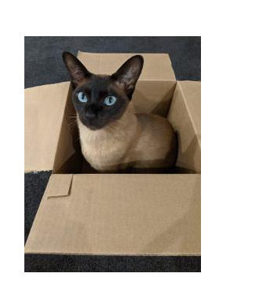

## パイプライン

パイプラインを作成する理由:

- 保証 - コードの品質を向上させ、専任のデプロイ / リリース管理チームの必要性を排除します
- 自由 - 開発者がコードのビルドと出荷の方法と時期を所有できるようにする
- 信頼性 - パイプラインは少し退屈です。それらは、実行されるたびに同じ方法で実行されます!
- 生産への道：
    - 製品をより早く顧客に届けます
    - シームレスで反復可能なデプロイを可能にします
    - インフラストラクチャのような製品が増えると、保証が向上します
    - 「私たちはすでにそれを行っています」とうことがないようにリスク回避できます

<p class="warn">⛷️<b>注</b>⛷️ - 別の CodeReady Workspaces 環境に切り替える場合は、先に進む前に以下のコマンドを実行してください。</p>

```bash
cd /projects/tech-exercise
git remote set-url origin https://${GIT_SERVER}/${TEAM_NAME}/tech-exercise.git
git pull
```

### あなた自身の冒険を選んでください

チーム内で 2 つのグループに分かれます。あなた自身の冒険を選んでください！各グループは同様のタスクを実行します。

|🐈 **Jenkinsグループ** 🐈 | 🐅 **Tekton グループ** 🐅|
-------------------------- | -------------------------|
|* PetBattle をフォークする必要があります (GitHub からクローンを作成し、GitLab にプッシュします)。 | * PetBattle API をフォークする必要があります (GitHub からクローンして GitLab にプッシュします)。|
|* `Jenkinsfile`タスクを更新して、参加者のためにいくつかのものを除外します | * Tekton タスクを更新して、参加者のためにいくつかのものを除外します|
|* ジョブをトリガーするための Webhook を GitLab リポジトリに追加します | * ジョブをトリガーするための Webhook を GitLab リポジトリに追加します|
|* `pet-battle/stage/values.yaml` &amp;&amp; `pet-battle/test/values.yaml`サービス情報で更新します。 (ここで 2 つのチームが作業を統合します。) | * `pet-battle/stage/values.yaml` &amp;&amp; `pet-battle/test/values.yaml`サービス情報で更新します。 (ここで 2 つのチームが作業を統合します。)|
|* バージョン ファイル (pom.xml など) を更新することで、パイプラインをキックします。 | * バージョン ファイル (pom.xml など) を更新することで、パイプラインをキックします。|
|<span style="color:blue;"><p><a href="2-attack-of-the-pipelines/3a-jenkins.md">jenkins</a></p></span> | <span style="color:blue;"><p><a href="2-attack-of-the-pipelines/3b-tekton.md">tekton</a></p></span>|

🐈<span style="color:purple;">期待される結果</span>: Pet Battle アプリケーション (フロントエンドとバックエンド) を構築する作業パイプライン - はい ..**猫**!! 🐈


