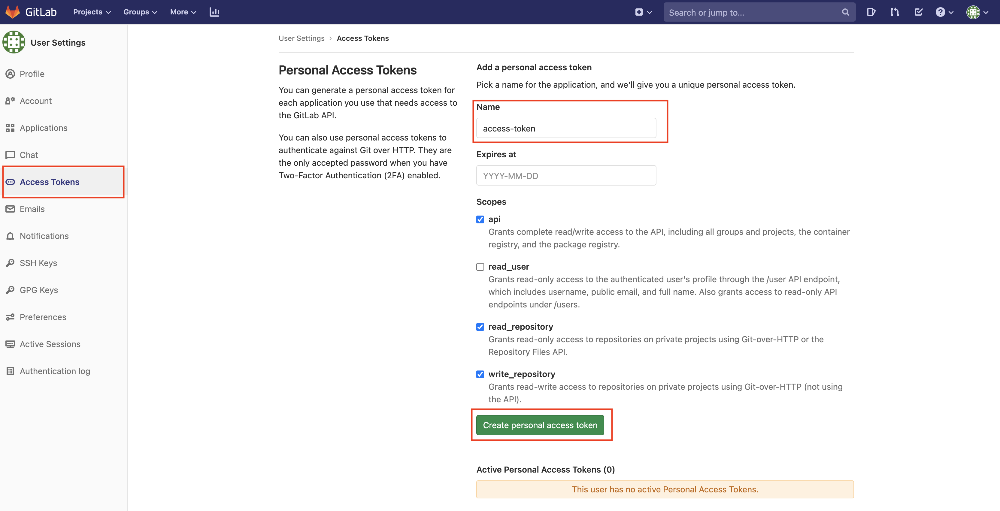
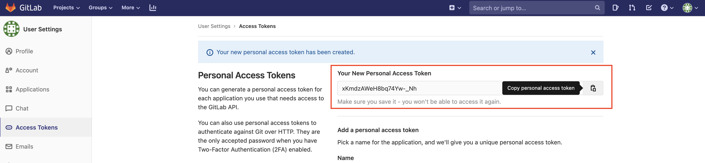
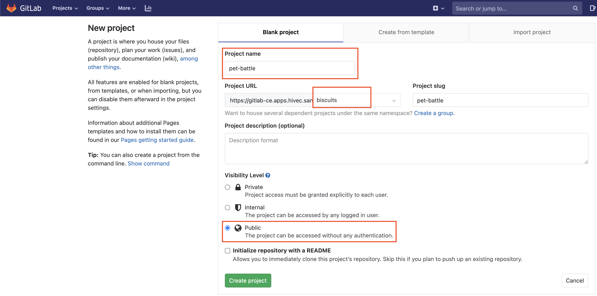
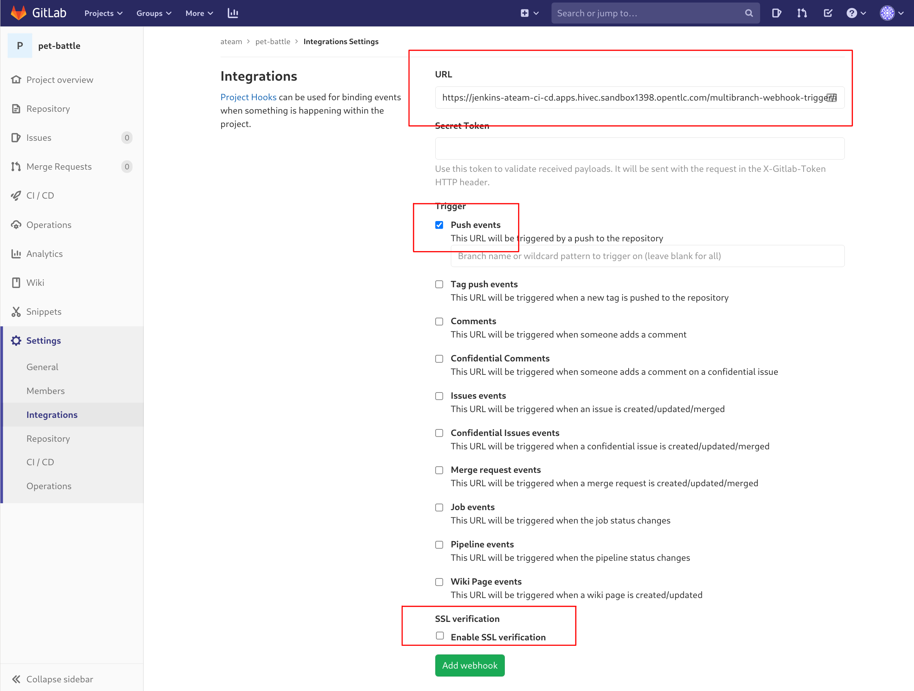
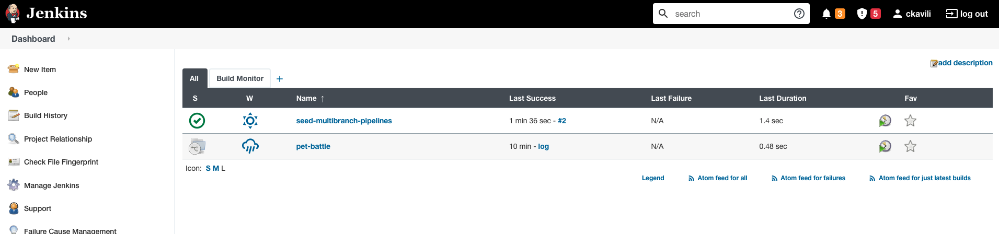
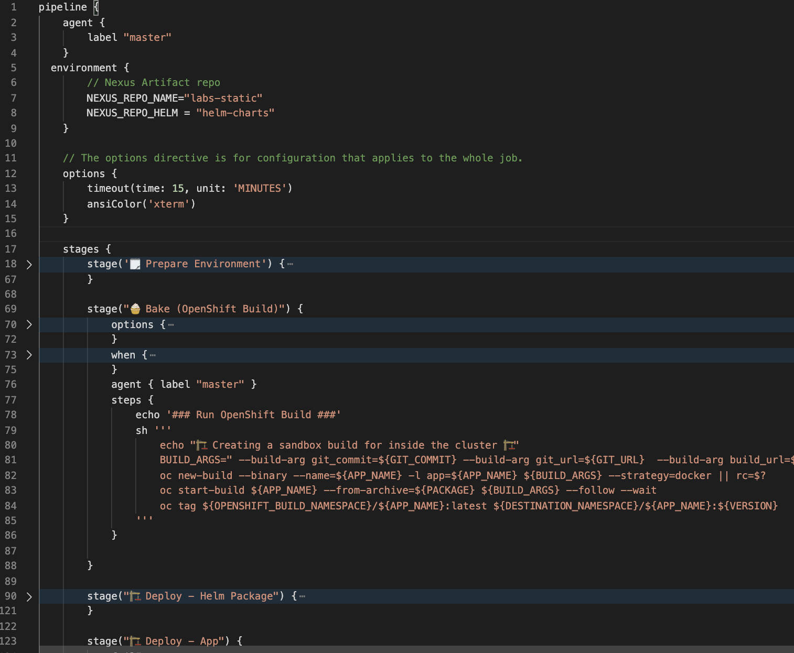
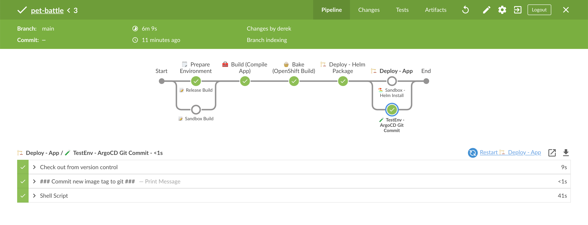

### Jenkinsパイプライン

> Jenkinsは以前からあるツールですが、多くの顧客から支持されています。ビルドサーバーでありながら、プラグインやエージェントで拡張できるため、非常に強力なツールとなっています。

<!---
#### Jenkins access to GitLab
Jenkins needs to access repositories to see Jenkinsfile. There are multiple options to use ie username/password, SSH Keys and token (which we will going to use)

1. Login to GitLab and click on your avatar from upper left corner > Settings.

2. Click on Access Token and generate one.

3. Copy the newly generated token and update `ubiquitous-journey/values-tooling.yaml`


```bash
...
...
          - name: GITLAB_TOKEN
            value: ''
...
```

```bash
git add ubiquitous-journey/values-tooling.yaml
git commit -m "🥔 Gitlab Token is added 🥔"
git push
```
--->

#### Pet Battle (フロントエンド) GitLabプロジェクトのセットアップ

1. GitLab UI を開きます。 `pet-battle`という名前の`<TEAM_NAME>`グループの下に GitLab でプロジェクトを作成します。プロジェクトを**public**にします。

    

2. CodeReady ワークスペースに戻り、PetBattle フロントエンド コードを git で新しく作成されたリポジトリにフォークします。

    ```bash#test
    cd /projects
    git clone https://github.com/rht-labs/pet-battle.git && cd pet-battle
    git remote set-url origin https://${GIT_SERVER}/${TEAM_NAME}/pet-battle.git
    git branch -M main
    git push -u origin main
    ```

3. コードを変更するたびにビルドを実行するように Jenkins に指示できるようにしたいと考えています。前に Argo CD で行ったのと同じように、Pet Battle フロント エンドの Webhook を GitLab に追加して、コミットごとにトリガーされるようにしましょう。 Jenkins がビルドをトリガーする`<JENKINS_URL>/multibranch-webhook-trigger/invoke?token=<APP_NAME>`形式の URL が必要です。

    ```bash#test
    echo "https://$(oc get route jenkins --template='{{ .spec.host }}' -n ${TEAM_NAME}-ci-cd)/multibranch-webhook-trigger/invoke?token=pet-battle"
    ```

    URL を取得したら、GitLab で`pet-battle > Settings > Integrations`に移動して Webhook を追加します。 

#### Jenkinsパイプライン

> Jenkins には`seed-multibranch-pipeline`と呼ばれる単純なジョブがプリロードされています。これは、各リポジトリ`Jenkinsfile`からパイプラインを自動的に雛形化(scaffold)するちょっとした groovy スクリプトです。このスクリプトのロジックは単純です。 Jenkinsfile を含むプロジェクトの特定の GitLab インスタンスのグループをチェックします。見つかった場合はそこからパイプラインを作成し、見つからない場合はスキップします。

1. `seed-multibranch-pipeline`ジョブを機能させるには、デプロイメントでいくつかの変数を公開して、Jenkins を GitLab に接続するだけです...もちろん、それらを OpenShift デプロイメントに追加することもできます。でも、これは GITOPS です! :muscle: :gun:

    `ubiquitous-journey/values-tooling.yaml` Jenkins ブロックにおける各値を次のように更新します。

    ```yaml
          #... more jenkins configuration here
          deployment:
            env_vars:
              - name: GITLAB_DEFAULT_BRANCH
                value: 'main'
              - name: GITLAB_HOST
                value: '<GIT_SERVER>'
              - name: GITLAB_GROUP_NAME
                value: '<TEAM_NAME>'
              - name: BISCUITS
                value: 'jaffa-cakes🍪'
    ```

    非常に面倒な場合は、このコードを実行して置換を行うこともできます。

    ```bash#test
    yq e '(.applications[] | (select(.name=="jenkins").values.deployment.env_vars[] | select(.name=="GITLAB_HOST")).value)|=env(GIT_SERVER)' -i /projects/tech-exercise/ubiquitous-journey/values-tooling.yaml
    yq e '(.applications[] | (select(.name=="jenkins").values.deployment.env_vars[] | select(.name=="GITLAB_GROUP_NAME")).value)|=env(TEAM_NAME)' -i /projects/tech-exercise/ubiquitous-journey/values-tooling.yaml
    ```

2. Jenkins は、パイプラインの一部として、Helm チャートへの変更を Nexus にプッシュします。以前は、PetBattle パブリック チャート リポジトリからプルするように App of Apps を構成したため、これも更新する必要があります。 `pet-battle/test/values.yaml`ファイルを変更して、OpenShift にデプロイされた Nexus チャート リポジトリを指すようにします。これを行うには、次のように`pet-battle`の`source`を更新します。

     <div class="highlight" style="background: #f7f7f7">
     <pre><code class="language-yaml">
        # Pet Battle Apps
        pet-battle-api:
            ...
        pet-battle:
            name: pet-battle
            enabled: true
            source: http://nexus:8081/repository/helm-charts #&lt;- update this
            source_ref: 1.0.6 # helm chart version
            ...
        </code></pre>
    </div>

    次に、 `pet-battle/stage/values.yaml`ファイルにも同じことを行います。

    非常に面倒な場合は、このコードを実行して置換を行うこともできます。

    ```bash#test
    yq e '.applications.pet-battle.source |="http://nexus:8081/repository/helm-charts"' -i /projects/tech-exercise/pet-battle/test/values.yaml
    ```

3. これらの変更を git にコミットして、Argo CD がそれらを同期できるようにします。

    ```bash#test
    cd /projects/tech-exercise
    git add .
    git commit -m  "🍕 ADD - jenkins pipelines config 🍕"
    git push
    ```

4. この変更がロールアウトされると、シード ジョブが Jenkins UI のフロントエンドのパイプラインを雛形化していることがわかります。これは、 `Jenkinsfile` (パイプライン定義) が見つかった pet-battle リポジトリを調べることによって行われます。ただし、最初の実行では失敗します。これを修正するために、いくつかの記述を書くことは想定されていることです!

    ```bash#test
    # to get the Jenkins route on your terminal
    echo https://$(oc get route jenkins --template='{{ .spec.host }}' -n ${TEAM_NAME}-ci-cd)
    ```

    

     <p class="warn"><b>INFO</b>- Jenkins の再起動後にジョブが実行されていない場合は、ジョブを手動でトリガーして実行してください。</p>
    

5. Jenkins が GitLab プロジェクトをスキャンして新しいリポジトリと git セットアップし、Jenkins でビルドをトリガーするようになったので、パイプラインを調べてみましょう。 `Jenkinsfile` 、DSL (Jenkins 言語) を使用して、パイプラインを一連のブロックで宣言的に記述します。私たちのものは次のように設定されています：

    

    上記の重要な点は次のとおりです。

    - `pipeline {}`を使って、すべての宣言型 Jenkins パイプラインを開始します。
    - `environment {}`は、すべてのビルド段階で使用される環境変数を定義します
    - `options {}`端末の色の設定など、ジョブ全体でグローバルに実行する特定のジョブ仕様が含まれています
    - `stage {}`すべてのジョブには 1 つのステージが必要です。これは、実行されるビルドの論理部分です。例: `bake-image`
    - `steps {}`各`stage`は 1 つ以上のステップが含まれます。これらは、execute shell や git checkout などです。
    - `agent {}` 、ビルドを実行する必要があるノードを指定します (例: `jenkins-agent-npm`
    - `post {}`フックは、ビルド後のアクションを指定するために使用されます。 Jenkins の宣言型パイプライン構文は、ジョブ フローの制御に役立つ、 `success` 、 `failure` 、および`always`ための非常に便利なコールバックを提供します。
    - `when {}` は、ステージ レベルで使用でき、そのステージに入るパイプラインを停止するために使用できます。たとえば、ブランチがmasterの場合にコードを`test`環境にデプロイします。

6. ここまでパイプラインが何をするかを見てきたので、失敗したビルドを修正してみましょう。 Jenkins ジョブの出力を見ると、Nexus でコンテナーに入れるものを見つけることができないことがわかります。これを修正するには、アプリのコンパイルを実行する新しい`stage`を追加するように`Jenkinsfile`を更新し、Nexus でアーティファクトを生成します。以下を`// 💥🔨 PIPELINE EXERCISE GOES HERE`コメントに追加します。

    ```groovy
            // 💥🔨 PIPELINE EXERCISE GOES HERE
            stage("🧰 Build (Compile App)") {
                agent { label "jenkins-agent-npm" }
                options {
                  skipDefaultCheckout(true)
                }
                steps {
                    sh '''
                    git clone ${GIT_URL} pet-battle && cd pet-battle
                    git checkout ${BRANCH_NAME}
                    '''
                    dir('pet-battle'){

                    script {
                        env.VERSION = sh(returnStdout: true, script: "npm run version --silent").trim()
                        env.PACKAGE = "${APP_NAME}-${VERSION}.tar.gz"
                    }
                    sh 'printenv'

                    echo '### Install deps ###'
                    sh 'npm ci --registry http://nexus:8081/repository/labs-npm'

                    // 💅 Lint exercise here
                    echo '### Running Linting ###'

                    // 🃏 Jest Testing
                    echo '### Running Jest Testing ###'

                    echo '### Running build ###'
                    sh 'npm run build '

                    // 🌞 SONARQUBE SCANNING EXERCISE GOES HERE
                    echo '### Running SonarQube ###'

                    echo '### Packaging App for Nexus ###'
                    sh '''
                        tar -zcvf ${PACKAGE} dist Dockerfile nginx.conf
                        curl -v -f -u ${NEXUS_CREDS} --upload-file ${PACKAGE} \
                            http://nexus:8081/repository/${NEXUS_REPO_NAME}/${APP_NAME}/${PACKAGE}
                    '''
                  }
                }
                // 📰 Post steps go here
            }
    ```

    非常に面倒な場合は、このコードを実行して置換を行うこともできます。

    ```bash#test
    wget -O /projects/pet-battle/Jenkinsfile https://raw.githubusercontent.com/rht-labs/tech-exercise/main/tests/doc-regression-test-files/3a-jenkins-Jenkinsfile.groovy
    ```

7. 変更を git にプッシュします。

    ```bash#test
    cd /projects/pet-battle
    git add Jenkinsfile
    git commit -m "🌸 Jenkinsfile updated with build stage 🌸"
    git push
    ```

8. Jenkins に戻ると、パイプラインが実行されていることがわかります。ブルー オーシャン ビューに切り替えると、実行中の様子を示す素敵なグラフが表示されます。

    

🪄パイプラインの実行を観察します:D - この時点で、グループの残りの半分にチェックインし、アプリの統合に成功したかどうかを確認します🪄
