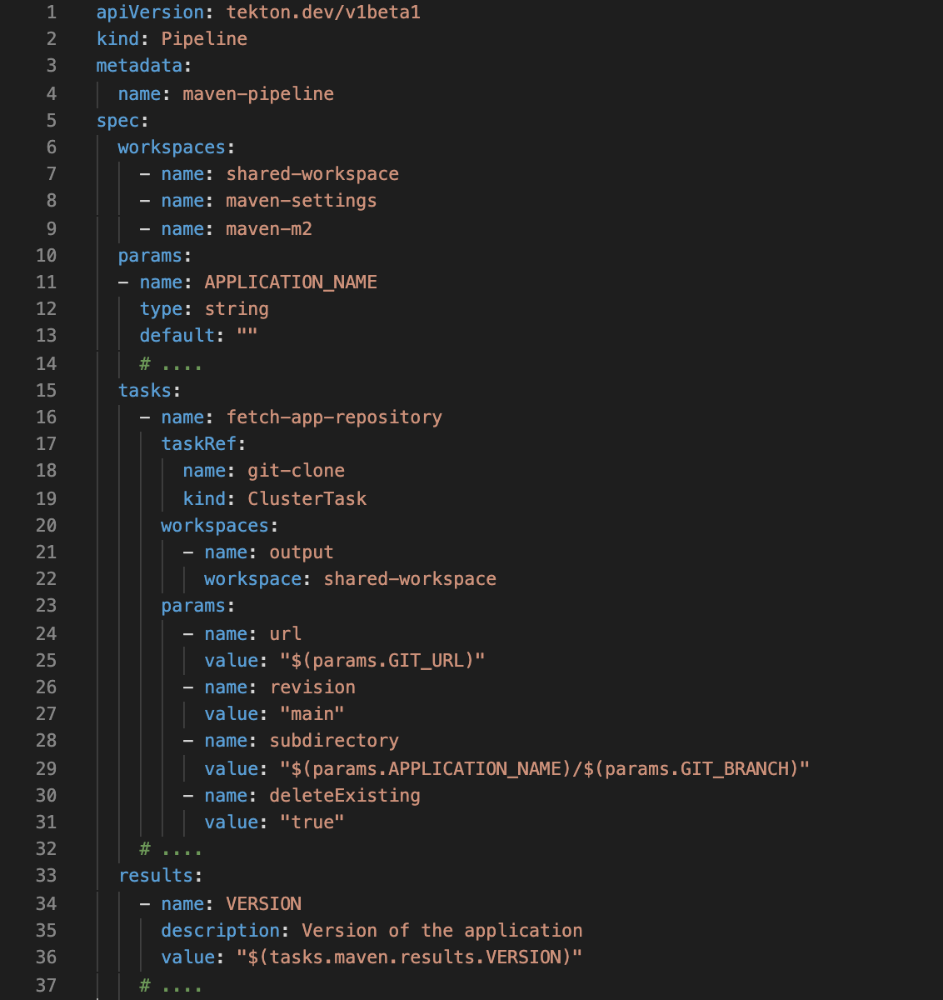
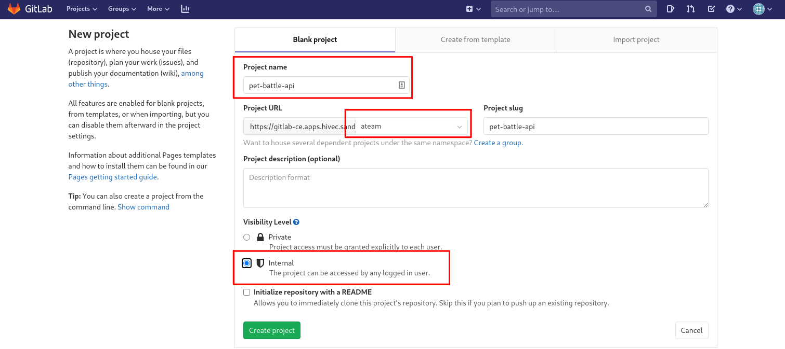
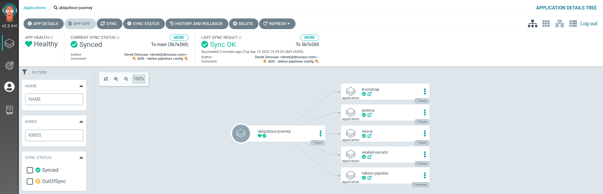
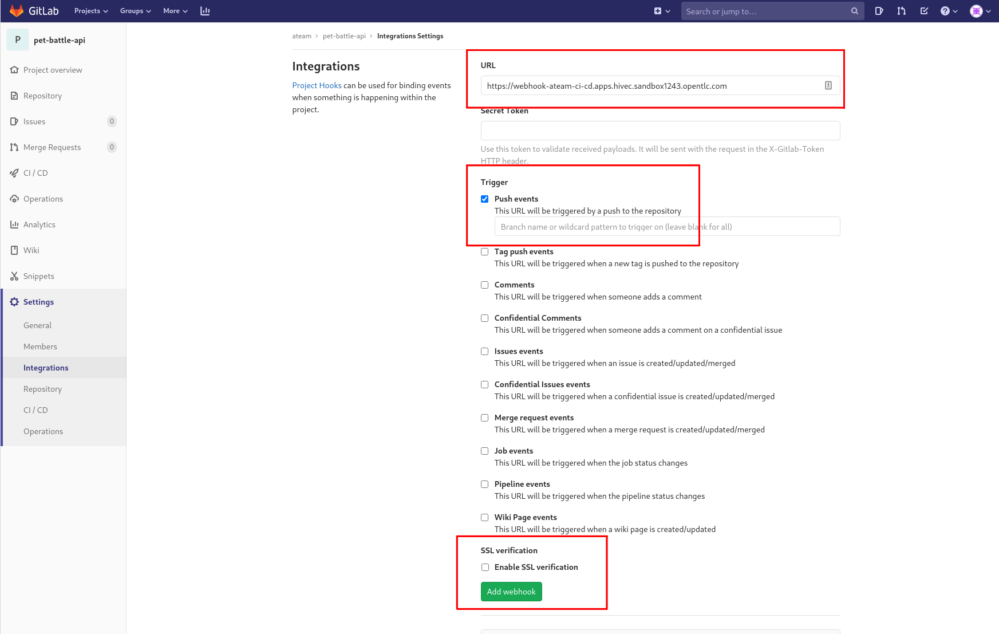
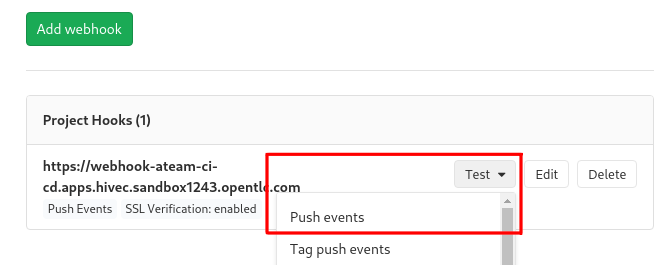
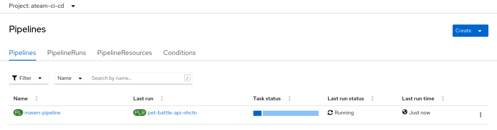

### Tektonパイプライン

> Tekton (OpenShift Pipelines) は、CI/CDの分野での新星です。KubernetesネイティブでCI/CDを実行するため、急速に人気が高まっています。

Jenkins の機能と Tekton の機能には多くの類似点があります。たとえば、どちらもパイプライン定義をコードとして Git リポジトリに格納するために使用できます。 Tekton はOperatorとしてクラスターにデプロイされ、ユーザーは YAML パイプラインとタスク定義で定義できます。 <span style="color:blue;"><a href="https://hub.tekton.dev/">Tekton Hub </a></span>は、これらの YAML リソースをコミュニティ間で共有するためのリポジトリであり、標準的なワークフローに優れた再利用性を提供します。

Tekton は、 `Task`や`Pipeline`など、それぞれ異なる目的を持つ多数の YAML ファイルで構成されています。これらは、`Pipeline`のインスタンスと、パイプラインのインスタンスを作成するためのワークスペースを含む別のYAMLファイル（ `PipelineRun` ）にまとめられます。



この演習で使用するパイプラインのこのスニペットでは、以下を定義します。

- パイプラインで使用される`workspaces` (構成マップ、および使用する各タスクの共有ワークスペース)。
- `params` `pipeline`の実行への入力です。たとえば、アプリケーション名やビルドする git リビジョンなどです。
- `tasks`は、パイプラインの要点、つまりパイプラインの各ステップで発生するアクションを定義する場所です。タスクは`ClusterTasks`または`Tasks`です。 `ClusterTasks`は 、すべてのプロジェクトで共有される単なるグローバル タスクです。 `Tasks` は、`Pipelines`と同様に、必要に応じてパラメーターとワークスペースも提供されます。

#### Tektonオブジェクトのデプロイ

1. GitLab UI を開きます。 `<TEAM_NAME>`グループの下に`pet-battle-api`という名前の GitLab プロジェクトを作成します。プロジェクトを**internal**として作成します。

     

2. CodeReady ワークスペースに戻り、PetBattle API コードを git で新しく作成されたリポジトリにフォークします。

    ```bash#test
    cd /projects
    git clone https://github.com/rht-labs/pet-battle-api.git && cd pet-battle-api
    git remote set-url origin https://${GIT_SERVER}/${TEAM_NAME}/pet-battle-api.git
    git branch -M main
    git push -u origin main
    ```

3. Jenkins とは異なり、Tekton パイプライン定義はコードベースに保存されません。代わりに、Ubiquitous Journey プロジェクトと共に Helm Chart としてラップされます。 Tekton Pipelines チャートは、 `tech-exercise`のルートにあります。

     <div class="highlight" style="background: #f7f7f7">
     <pre><code class="language-bash">
            tekton
            ├── Chart.yaml
            ├── templates
            │   ├── pipelines
            │   │   └── maven-pipeline.yaml
            │   ├── secrets
            │   │   ├── rolebindings.yaml
            │   │   └── serviceaccount-pipeline.yaml
            │   ├── tasks
            │   │   ├── bake-image.yaml
            │   │   ├── deploy.yaml
            │   │   ├── helm-package.yaml
            │   │   ├── maven.yaml
            │   │   └── verify.yaml
            │   ├── triggers
            │   │   ├── gitlab-event-listener.yaml
            │   │   ├── gitlab-trigger-binding.yaml
            │   │   └── gitlab-trigger-template.yaml
            │   └── workspaces
            │       ├── configmap-maven-settings.yaml
            │       ├── pipeline-serviceaccount.yaml
            │       ├── pv-build-images.yaml
            │       └── pv-maven-m2.yaml
            └── values.yaml
            </code></pre>
    </div>

    上記の重要な点は次のとおりです。

    - `workspaces` - これらの YAML は、パイプラインの各`tasks`で使用するボリュームです。固定されているがパイプラインにロードできる ConfigMap やその他のリソースは、ここに格納されます。
    - `tasks` - これらは Tekton のビルディング ブロックです。これらは、パラメーターを受け取り、提供されたイメージのシェルでステップを実行するカスタムリソースです。結果を生成し、ワークスペースを他のタスクと共有できます。
    - `secrets` - パイプラインで使用される安全なデータ
    - `pipelines` - これはパイプラインの定義で,<br>上記のすべての項目 (ワークスペース、タスク、シークレットなど) を、便利で再利用可能な一連のアクティビティに結び付けます。
    - `triggers`フォルダーには、Webhook の構成が格納されます。 gitlab から WebHooks を追加してパイプラインをトリガーし、このディレクトリのリソースを使用して Webhook エンドポイント ( `gitlab-event-listener.yaml` ) を公開し、そこからのデータを解析 ( `gitlab-trigger-binding.yaml` ) して PipelineRun をトリガーします。 ( `gitlab-trigger-template.yaml` )

4. Tekton パイプラインは単なる YAML であるため、コードでパイプラインを使用できるように、Argo CD でパイプラインをクラスターに同期させることができます。パイプライン定義をデプロイするには、 `ubiquitous-journey/values-tooling.yaml`を編集します。 ArgoCD アプリケーションリストにチャートを追加して、調査した tekton チャートへの参照を追加します。

    ```yaml
      # Tekton Pipelines
      - name: tekton-pipeline
        enabled: true
        source: "https://<GIT_SERVER>/<TEAM_NAME>/tech-exercise.git"
        source_ref: main
        source_path: tekton
        values:
          team: <TEAM_NAME>
          cluster_domain: <CLUSTER_DOMAIN>
          git_server: <GIT_SERVER>
    ```

    非常に面倒な場合は、このコードを実行して置換を行うこともできます。

    ```bash#test
    if [[ $(yq e '.applications[] | select(.name=="tekton-pipeline") | length' /projects/tech-exercise/ubiquitous-journey/values-tooling.yaml) < 1 ]]; then
        yq e '.applications += {"name": "tekton-pipeline","enabled": true,"source": "https://GIT_SERVER/TEAM_NAME/tech-exercise.git","source_ref": "main","source_path": "tekton","values": {"team": "TEAM_NAME","cluster_domain": "CLUSTER_DOMAIN","git_server": "GIT_SERVER"}}' -i /projects/tech-exercise/ubiquitous-journey/values-tooling.yaml
        sed -i "s|GIT_SERVER|$GIT_SERVER|" /projects/tech-exercise/ubiquitous-journey/values-tooling.yaml
        sed -i "s|TEAM_NAME|$TEAM_NAME|" /projects/tech-exercise/ubiquitous-journey/values-tooling.yaml
        sed -i "s|CLUSTER_DOMAIN|$CLUSTER_DOMAIN|" /projects/tech-exercise/ubiquitous-journey/values-tooling.yaml
    fi
    ```

5. Tekton は、パイプラインの一部として Helm Chart への変更を Nexus にプッシュします。当初、別のチャート リポジトリからプルするように App of Apps を構成したため、Pet Battle の`pet-battle/test/values.yaml`ファイルを更新して、OpenShift にデプロイされた Nexus チャート リポジトリを指すようにする必要もあります。以下に示すように、 `pet-battle-api`の`source`を更新します。

     <div class="highlight" style="background: #f7f7f7">
     <pre><code class="language-yaml">
              # Pet Battle Apps
              pet-battle-api:
                name: pet-battle-api
                enabled: true
                source: http://nexus:8081/repository/helm-charts #&lt;- update this
                chart_name: pet-battle-api
                source_ref: 1.2.1 # helm chart version
                values:
                  image_name: pet-battle-api
                  image_version: latest # container image version
            </code></pre>
    </div>

    非常に面倒な場合は、このコードを実行して置換を行うこともできます。

    ```bash#test
    yq e '.applications.pet-battle-api.source |="http://nexus:8081/repository/helm-charts"' -i /projects/tech-exercise/pet-battle/test/values.yaml
    ```

6. git を更新して、Tekton パイプラインが ArgoCD にデプロイされるのを待ちます。

    ```bash#test
    cd /projects/tech-exercise
    git add .
    git commit -m  "🍕 ADD - tekton pipelines config 🍕"
    git push
    ```

    

7. パイプライン定義がクラスターに同期され (Argo CD に感謝🐙👏)、コードベースがフォークされたので、Webhook を GitLab `pet-battle-api`プロジェクトに追加できるようになりました。まず、パイプラインをトリガーするために呼び出す URL を取得します。

    ```bash#test
    echo https://$(oc -n ${TEAM_NAME}-ci-cd get route webhook --template='{{ .spec.host }}')
    ```

8. URL を取得したら、GitLab で`pet-battle-api > Settings > Integrations`に移動して、Webhook を追加します。

    - `Push Events`を選択し、今のところブランチを空のままにします
    - `SSL Verification`を選択
    - `Add webhook`ボタンをクリックします。

    

    GitLab から Webhook の動作をテストできます。

    

9. これらすべてのコンポーネントが配置されたら、Pet Battle API のコードをチェックインして、Webhook 経由でパイプラインをトリガーします。アプリケーションのバージョンに簡単な変更を加えてみましょう。 pet- `pet-battle-api` -api `pom.xml`を編集し、 `version`番号を更新します。パイプラインは`chart/Chart.yaml`これらのバージョンで更新します。

    ```xml
        <artifactId>pet-battle-api</artifactId>
        <version>1.3.1</version>
    ```

    非常に面倒な場合は、このコードを実行して置換を行うこともできます。

    ```bash#test
    cd /projects/pet-battle-api
    mvn -ntp versions:set -DnewVersion=1.3.1
    ```

10. いつものように、コードを git にプッシュして ...

    ```bash#test
    cd /projects/pet-battle-api
    git add .
    git commit -m  "🍕 UPDATED - pet-battle-version to 1.3.1 🍕"
    git push
    ```

    🪄 OpenShift UIの`<TEAM_NAME>-ci-cd`プロジェクトにおいて、 左ペインのPipelines -> Pipelines でパイプラインの実行状況を確認します。

    

?> **TIP** **tkn**コマンド ラインを使用して、 `PipelineRun`ログを観察することもできます。

```bash
tkn -n ${TEAM_NAME}-ci-cd pr logs -Lf
```

🪄パイプラインの実行を観察します:D - この時点で、グループの残りの半分にチェックインし、アプリの統合に成功したかどうかを確認します🪄
