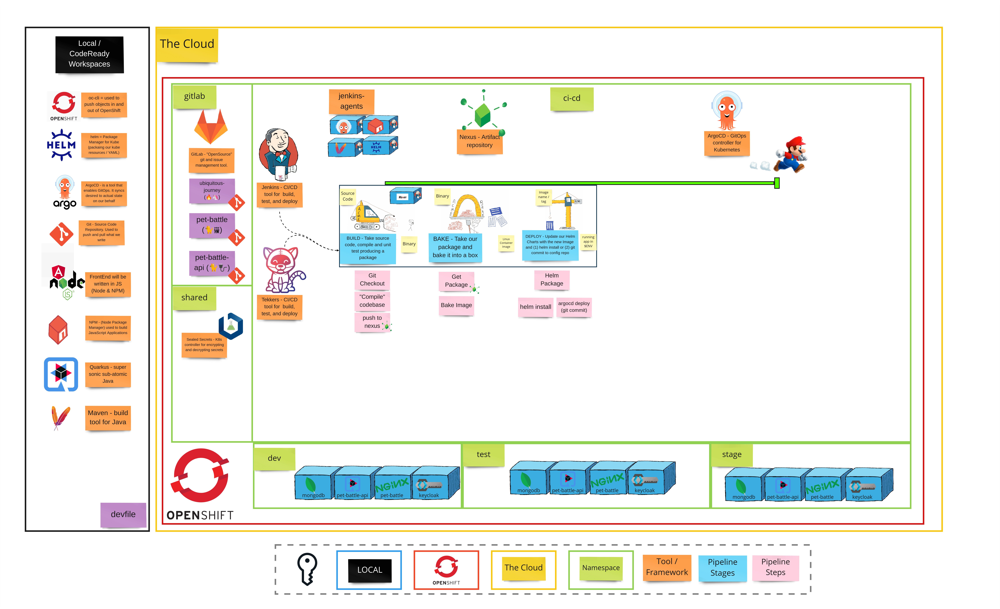

# 演習 2 - パイプラインの攻撃

> パイプラインの仕事は、コードが実稼働の準備ができていないことを証明することです。

## 👨‍🍳演習の説明

**継続的デリバリー(Continuous Delivery、CDと略)とは**、コードの変更 (*機能*、*構成の変更*、*バグ修正*、*実験*) を実稼動環境またはユーザーの手に**安全に**、**迅速**かつ**持続可能な**方法で提供する機能です。 CDのエンジニアリングアプローチの一環として、ビルド、テスト、リリースのプロセスを体系化し、ソフトウェアをいつでも確実にリリースできるようにします。これは**パイプライン**の仕事です。そうすることで、ソフトウェアのビルド、テスト、およびリリースがより高速になり、より頻繁に行われます。

## 🖼️ Big Picture

## 🔮 学習成果

- git 経由で App Config を管理できます
- ソフトウェア Jenkins または Tekton を自動的にビルド /イメージ作成/ デプロイできます
- パイプラインで使用されるシークレットを git に安全に保存できます

## 🔨 この演習で使用するツール

- <a href="https://github.com/bitnami-labs/sealed-secrets">SealedSecrets</a> - シークレットを暗号化して安全に保存するのに役立ちます。パブリック リポジトリにも使用できます。
- <a href="https://tekton.dev/">Tekton</a> - クラウド ネイティブな CI/CD ツールで、どこでもビルド、テスト、デプロイできます。
- <a href="https://jenkins.io/">Jenkins</a> - オープン ソース ビルド自動化サーバー.プラグインによる高度なカスタマイズが可能です。
- <a href="https://www.sonatype.com/nexus-repository-sonatype">Nexus</a> - 多くのアプリケーション タイプを格納するためのリポジトリ マネージャー. `npm`および`Docker`レジストリーもホストできます。
