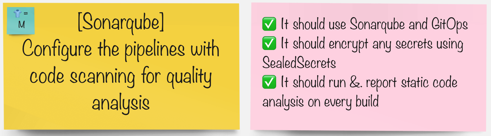
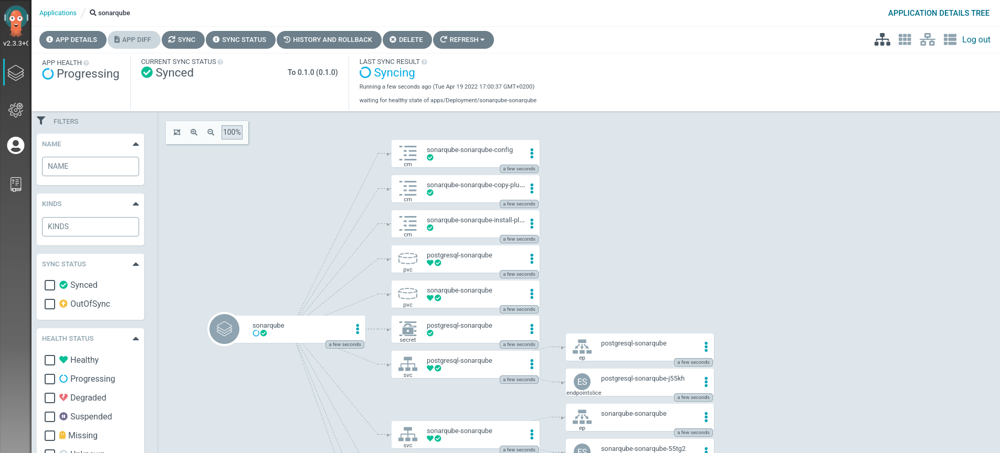
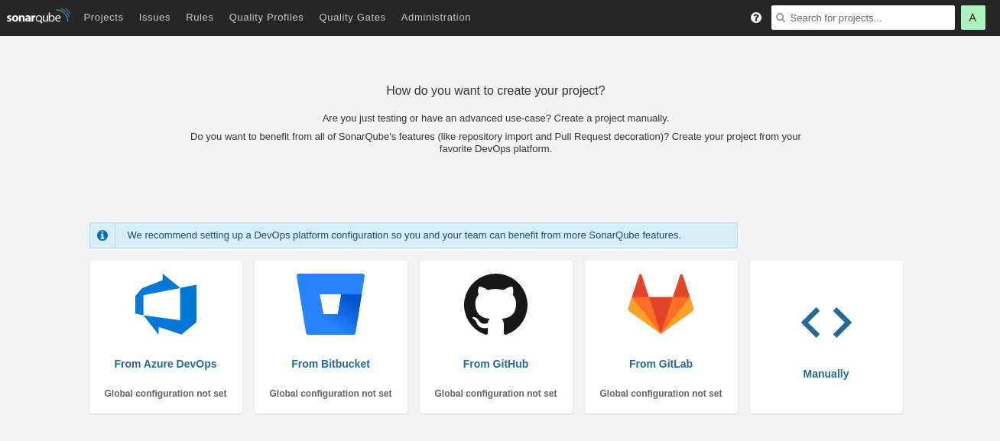

# Sonarスキャン

> Sonarqube は、静的コード分析を実行するツールです。コーディングの落とし穴を探して報告します。脆弱性をキャッチするための優れたツールです。

## タスク



## GitOps を使用して Sonarqube をデプロイする

1. デプロイとパイプラインが実行時にシークレットを活用できるように、Sonarqube 管理者ユーザー用に Git リポジトリに SealedSecrets を作成します*(はい、GitOps であるためです!)* 。

    ```bash
    cat << EOF > /tmp/sonarqube-auth.yaml
    apiVersion: v1
    data:
      username: "$(echo -n admin | base64 -w0)"
      password: "$(echo -n admin123 | base64 -w0)"
      currentAdminPassword: "$(echo -n admin | base64 -w0)"
    kind: Secret
    metadata:
      labels:
        credential.sync.jenkins.openshift.io: "true"
      name: sonarqube-auth
    EOF
    ```

2. 前と同じように、 `kubeseal`コマンド ラインを使用して、作成したシークレット定義を暗号化します。

    ```bash
    kubeseal < /tmp/sonarqube-auth.yaml > /tmp/sealed-sonarqube-auth.yaml \
        -n ${TEAM_NAME}-ci-cd \
        --controller-namespace tl500-shared \
        --controller-name sealed-secrets \
        -o yaml
    ```

    この暗号化の結果、特に`encryptedData`を取得します。

    ```bash
    cat /tmp/sealed-sonarqube-auth.yaml| grep -E 'username|password|currentAdminPassword'
    ```

    非常に長い無意味な文字列を含む出力は、次のようになります。

     <div class="highlight" style="background: #f7f7f7">
     <pre><code class="language-yaml">
            username: AgAj3JQj+EP23pnzu...
            password: AgAtnYz8U0AqIIaqYrj...
            currentAdminPassword: AgAtnYz8U0AqIIaqYrj...
        </code></pre>
    </div>
    

3. `ubiquitous-journey/values-tooling.yaml`ファイルを開き、 **Sealed Secrets**エントリを拡張します。前のコマンドからの`username` 、 `password` 、および`currentAdminPassword`の出力をコピーし、値を更新します。データを正しくインデントしていることを確認してください。

    Sealed Secrets エントリを見つけます。次のようになっているはずです (これをコピーしないでください!)。

     <div class="highlight" style="background: #f7f7f7">
     <pre><code class="language-yaml">
          # Sealed Secrets
          - name: sealed-secrets
            values:
              secrets:
        </code></pre>
    </div>

    `sonarqube-auth`エントリを追加します (これをコピーしてください!):

    ```yaml
            - name: sonarqube-auth
              type: Opaque
              labels:
                credential.sync.jenkins.openshift.io: "true"
              data:
                username: AgAj3JQj+EP23pnzu...
                password: AgAtnYz8U0AqIIaqYrj...
                currentAdminPassword: AgCHCphbYpeLYMPK...
    ```

    変更をプッシュします。

    ```bash
    cd /projects/tech-exercise
    git add ubiquitous-journey/values-tooling.yaml
    git commit -m  "🍳 ADD - sonarqube creds sealed secret 🍳"
    git push
    ```

  <p class="tip"><b>error: failed to push some refs to..</b>のようなエラーが発生した場合は、 <b><i>git pull --rebase</i></b>を実行してから、再度<b><i>git push</i></b>を実行してください。</p>


1. UI またはターミナルをチェックして、クラスターで使用可能なシークレット定義があることを確認します。

    ```bash
    oc get secrets -n <TEAM_NAME>-ci-cd | grep sonarqube-auth
    ```

2. コード品質ツールである**Sonarqube**をインストールします。 IDE で`ubiquitous-journey/values-tooling.yaml`ファイルを編集し、 `applications`リストに追加します。

    ```yaml
      # Sonarqube
      - name: sonarqube
        enabled: true
        source: https://redhat-cop.github.io/helm-charts
        chart_name: sonarqube
        source_ref: "0.1.0"
        values:
          account:
            existingSecret: sonarqube-auth
          initContainers: true
          plugins:
            install:
              - https://github.com/checkstyle/sonar-checkstyle/releases/download/9.2/checkstyle-sonar-plugin-9.2.jar
              - https://github.com/dependency-check/dependency-check-sonar-plugin/releases/download/2.0.8/sonar-dependency-check-plugin-2.0.8.jar
    ```

3. Git の追加、コミット、変更のプッシュ (GITOPS 🪄🪄)。 ArgoCD では、それが生きているのがわかります。

    ```bash
    cd /projects/tech-exercise
    git add .
    git commit -m  "🦇 ADD - sonarqube 🦇"
    git push
    ```

    

4. Sonarqube UI に接続して、インストールが成功したかどうかを確認します (ユーザー名`admin`とパスワード`admin123` )。

    ```bash
    echo https://$(oc get route sonarqube --template='{{ .spec.host }}' -n ${TEAM_NAME}-ci-cd)
    ```

    

    ツールがデプロイされたので...

#### グループで、パイプラインを統合するツールを選択します。

|🐈 **Jenkinsグループ** 🐈 | 🐅 **Tekton グループ** 🐅|
|--- | ---
|* コード分析を実行するようにパイプラインを構成する | * コード分析を実行するようにパイプラインを構成する|
|* 品質ゲートをチェックするようにパイプラインを構成する | * 品質ゲートをチェックするようにパイプラインを構成する|
|* アプリケーション コードの品質を向上させる | * アプリケーション コードの品質を向上させる|
|<span style="color:blue;"><p><a href="3-revenge-of-the-automated-testing/1a-jenkins.md">jenkins</a></p></span> | <span style="color:blue;"><p><a href="3-revenge-of-the-automated-testing/1b-tekton.md">tekton</a></p></span>|
