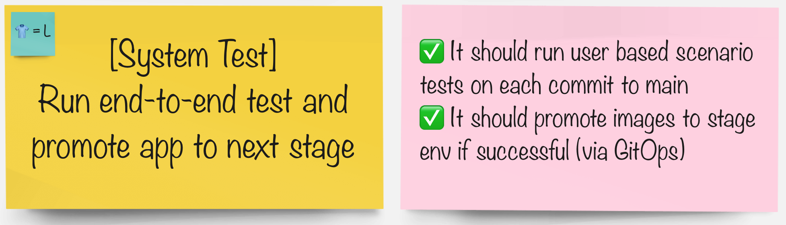

# システムテスト

> 次の段階に進む前に、システムの各部分が期待どおりに動作していることを検証します。

## タスク

#### グループで、パイプラインを統合するツールを選択します。

|🐈‍⬛ **Jenkinsグループ** 🐈‍⬛ | 🐅 **Tekton グループ** 🐅|
|--- | ---|
|* | *|
|
<a href="3-revenge-of-the-automated-testing/10a-jenkins.md">jenkins</a>
 | 
<a href="3-revenge-of-the-automated-testing/10b-tekton.md">tekton</a>
|
