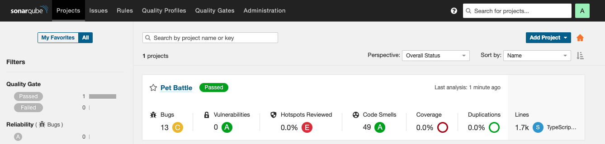

## Sonar スキャンを使用して Jenkins パイプラインを拡張する

> この演習では、品質指標のためにコード ベースを Sonar に接続します。

1. CodeReadyWorkspace を開き、 `pet-battle`プロジェクトのルートにsonar ファイルを作成します。このファイルには、Sonarqube インスタンスの情報と、コード ベースの評価中にスキャナーが使用するその他のプロパティが含まれています。

    ```javascript
    cd /projects/pet-battle
    cat << EOF > sonar-project.js
    const scanner = require('sonarqube-scanner');

    scanner(
      {
        serverUrl: 'http://sonarqube-sonarqube:9000',
        options: {
          'sonar.login': process.env.SONARQUBE_USERNAME,
          'sonar.password': process.env.SONARQUBE_PASSWORD,
          'sonar.projectName': 'Pet Battle',
          'sonar.projectDescription': 'Pet Battle UI',
          'sonar.sources': 'src',
          'sonar.tests': 'src',
          'sonar.inclusions': '**', // Entry point of your code
          'sonar.test.inclusions': 'src/**/*.spec.js,src/**/*.spec.ts,src/**/*.spec.jsx,src/**/*.test.js,src/**/*.test.jsx',
          'sonar.exclusions': '**/node_modules/**',
          //'sonar.test.exclusions': 'src/app/core/*.spec.ts',
          // 'sonar.javascript.lcov.reportPaths': 'reports/lcov.info',
          // 'sonar.testExecutionReportPaths': 'coverage/test-reporter.xml'
        }
      },
      () => process.exit()
    );
    EOF
    ```

2. 次に、SonarQube 資格情報を`Jenkinsfile`に導入する必要があります。これらは既に Git からクラスターに同期されているため、パイプラインにそれらを使用するように指示するだけです。 `Jenkinsfile`の`environment {}`ブロックの他の`CREDS`のリストに以下を追加します。

     <p class="warn">⛷️<b>注</b>⛷️ - OpenShift 4.11+ で DevSpaces を使用している場合は、Jenkinsfileを開くためにpet-battleフォルダーを Che Workspace に追加する必要がある場合があります。</p>


    

    ```groovy
            SONARQUBE_CREDS = credentials("${OPENSHIFT_BUILD_NAMESPACE}-sonarqube-auth")
    ```

    その後、次のようなものが得られます。

     <div class="highlight" style="background: #f7f7f7">
     <pre><code class="language-groovy">
        environment {
            // .. other stuff ...
                // Credentials bound in OpenShift
                GIT_CREDS = credentials("${OPENSHIFT_BUILD_NAMESPACE}-git-auth")
                NEXUS_CREDS = credentials("${OPENSHIFT_BUILD_NAMESPACE}-nexus-password")
                SONAR_CREDS = credentials("${OPENSHIFT_BUILD_NAMESPACE}-sonar-auth")
            // .. more stuff ...
        }
        </code></pre>
    </div>
    

3. `// SONARQUBE SCANNING`プレースホルダーがある場所に、以前に追加したパイプラインの`stage("🧰 Build (Compile App)")`ステージにシェル ステップを追加します。これは、ビルドの前に行う必要があります。

    ```bash
                    // 🌞 SONARQUBE SCANNING EXERCISE GOES HERE
                    echo '### Running SonarQube ###'
                    sh '''
                      export SONARQUBE_USERNAME=${SONARQUBE_CREDS_USR}
                      export SONARQUBE_PASSWORD=${SONARQUBE_CREDS_PSW}
                      npm run sonar
                    '''
    ```

4. 変更を git リポジトリにプッシュすると、新しいビルドもトリガーされます。

    ```bash
    cd /projects/pet-battle
    git add Jenkinsfile sonar-project.js
    git commit -m "🧦 test code-analysis step 🧦"
    git push
    ```

5. パイプラインを観察し、スキャンが完了したら、Sonarqube UI を参照して詳細を確認します。

    
