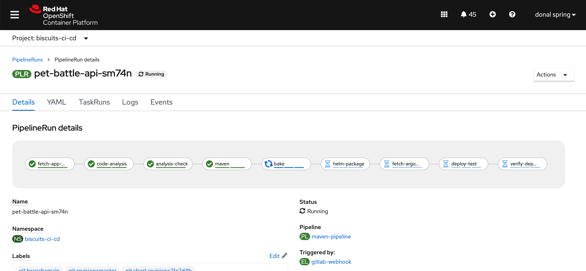
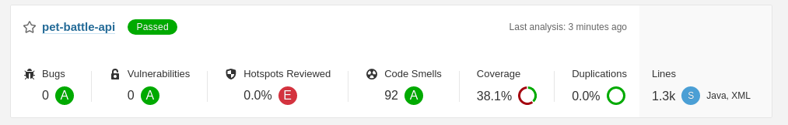

## Sonar スキャンによる Tekton パイプラインの拡張

> この演習では、tekton `Pipeline`を編集して、API のソナーを使用してcode-analysisを実行し、追加の`Task`を追加して結果を分析します。

1. `Pipeline`に`code-analysis`ステップを追加します。 `tech-exercise/tekton/templates/pipelines/maven-pipeline.yaml`ファイルを編集し、 `maven`ビルド ステップの前にこのステップを追加します。ここで新しいタスクを作成する必要はありません。いくつかの新しいパラメーターを既存の`maven`タスクに提供するだけで、Tekton コンポーネントの再利用性が大幅に向上します。

    ```yaml
        # Code Analysis
        - name: code-analysis
          taskRef:
            name: maven
          params:
            - name: WORK_DIRECTORY
              value: "$(params.APPLICATION_NAME)/$(params.GIT_BRANCH)"
            - name: GOALS
              value: "test sonar:sonar"  # - org.owasp:dependency-check-maven:check
            - name: MAVEN_BUILD_OPTS
              value: "-Dsonar.host.url=http://sonarqube-sonarqube:9000 -Dsonar.userHome=/tmp/sonar"
          runAfter:
            - fetch-app-repository
          workspaces:
            - name: maven-settings
              workspace: maven-settings
            - name: maven-m2
              workspace: maven-m2
            - name: output
              workspace: shared-workspace
            - name: sonarqube-auth
              workspace: sonarqube-auth
    ```

2. また、パイプラインの実行をトリガーするときに、 `sonarqube-auth`ワークスペースをシークレットにバインドする必要があります。これを行うには`tekton/templates/triggers/gitlab-trigger-template.yaml`ファイルを編集し、 `# sonarqube-auth`プレースホルダーがある`workspaces list`の末尾にこのコードを追加します。

    ```yaml
            # sonarqube-auth
            - name: sonarqube-auth
              secret:
                secretName: sonarqube-auth
    ```

3. Tekton タスクは yaml の一部です。そのため、タスクを簡単に追加できます。 Tekton Hub は、特定のアクティビティを行うための再利用可能なコンポーネントを見つけるのに最適な場所です。この例では、 `sonarqube-quality-gate-check.yaml`タスクを取得してクラスターに追加します。後で`tekton/templates/tasks/sonarqube-quality-gate-check.yaml`ファイルを開くと、タスクがイメージ内の 1 つのシェル スクリプトを実行する単純なタスクであることがわかります。

    ```bash
    cd /projects/tech-exercise
    cat <<'EOF' >> tekton/templates/tasks/sonarqube-quality-gate-check.yaml
    apiVersion: tekton.dev/v1beta1
    kind: Task
    metadata:
      name: sonarqube-quality-gate-check
    spec:
      description: >-
        This Task can be used to check sonarqube quality gate
      workspaces:
        - name: output
        - name: sonarqube-auth
          optional: true
      params:
        - name: WORK_DIRECTORY
          description: Directory to start build in (handle multiple branches)
          type: string
        - name: IMAGE
          description: the image to use
          type: string
          default: "quay.io/eformat/openshift-helm:latest"
      steps:
      - name: check
        image: $(params.IMAGE)
        script: |
          #!/bin/sh
          test -f $(workspaces.sonarqube-auth.path) || export SONAR_USER="$(cat $(workspaces.sonarqube-auth.path)/username):$(cat $(workspaces.sonarqube-auth.path)/password)"
      
          cd $(workspaces.output.path)/$(params.WORK_DIRECTORY)
          TASKFILE=$(find . -type f -name report-task.txt)
          if [ -z ${TASKFILE} ]; then
            echo "Task File not found"
            exit 1
          fi
          echo ${TASKFILE}

          TASKURL=$(cat ${TASKFILE} | grep ceTaskUrl)
          TURL=${TASKURL##ceTaskUrl=}
          if [ -z ${TURL} ]; then
            echo "Task URL not found"
            exit 1
          fi
          echo ${TURL}

          AID=$(curl -u ${SONAR_USER} -s $TURL | jq -r .task.analysisId)
          if [ -z ${AID} ]; then
            echo "Analysis ID not found"
            exit 1
          fi
          echo ${AID}

          SERVERURL=$(cat ${TASKFILE} | grep serverUrl)
          SURL=${SERVERURL##serverUrl=}
          if [ -z ${SURL} ]; then
            echo "Server URL not found"
            exit 1
          fi
          echo ${SURL}

          BUILDSTATUS=$(curl -u ${SONAR_USER} -s $SURL/api/qualitygates/project_status?analysisId=${AID} | jq -r .projectStatus.status)
          if [ "${BUILDSTATUS}" != "OK" ]; then
            echo "Failed Quality Gate - please check - $SURL/api/qualitygates/project_status?analysisId=${AID}"
            exit 1
          fi

          echo "Quality Gate Passed OK - $SURL/api/qualitygates/project_status?analysisId=${AID}"
          exit 0
    EOF
    ```

4. このタスクをパイプラインに追加しましょう。以下に示すように`tech-exercise/tekton/templates/pipelines/maven-pipeline.yaml`ファイルを編集し、 `code-analysis-check`ステップをパイプラインに追加します。

    ```yaml
        # Code Analysis Check
        - name: analysis-check
          retries: 1
          taskRef:
            name: sonarqube-quality-gate-check
          workspaces:
            - name: output
              workspace: shared-workspace
            - name: sonarqube-auth
              workspace: sonarqube-auth
          params:
          - name: WORK_DIRECTORY
            value: "$(params.APPLICATION_NAME)/$(params.GIT_BRANCH)"
          runAfter:
          - code-analysis
    ```

5. Tekton では、 `runAfter`を使用してパイプラインの構造を整理することでフローを制御できます。 `maven`ビルド ステップの`runAfter`を`analysis-check`に設定して、アプリをコンパイルする前に静的分析ステップが行われるようにします。

     <div class="highlight" style="background: #f7f7f7"><pre><code class="language-yaml">
            - name: maven
              taskRef:
                name: maven
              runAfter:
                - analysis-check # &lt;- update this 💪💪
              params:
                - name: WORK_DIRECTORY
                  value: "$(params.APPLICATION_NAME)/$(params.GIT_BRANCH)"
                - name: GOALS
                  value: "package"
                - name: MAVEN_BUILD_OPTS
                  value: "-Dquarkus.package.type=fast-jar -DskipTests"
              workspaces:
                - name: maven-settings
                  workspace: maven-settings
                - name: maven-m2
                  workspace: maven-m2
                - name: output
                  workspace: shared-workspace
        </code></pre></div>
    

6. これらすべての変更が整ったら、Git で追加、コミット、変更をプッシュして、パイプライン定義がクラスターで更新されるようにします。

    ```bash
    cd /projects/tech-exercise
    git add .
    git commit -m  "🥽 ADD - code-analysis & check steps 🥽"
    git push
    ```

7. 次に、パイプライン ビルドをトリガーします。空のコミットをリポジトリにプッシュして、パイプラインをトリガーできます。

    ```bash
    cd /projects/pet-battle-api
    git commit --allow-empty -m "🧦 TEST - running code analysis steps 🧦"
    git push
    ```

     <p class="warn"><b>ヒント</b>- リポジトリにコミットを追加したくない場合は、いつでも GitLab にアクセスして、そこから WebHook を直接トリガーすることができます。これにより、パイプラインも開始されますが、git 履歴には痕跡が残りません🧙‍♀️✨🧙‍♀️ .</p>

    

8. パイプラインが完了すると、Sonarqube UI で結果を調べることができます。 Sonarqube の URL を参照

    ```bash
    echo https://$(oc get route sonarqube --template='{{ .spec.host }}' -n ${TEAM_NAME}-ci-cd)
    ```

    
