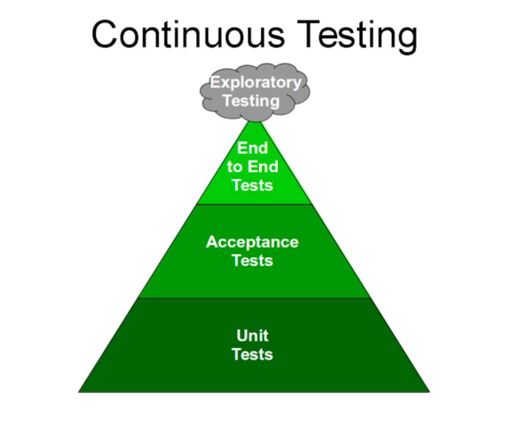
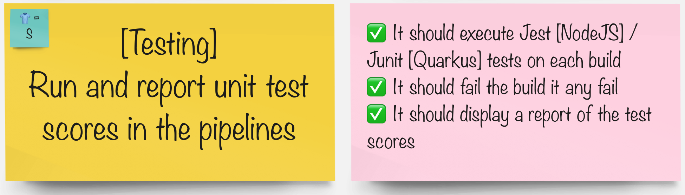

# 自動テスト

> テスト テスト .... 始めてますか?

継続的デリバリーには、迅速で信頼できるフィードバックが必要です。継続的なテストへの投資は価値のある活動です。

## タスク

#### グループで、パイプラインを統合するツールを選択します。

|🐈‍⬛ **Jenkins グループ** 🐈‍⬛ | 🐅 **Tekton グループ** 🐅|
--- | ---
|* パイプラインに Jest テストを追加 | * パイプラインに Junit と Alure のテスト レポートを追加|
|
<a href="3-revenge-of-the-automated-testing/2a-jenkins.md">jenkins</a>
 | 
<a href="3-revenge-of-the-automated-testing/2b-tekton.md">tekton</a>
|
