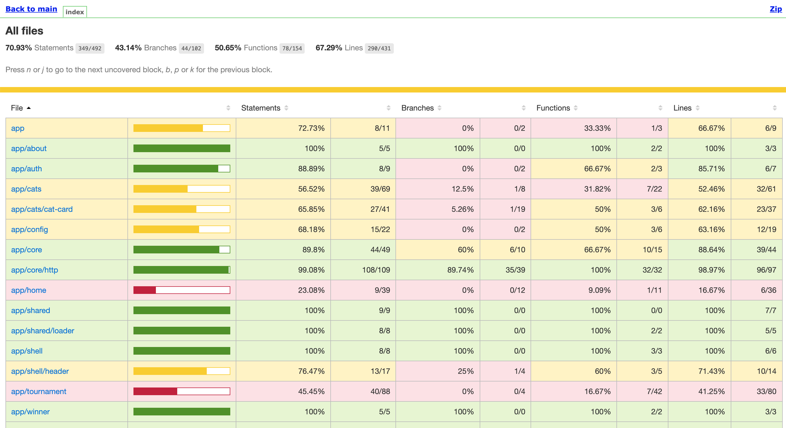

## 自動テストによるJenkinsパイプラインの拡張

> Jest は、Facebook の友好的な人々によって構築された、超高速で軽量な JavaScript テスト フレームワークです。これを使用して、Angular コンポーネントを評価します。

1. Frontendの場合 - Jest を使用して単体テストを実行します。テストは、 `Describe("something")`と一連の`it('')`ステートメントの形式で記述され、その処理が何をすべきか、何をすべきでないかを定義します。このようにテストを書くと、簡単に理解できるようになります。

     <div class="highlight" style="background: #f7f7f7">
     <pre>
        <code class="language-javascript">
        describe('MyAwesomeComponent', () =&gt; {
        let component: MyAwesomeComponent;
        beforeEach(async () =&gt; {
            // Do test setup stuff here
        });
        it('should not be visible by default', () =&gt; {
            // Some assertions ....
            expect(div.getAttribute('hidden')).not.toBeNull();
        });
        it('should be visible when a button is clicked', () =&gt; {
            // Write some assertions
        });
        it('should display a message by default', () =&gt; {
            // Arrange
            const span = element.querySelectorAll('span')[0];
            // Assert
            expect(span.textContent).toBe('Some cool thing');
        });
        });
        </code>
        </pre>
     </div>
    

2. テストは、最初に依存関係 ( `npm i` ) をインストールして`npm run test`を実行することにより、IDE ( `/projects/pet-battle`内) で実行できますが、あなたのマシンで動作するかどうかは問題ではないため、先にパイプラインで実行してみましょう！これを行うために、 `Jenkinsfile`の`Build{}`ステージを拡張します。 <span style="color:green;">// 🃏 Jest Testing</span>プレースホルダーがあるパイプラインを拡張します。これは、ビルドを実行する前に行う必要があります。

    ```groovy
                    // 🃏 Jest Testing
                    echo '### Running Jest Testing ###'
                    sh 'npm run test:ci'
    ```

3. テストを`ci`モードで実行する場合、スコアの`xml`出力するように設定しました。Jenkins は結果を読んで、ビルドに失敗するかどうかを判断できるので、これは素晴らしいことです。 `Jenkinsfile`にも`junit`レポートを追加しましょう。テストが実行されると、コード カバレッジの統計情報も収集されます。これは、Jenkins に提供できるもう 1 つのレポートです。

    Jenkinsfile の`post{}`ステップを使用すると、ビルドの一部が終了した後に特定のアクティビティを実行できます。 Jenkins が提供する`always{}` 、 `success{}` 、 `failure{}`などのフックがあり、通知の送信や別のジョブの呼び出しなど、ビルドの結果に基づいてフロー制御を行うことができます。この場合、 `alwasys{}`したがって、これらの`post`ステップを<span style="color:green;">// 📰 Post steps go here</span>プレースホルダーによってパイプラインに追加します。

    ```groovy
          // 📰 Post steps go here
                post {
                    always {
                        dir('pet-battle'){
                        junit 'junit.xml'
                        publishHTML target: [
                            allowMissing: true,
                            alwaysLinkToLastBuild: false,
                            keepAll: false,
                            reportDir: 'reports/lcov-report',
                            reportFiles: 'index.html',
                            reportName: 'Web Code Coverage'
                        ]
                        }
                    }
                }
    ```

     <p class="warn">⛷️<b>注意</b>⛷️ - Sonarスキャンステップを完了している場合は、コード カバレッジの結果を Sonarqube に含めることもできます。 `/projects/pet-battle/sonar-project.js` ファイルを開き、先頭の `//` を削除して行の下のコメントを外し、カバレッジ レポートを SonarQube に保存します。</p>

    ```bash
        'sonar.javascript.lcov.reportPaths': 'reports/lcov.info',
    ```

4. 変更を git リポジトリにプッシュします。これにより、新しいビルドもトリガーされます。

    ```bash
    cd /projects/pet-battle
    git add .
    git commit -m "🍊 ADD - save test results 🍊"
    git push
    ```

5. Jenkins では、テスト結果を表示できるはずです (グラフを表示するには、ビルドを少なくとも 2 回実行します。グラフを表示するには、グラフに複数のデータ ポイントをプロットする必要があるためです)。 

6. `Web Code Coverage` HTML を開くと、コード カバレッジ レポートも表示されるはずです。 
