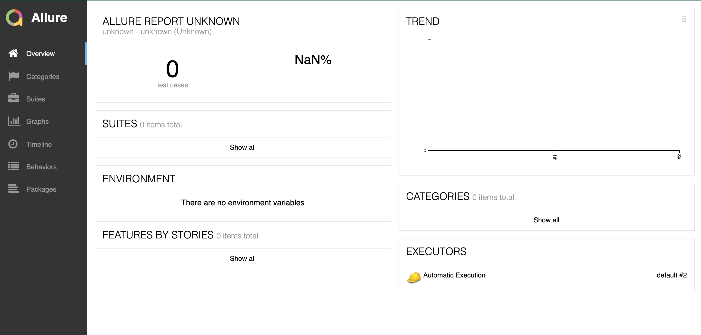
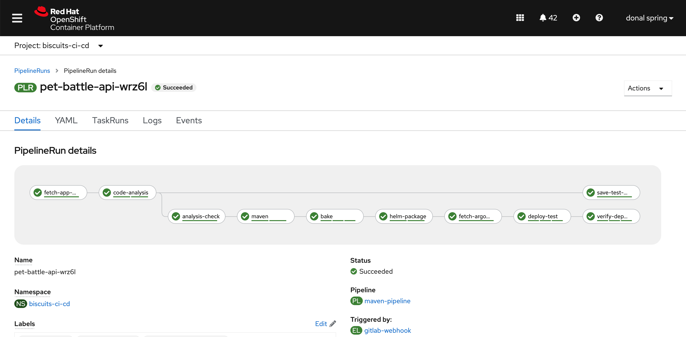
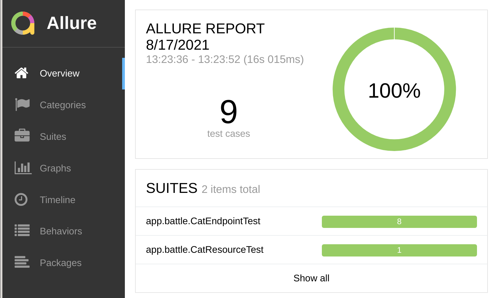
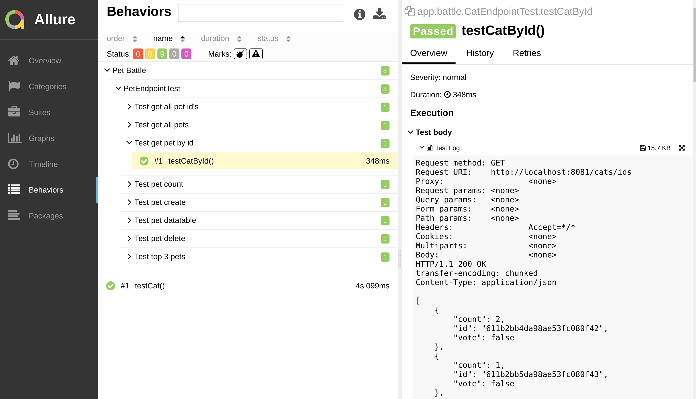
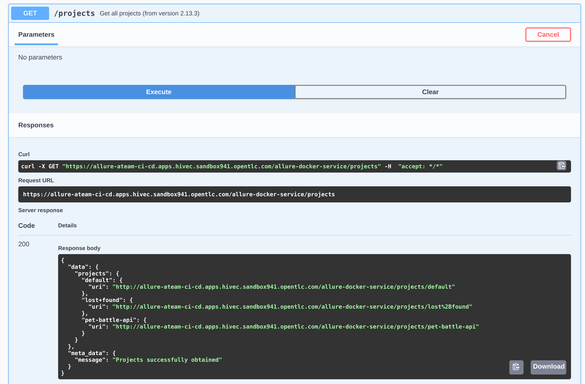

## 自動テストによる Tekton パイプラインの拡張

> この演習では、CI/CD サーバーから Java テストやその他のレポートを管理するための便利なツールである Allure をデプロイします。演習は 2 つの部分に分かれています。最初に gitOps を使用して Allure をデプロイし、次にパイプラインにテストを追加します。

### パート1 - Allure

1. この演習では、Java 用のテスト リポジトリ マネージャーである**Allure**というツールを使用しますが、最初に、このツールで使用するユーザー名とパスワード用の SealedSecrets オブジェクトを作成しましょう。このプロセスは、今ではかなり慣れているはずです 🃏🃏🃏

    ```bash
    cat << EOF > /tmp/allure-auth.yaml
    apiVersion: v1
    data:
      password: "$(echo -n password | base64 -w0)"
      username: "$(echo -n admin | base64 -w0)"
    kind: Secret
    metadata:
      name: allure-auth
    EOF
    ```

2. `kubeseal`コマンドラインを使用して、シークレットの定義を封印します。

    ```bash
    kubeseal < /tmp/allure-auth.yaml > /tmp/sealed-allure-auth.yaml \
        -n ${TEAM_NAME}-ci-cd \
        --controller-namespace tl500-shared \
        --controller-name sealed-secrets \
        -o yaml
    ```

3. `encryptedData`を取得します。

    ```bash
    cat /tmp/sealed-allure-auth.yaml| grep -E 'username|password'
    ```

    出力は次のようになります。

     <div class="highlight" style="background: #f7f7f7">
     <pre><code class="language-yaml">
            username: AgAj3JQj+EP23pnzu...
            password: AgAtnYz8U0AqIIaqYrj...
        </code></pre>
    </div>
    

4. `ubiquitous-journey/values-tooling.yaml`ファイルを開き、 **Sealed Secrets**エントリを拡張します。前のコマンドからの`username`と`password`の出力をコピーし、値を更新します。データを正しくインデントしていることを確認してください。

    Sealed Secretsエントリを見つけます。

     <div class="highlight" style="background: #f7f7f7">
     <pre><code class="language-yaml">
          # Sealed Secrets
          - name: sealed-secrets
            values:
              secrets:
        </code></pre>
    </div>

    `allure-auth`エントリを追加します。

    ```yaml
            - name: allure-auth
              type: Opaque
              data:
                username: AgAj3JQj+EP23pnzu...
                password: AgAtnYz8U0AqIIaqYrj...
    ```

5. `ubiquitous-journey/value-tooling.yaml`ファイルで、Helm チャートを追加して Allure をインストールします。

    ```yaml
      # Allure
      - name: allure
        enabled: true
        source: https://github.com/eformat/allure.git
        source_path: "chart"
        source_ref: "main"
        values:
          security:
            secret: allure-auth
    ```

6. 最後に、変更をリポジトリにプッシュします。

    ```bash
    cd /projects/tech-exercise
    git add ubiquitous-journey/values-tooling.yaml
    git commit -m  "👩‍🏭 ADD - Allure tooling 👩‍🏭"
    git push
    ```

     <p class="warn">error <b>: failed to push some refs to..</b>のようなエラーが発生した場合は、 <b><i>git pull</i></b>を実行してから、上記のコマンドを実行して変更を再度プッシュしてください。</p>
    

7. ArgoCD が同期した後、しばらくすると Allure UI が表示されるはずです。 Allure でデフォルト プロジェクトを参照して、それが稼働中であることを確認できます。

    ```bash
    echo https://$(oc get route allure --template='{{ .spec.host }}' -n ${TEAM_NAME}-ci-cd)/allure-docker-service/projects/default/reports/latest/index.html
    ```

    


### パート 2 - テスト タスク

1. IDE で、テスト スコアをallureにプッシュする tekton タスクを作成しましょう。 `allure-post-report.yaml`タスクを`tekton/templates/tasks/`フォルダーに追加します。

    ```yaml
    cd /projects/tech-exercise
    cat <<'EOF' > tekton/templates/tasks/allure-post-report.yaml
    apiVersion: tekton.dev/v1beta1
    kind: Task
    metadata:
      name: allure-post-report
      labels:
        app.kubernetes.io/version: "0.2"
    spec:
      description: >-
        This task used for uploading test reports to allure
      workspaces:
        - name: output
      params:
        - name: APPLICATION_NAME
          type: string
          default: ""
        - name: IMAGE
          description: the image to use to upload results
          type: string
          default: "quay.io/openshift/origin-cli:4.9"
        - name: WORK_DIRECTORY
          description: Directory to start build in (handle multiple branches)
          type: string
        - name: ALLURE_HOST
          description: "Allure Host"
          default: "http://allure:5050"
        - name: ALLURE_SECRET
          type: string
          description: Secret containing Allure credentials
          default: allure-auth
      steps:
        - name: save-tests
          image: $(params.IMAGE)
          workingDir: $(workspaces.output.path)/$(params.WORK_DIRECTORY)
          env:
            - name: ALLURE_USERNAME
              valueFrom:
                secretKeyRef:
                  name: $(params.ALLURE_SECRET)
                  key: username
            - name: ALLURE_PASSWORD
              valueFrom:
                secretKeyRef:
                  name: $(params.ALLURE_SECRET)
                  key: password
          script: |
            #!/bin/bash
            curl -sLo send_results.sh https://raw.githubusercontent.com/eformat/allure/main/scripts/send_results.sh && chmod 755 send_results.sh
            ./send_results.sh $(params.APPLICATION_NAME) \
              $(workspaces.output.path)/$(params.WORK_DIRECTORY) \
              ${ALLURE_USERNAME} \
              ${ALLURE_PASSWORD} \
              $(params.ALLURE_HOST)
    EOF
    ```

2. Maven パイプライン ( `/projects/tech-exercise/tekton/templates/pipelines/maven-pipeline.yaml` ) を開き、パイプラインに`save-test-results`ステップを追加します。

    ```yaml
        # Save Test Results
        - name: save-test-results
          taskRef:
            name: allure-post-report
          params:
            - name: APPLICATION_NAME
              value: "$(params.APPLICATION_NAME)"
            - name: WORK_DIRECTORY
              value: "$(params.APPLICATION_NAME)/$(params.GIT_BRANCH)"
          runAfter:
            - maven
          workspaces:
            - name: output
              workspace: shared-workspace
    ```

3. <strong>(オプション)</strong>このステップは、前のテスト セクション<a>3. 自動テスト / Sonarqube / Tekton の復習 を</a>実行して<strong>いない</strong>場合にのみ実行してください。それ以外の場合は、この手順をスキップしてください。 Maven パイプライン ( `/projects/tech-exercise/tekton/templates/pipelines/maven-pipeline.yaml` ) を開き、パイプラインから<code>skipTests</code>引数<strong>を削除します</strong>。これにより、単体テストが確実に実行されます。

    以下のビルド オプションの設定を

     <div class="highlight" style="background: #f7f7f7">  <pre><code class="language-yaml">
        - name: maven
          params:
            - name: MAVEN_BUILD_OPTS
              value: "-Dquarkus.package.type=fast-jar <strong>-DskipTests"</strong>
        </code></pre>
    </div>
    次のように変更します。
    <div class="highlight" style="background: #f7f7f7">  <pre><code class="language-yaml">
        - name: maven
          params:
            - name: MAVEN_BUILD_OPTS
              value: "-Dquarkus.package.type=fast-jar"
        </code></pre>
    </div>

4. Git の追加、コミット、変更のプッシュ

    ```bash
    cd /projects/tech-exercise
    git add .
    git commit -m  "🥽 ADD - save-test-results step 🥽"
    git push
    ```

5. 空のコミットで新しい`PipelineRun`をトリガーし、OpenShift Pipelines に移動して実行を確認します。

    ```bash
    cd /projects/pet-battle-api
    git commit --allow-empty -m "🧦 test save-test-results step 🧦"
    git push
    ```

    

6. Allure のパイプラインからアップロードされたテスト結果を参照します。

    ```bash
    echo https://$(oc get route allure --template='{{ .spec.host }}' -n ${TEAM_NAME}-ci-cd)/allure-docker-service/projects/pet-battle-api/reports/latest/index.html
    ```

    ここから、テスト結果と動作を参照できます。

    

    ドリルダウンしてテストの詳細情報を表示することもできます。

    

    <p class="warn"><b>ヒント</b> Allure swagger apiから<span style="color:blue;"><a href="https://allure-<TEAM_NAME>-ci-cd.<CLUSTER_DOMAIN>/allure-docker-service/"><https://allure-<TEAM_NAME>-ci-cd.<CLUSTER_DOMAIN>/allure-docker-service//a></span> に移動すると、利用できるプロジェクトとテストレポートも見つかります。</p>

    
