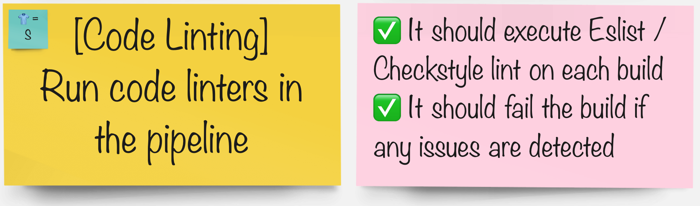

# コードリンティング

> リンティングは、エラーを減らし、コードの全体的な品質を向上させるために重要です。 lint ツールを使用すると、開発を加速し、エラーを早期に発見してコストを削減できます。

## タスク

#### グループで、パイプラインを統合するツールを選択します。

🐈‍⬛ **Jenkinsグループ** 🐈‍⬛ | 🐅 **Tekton グループ** 🐅
--- | ---
* ESlint を使用してコードベースを分析する | * Maven check-style を使用してコードを分析する

<a href="3-revenge-of-the-automated-testing/4a-jenkins.md">jenkins</a>
 | 
<a href="3-revenge-of-the-automated-testing/4b-tekton.md">tekton</a>

