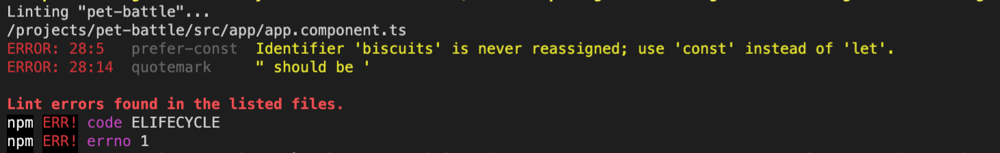

## CodeリンティングによるJenkinsパイプラインの拡張

1. JavaScript には多くの素晴らしい*癖*があり、コンパイルされていないため、コードが特定のスタイルで記述されていることを確認できることが非常に重要です。コードのリンティングを入力してください！大規模なソフトウェア プロジェクトでは、すべてのエンジニア間で一貫性を確保することは、サポートに非常に役立ちます。ビルドにルールを適用することもできます! IDE でアプリの依存関係をインストールし、リンターを実行します。

    ```bash
    cd /projects/pet-battle
    npm i
    npm run lint
    ```

2. リンティングはエラーを表示しないはずですが、コーディング標準に違反するものを導入して、何が起こるか見てみましょう。

    ```bash
    echo 'let biscuits="something"'  >> src/app/app.component.ts
    npm run lint
    ```

    

3. ご覧のとおり、変数が再割り当てされていない場合は`let` の使用を許可せず、ブラウザーの互換性の問題により、二重引用符の代わりに単一引用符を使用するようにルールが設定されています。便利なワンライナーでこれを修正しましょう💪🔥

    ```bash
    npm run lint:fix
    ```

4. 次に、リンターをパイプラインに追加して、ビルドごとにスタイルをチェックし、lint タスクで`Jenkinsfile`の`stage{ "Build" }`を拡張します。

    ```groovy
                    //💅 Lint exercise here
                    echo '### Running Linting ###'
                    sh 'npm run lint'
    ```

5. 変更をリポジトリにプッシュして、新しいビルドをトリガーします。

    ```bash
    cd /projects/pet-battle
    git add .
    git commit -m "💅 ADD - linting to the pipeline 💅"
    git push
    ```

6. Jenkins では、新しいビルドがトリガーされ、リンターがその一部として実行されていることがわかります。
