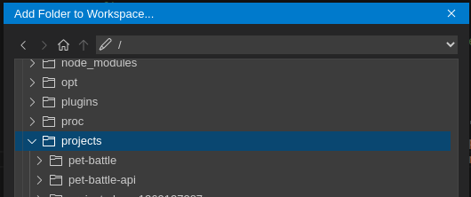
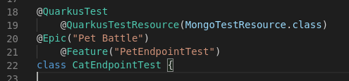
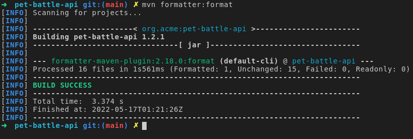
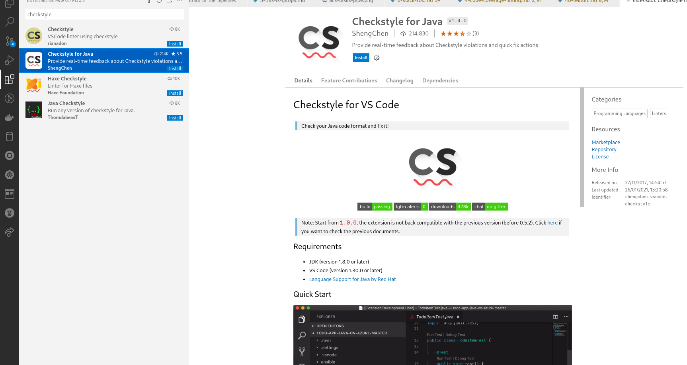
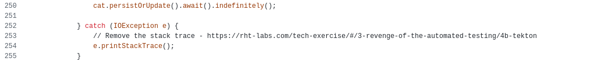
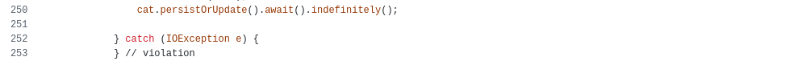
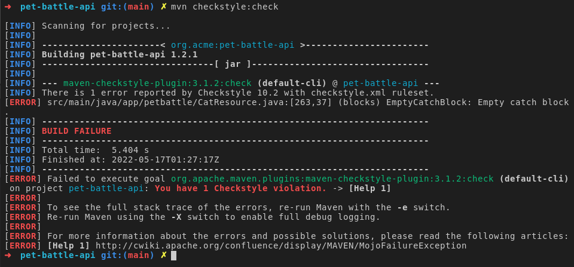
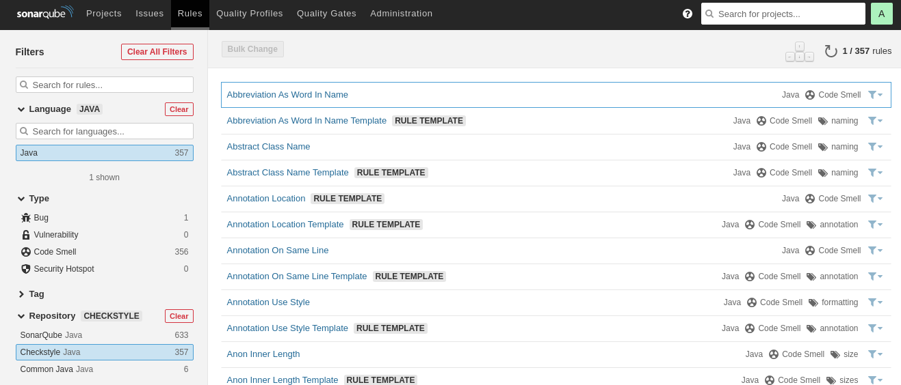
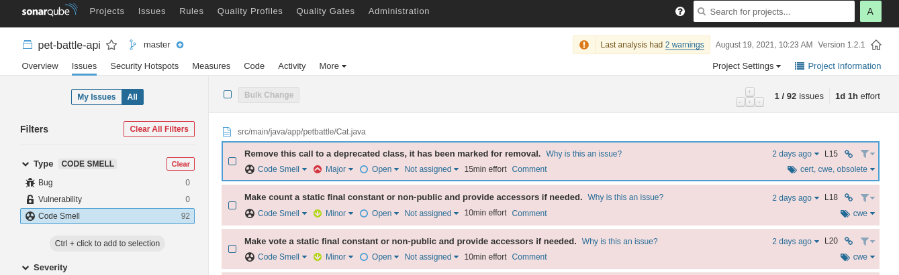

## コードリンティングによるTektonパイプラインの拡張

1. <span style="color:blue;"><a href="https://code.revelc.net/formatter-maven-plugin/usage.html">maven formatter plugin</a></span>を使用して、maven ビルド ライフサイクルの一部としてコードのフォーマットを試してみましょう。このコマンドをシェルで実行して、コードをフォーマットします。

    ```bash
    cd /projects/pet-battle-api
    mvn formatter:format
    ```

     <p class="warn">⛷️<b>注</b>⛷️ - OpenShift 4.11+ で DevSpaces を使用している場合は、次のステップでファイルを開くためにpet-battle-apiフォルダーを Che Workspace に追加する必要がある場合があります。</p>

    

2. `/projects/pet-battle-api/src/test/java/app/battle/CatEndpointTest.java`などの Java クラス ファイルを編集し、L19,21 などにいくつかの TAB/スペースを追加します。

    

    次に、これらのスペースを削除する`formatting:format` mavenコマンドを再実行します。

    

3. Checkstyle ( `checkstyle.xml` ) を使用したリンティングとフォーマット。残念ながら、これらはまだクラウド IDE にインストールされていないため、これらを直接試すことはできないかもしれませんが、次のステップで同等のコマンド ラインを使用できるようになります。 VCode を使用している場合は、次のリンクをチェックアウトできます。

    - ここで役立つプラグインがいくつかあります。たとえば、VSCode のユーザーは、リアルタイム フィードバック用の<span style="color:blue;"><a href="https://code.visualstudio.com/docs/java/java-linting">IDE 拡張機能</a></span>をインストールできます。 

    - IDE でリアルタイムにチェックするための<span style="color:blue;"><a href="https://marketplace.visualstudio.com/items?itemName=SonarSource.sonarlint-vscode">Sonar Lint Extension</a></span>もあります。

4. コマンド ラインからこれらのツールを使用する方法を見てみましょう。

    デフォルトでは、Pet Battle API の`checkstyle.xml`構成ファイルで、全体的な checkstyle の重大度が`warning`なっています。これは、コードスタイルが満たされていない場合でもビルドを停止しないことを意味します。コマンドラインでこれを実際に見てみましょう：

    ```bash
    mvn checkstyle:check
    ```

5. `/project/pet-battle-api/checkstyle.xml`ファイルを開き、 `EmptyCatchBlock`を検索します。次に、重大度の値を**error**に設定します。 <span style="color:blue;"><a href="https://checkstyle.sourceforge.io/config_blocks.html#EmptyCatchBlock">ここで EmptyCatchBlock </a></span>について読むことができます。

    ```xml
            <module name="EmptyCatchBlock">
                <property name="severity" value="error"/>
                <property name="exceptionVariableName" value="expected"/>
            </module>
    ```

    pom.xml に`consoleOutput` true を追加することで、checkstyle デバッグを有効にすることができます。

    ```xml
                    <configuration>
                        <configLocation>checkstyle.xml</configLocation>
                        <consoleOutput>true</consoleOutput>
                    </configuration>
    ```

6. `CatResource.java`クラス ファイルを編集し、 `loadlitter()`メソッドの一部である catch ブロックのスタック トレースを削除して、空にします。

    From this:

    

    To this:

    

    チェックを実行すると、空のコード ブロックがあることを示すハード エラーが表示されるはずです。

    ```bash
    mvn checkstyle:check
    ```

    

7. これらのタイプのチェック (およびテスト) は、**verify**と呼ばれる Maven ライフサイクル フェーズに含まれています。

    ```bash
    mvn verify
    ```

8. これらの checkstyle の変更を隠して、いったんコードを元に戻すことができます。

    ```bash
    cd /projects/pet-battle-api
    git stash
    ```

9. CICD パイプラインでは、これらのチェックは`mvn test`ライフサイクル フェーズの一部として実行されます。

    Maven フェーズは、Maven ビルド ライフサイクルのステージを表します。各フェーズは、特定のタスクを担当します。

    以下は、デフォルトのビルド ライフサイクルにおける最も重要なフェーズの一部です。

    - clean: 以前のビルドで生成されたすべてのファイルを削除します
    - validate: ビルドに必要なすべての情報が利用可能かどうかを確認します
    - compile: ソースコードをコンパイルします
    - verify: チェックを実行して、パッケージが有効であり、品質基準を満たしていることを確認します
    - test: 単体テストを実行します

    これらのフェーズはアウト ビルド パイプラインで使用します。完全なライフサイクル リファレンスは<span style="color:blue;"><a href="https://maven.apache.org/guides/introduction/introduction-to-the-lifecycle.html#Lifecycle_Reference">こちらです。</a></span>

    **Sonarqube 項目を実行した場合は、そこに追加情報が表示されます....** Sonarqubeのcheckstyleプラグインは**Rules**の下の**Java**言語や**Repository**を使用します。

    <p class="warn"><b>ヒント</b> <span style="color:blue;"><a href="https://sonarqube-<TEAM_NAME>-ci-cd.<CLUSTER_DOMAIN>/">https://sonarqube-<TEAM_NAME>-ci-cd.<CLUSTER_DOMAIN>/</a></span>に移動すると、Sonarqube で利用可能なプロジェクトとレポートを見つけることができます。</p>

    

    Sonarqube は *Code Smells*の下に警告を報告します。

    
