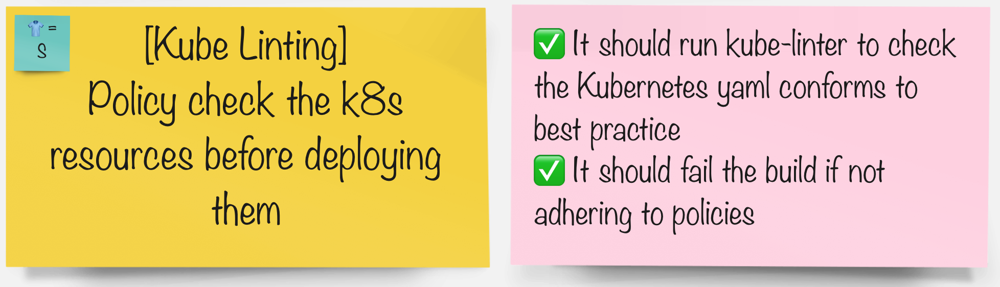

# Kubeリンティング

> KubeLinter は、Kubernetes YAML ファイルと Helm チャートを分析し、本番環境の準備とセキュリティに重点を置いて、さまざまなベスト プラクティスと照合してチェックするオープン ソース ツールです。

## タスク



## kube-linter に慣れる

1. KubeLinter には、lint を実行するときに確認するためのベスト プラクティスが組み込まれています。それらをリストできます。

    ```bash
    kube-linter checks list | grep Name:
    ```

     <div class="highlight" style="background: #f7f7f7">
     <pre><code class="language-yaml">
        Name: cluster-admin-role-binding
        Name: dangling-service
        Name: default-service-account
        Name: deprecated-service-account-field
        Name: docker-sock
        Name: drop-net-raw-capability
        Name: env-var-secret
        Name: exposed-services
        Name: host-ipc
        Name: host-network
        Name: host-pid
        Name: mismatching-selector
        Name: no-anti-affinity
        Name: no-extensions-v1beta
        Name: no-liveness-probe
        Name: no-read-only-root-fs
        Name: no-readiness-probe
        Name: non-existent-service-account
        Name: privilege-escalation-container
        Name: privileged-container
        Name: privileged-ports
        Name: required-annotation-email
        Name: required-label-owner
        Name: run-as-non-root
        Name: sensitive-host-mounts
        Name: ssh-port
        Name: unsafe-proc-mount
        Name: unsafe-sysctls
        Name: unset-cpu-requirements
        Name: unset-memory-requirements
        Name: writable-host-mount
        </code></pre>
    </div>
    

2. **chart**フォルダーの 1 つでローカルに**kube-linter**を試してみましょう。 （ご覧のとおり、修正が必要なもののリストがあります👀）

    ```bash
    cd /projects/pet-battle-api
    kube-linter lint chart/
    ```

    パイプラインに kube-linter を含める方法を進めましょう。

#### グループで、パイプラインを統合するツールを選択します。

|🐈‍⬛ **Jenkins グループ** 🐈‍⬛ | 🐅 **Tekton グループ** 🐅|
|--- | ---
|* 新しい jenkins エージェントをリストに追加 | * Tekton Hub からパイプラインにタスクを追加します|
|* パイプラインで kube-lint を実行する | * コードがパイプラインでビルドされたときに kube-lint を実行する|
|<span style="color:blue;"><p><a href="3-revenge-of-the-automated-testing/5a-jenkins.md">jenkins</a></p></span> | <span style="color:blue;"><p><a href="3-revenge-of-the-automated-testing/5b-tekton.md">tekton</a></p></span>|
