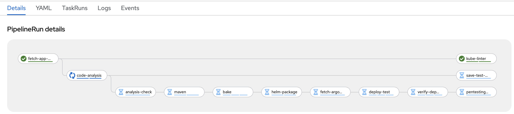
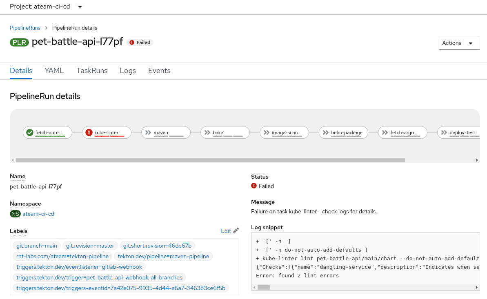
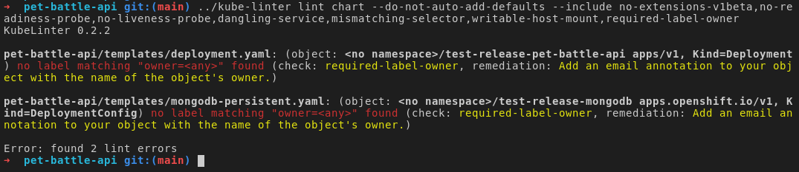

# KubeリンティングによるTekton パイプラインの拡張

パイプラインで**kube-linter**タスクを有効にしましょう。

1. Kube lint は Tekton Hub に tekton タスクを持っているので、それを取得してクラスターに`Task`を追加しましょう。 `Task`何をするかを自由に調べてください

    ```bash
    curl -sLo /projects/tech-exercise/tekton/templates/tasks/kube-linter.yaml \
    https://raw.githubusercontent.com/tektoncd/catalog/main/task/kube-linter/0.1/kube-linter.yaml
    ```

    ```bash
    # commit this so ArgoCD will sync it
    cd /projects/tech-exercise
    git add .
    git commit -m  "☎️ ADD - kube-linter task ☎️"
    git push
    ```

2. パイプラインですべてのデフォルト チェックを使用して**kube-linter**タスクを実行できますが、これはビルドに失敗します。そこで、*いたずら心で*チェックのセットを制限して実行することにしましょう。`maven-pipeline.yaml` ( `/projects/tech-exercise/tekton/templates/pipelines/maven-pipeline.yaml`に格納) を次のステップに追加します。

    ```yaml
        # Kube-linter
        - name: kube-linter
          runAfter:
          - fetch-app-repository
          taskRef:
            name: kube-linter
          workspaces:
            - name: source
              workspace: shared-workspace
          params:
            - name: manifest
              value: "$(params.APPLICATION_NAME)/$(params.GIT_BRANCH)/chart"
            - name: default_option
              value: do-not-auto-add-defaults
            - name: includelist
              value: "no-extensions-v1beta,no-readiness-probe,no-liveness-probe,dangling-service,mismatching-selector,writable-host-mount"
    ```

    `runAfter`が`kube-linter`タスクになるように、パイプラインの`maven`タスクも必ず更新してください 💪💪💪

     <p class="warn">⛷️<b>注</b>⛷️ - Sonarqube のステップが完了したら、<strong>分析チェック</strong>として<strong>runAfter</strong>を設定する必要があります</p>

    次のようなパイプライン定義が必要です。

     <div class="highlight" style="background: #f7f7f7">
     <pre><code class="language-yaml">
            - name: kube-linter
            runAfter:
            - fetch-app-repository
        ...
            - name: maven
              taskRef:
                name: maven
              runAfter: &lt;== make sure you update this 💪💪
                - kube-linter # check the NOTE above❗❗ this could be `analysis-check` as well.
              params:
                - name: WORK_DIRECTORY
                value: "$(params.APPLICATION_NAME)/$(params.GIT_BRANCH)"
        ...
        </code></pre>
    </div>
    

3. 変更を git にチェックします。

    ```bash
    cd /projects/tech-exercise
    # git add, commit, push your changes..
    git add .
    git commit -m  "🐡 ADD - kube-linter checks 🐡"
    git push
    ```

4. パイプライン ビルドをトリガーします。

    ```bash
    cd /projects/pet-battle-api
    git commit --allow-empty -m "🐡 test kube-linter step 🐡"
    git push
    ```

    🪄 **kube-linter**タスクで実行されるパイプラインを確認します。

    

## ビルドを壊す

**kube-linter**でビルドを中断/修正するシナリオを実行してみましょう。

1. `maven-pipeline.yaml`を再度編集し、 **kube-linter**タスクの**includelist**リストに**required-label-owner**を追加します。

    ```yaml
            - name: includelist
              value: "no-extensions-v1beta,no-readiness-probe,no-liveness-probe,dangling-service,mismatching-selector,writable-host-mount,required-label-owner"
    ```

2. これらの変更をチェックインして、パイプラインの実行をトリガーします。

    ```bash
    cd /projects/tech-exercise
    # git add, commit, push your changes..
    git add .
    git commit -m  "🐡 ADD - kube-linter required-label-owner check 🐡"
    git push
    ```

     <p class="warn">error <b>: failed to push some refs to..</b>のようなエラーが発生した場合は、 <b><i>git pull</i></b>を実行してから、上記のコマンドを実行して変更を再度プッシュしてください。</p>

    空のコミットを作成して、パイプラインをトリガーします。

    ```bash
    cd /projects/pet-battle-api
    git commit --allow-empty -m "🩴 test required-label-owner check 🩴"
    git push
    ```

3. パイプラインが同期し、 **pet-battle-api**ビルドがトリガーされるまで待ちます。これで失敗するはずです。

    

4. エラーを確認して、コマンド ラインで再現できます。

    ```bash
    cd /projects/pet-battle-api
    kube-linter lint chart --do-not-auto-add-defaults --include no-extensions-v1beta,no-readiness-probe,no-liveness-probe,dangling-service,mismatching-selector,writable-host-mount,required-label-owner
    ```

    

5. リンターは、リソースにラベルがないことを訴えています。helm を使用して**所有者**ラベルを追加して、デプロイメントを修正しましょう。 `pet-battle-api/chart/values.yaml`ファイルを編集して、 **owner**の値を追加します。

    ```yaml
    # Owner value
    owner: <TEAM_NAME>
    ```

6. Helm ランドでは、 `_helpers.tpl`ファイルを使用して、チャート内のすべてのリソースで簡単に再利用できる変数と yaml のチャンクを定義できます。そこにあるラベル定義を更新して、kube-lint の問題を修正しましょう。 `pet-battle-api/chart/templates/_helpers.tpl`編集し、このように`owner`ラベルを 2 つの場所に追加します - **pet-battle-api.labelsを定義する**場所と**mongodb.labelsを定義する**場所に`app.kubernetes.io/managed-by: {{ .Release.Service }}`の下に追加します。

    ```yaml
    owner: {{ .Values.owner }}
    ```

    したがって、次のようになります。

     <div class="highlight" style="background: #f7f7f7">
     <pre><code class="language-yaml">
        ...
            {{- end }}
            app.kubernetes.io/managed-by: {{ .Release.Service }}
            owner: {{ .Values.owner }}
            {{- end }}
        ...
        </code></pre>
    </div>
    

7. 新しいバージョンでパイプラインをトリガーできるようになりました。 `pet-battle-api`プロジェクトのルートで見つかるpet-battle-api `pom.xml`を編集し、 `version`番号を更新します。パイプラインは`chart/Chart.yaml`をこれらのバージョンで更新します。バージョン番号をインクリメントして適切に変更します。

    ```xml
        <artifactId>pet-battle-api</artifactId>
        <version>1.3.1</version>
    ```

    非常に面倒な場合は、このコードを実行して置換を行うこともできます。

    ```bash#test
    cd /projects/pet-battle-api
    mvn -ntp versions:set -DnewVersion=1.3.1
    ```

8. **kube-linter**コマンドを再度確認し、これらの変更を以下で確認できます。

    ```bash
    cd /projects/pet-battle-api
    git add .
    git commit -m  "🐊 ADD - kube-linter owner labels 🐊"
    git push
    ```

    🪄 **pet-battle-api**パイプラインが再び正常に実行されていることを確認します。
