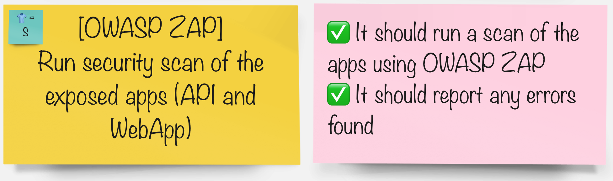

# OWASP ZAP 脆弱性スキャン

> [OWASP Zed Attack Proxy](https://www.zaproxy.org/)とは?

この演習では、OWASP Zed Attack Proxyまたは略して ZAP と呼ばれるツールを使用します。アプリケーションのセキュリティの脆弱性を自動的に検出するのに役立ちます。これにより、開発者は CI/CD パイプラインでアプリケーションの侵入テストとセキュリティ回帰テストを自動化できます。

## タスク

#### グループで、パイプラインを統合するツールを選択します。

|🐈‍⬛ **Jenkins グループ** 🐈‍⬛ | 🐅 **Tekton グループ** 🐅|
|--- | ---|
|* パイプラインにステージを追加して、セキュリティ スキャンを実行します | * パイプラインにタスクを追加して、セキュリティ スキャンを実行します|
|
<a href="3-revenge-of-the-automated-testing/6a-jenkins.md">jenkins</a>
 | 
<a href="3-revenge-of-the-automated-testing/6b-tekton.md">tekton</a>
|
