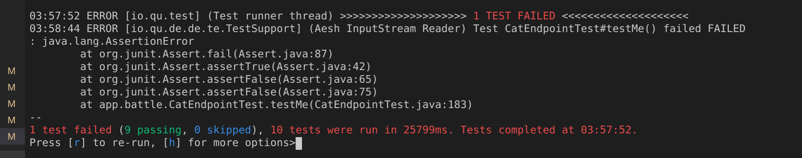
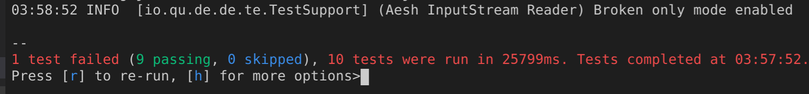
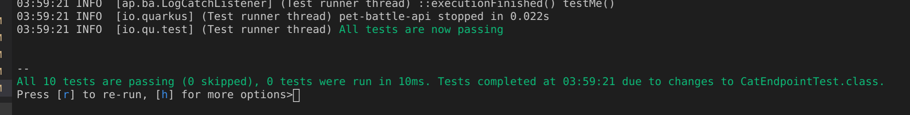
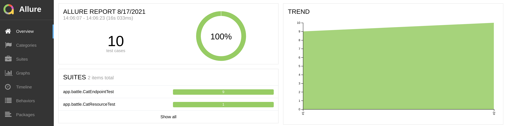
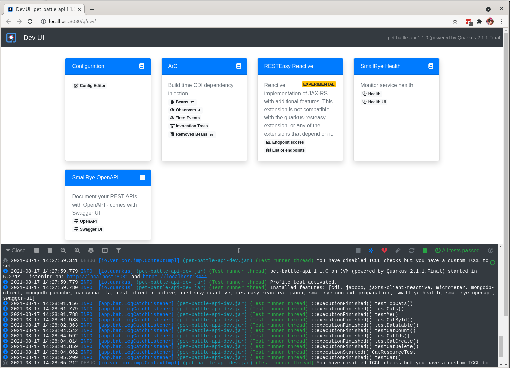
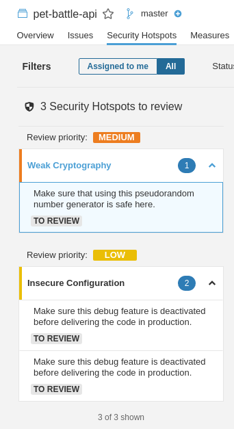
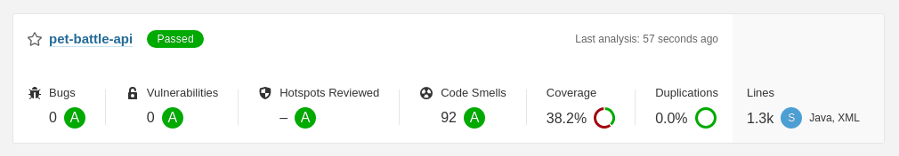
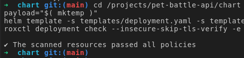

# ドラゴンが来た！


### 拡張機能のテスト

- TestContainersの何か

### 継続的なテスト

Quarkus <span style="color:blue;"><a href="https://quarkus.io/guides/continuous-testing">継続的テスト</a></span>

<div class="highlight" style="background: #f7f7f7">
<pre><code class="language-yaml">
The following commands are available:
[r] - Re-run all tests
[f] - Re-run failed tests
[b] - Toggle 'broken only' mode, where only failing tests are run (disabled)
[v] - Print failures from the last test run
[p] - Pause tests
[o] - Toggle test output (disabled)
[i] - Toggle instrumentation based reload (disabled)
[l] - Toggle live reload (enabled)
[s] - Force restart
[h] - Display this help
[q] - Quit
</code></pre>
</div>

テストを実行します。

```bash
mvn quarkus:test
```

新しい失敗したテストを追加します。

```java
    @Test
    @Story("Test me")
    void testMe() {
        Assert.assertFalse(false);
    }
```



<code>b</code>を押して<strong>壊れた専用モード</strong>に切り替えます



テストに合格します。

```java
    @Test
    @Story("Test me")
    void testMe() {
        Assert.assertFalse(true);
    }
```



```bash
git add .
git commit -m  "⛑️ ADD - new test ⛑️"
git push
```

Allureの新しいテストが追加され、テストの傾向が表示されます。



`TODO`

- [ ] 手順を文書化する
- [ ] Allureタスクは既にリポジトリにあるはずですか?
- [ ] Allure注釈、新しいテストの追加、過去のテスト結果
- [ ] DevUI: `mvn quarkus:dev`モード - イメージで実行されている mongodb が必要



### Sonar Quality Gates

- [ ]**Security HotSpots**を修正し、品質を向上させるためのコード演習。



```java
diff --git a/src/main/java/app/petbattle/Cat.java b/src/main/java/app/petbattle/Cat.java
index c9dad23..a5bcbed 100644
--- a/src/main/java/app/petbattle/Cat.java
+++ b/src/main/java/app/petbattle/Cat.java
@@ -85,7 +85,7 @@ public class Cat extends ReactivePanacheMongoEntity {
                     .encodeToString(baos.toByteArray());
             setImage("data:image/jpeg;base64," + encodedString);
         } catch (IOException e) {
-            e.printStackTrace();
+            // do nothing
         }
     }
 
diff --git a/src/main/java/app/petbattle/CatResource.java b/src/main/java/app/petbattle/CatResource.java
index 5b194b5..c9ed55c 100644
--- a/src/main/java/app/petbattle/CatResource.java
+++ b/src/main/java/app/petbattle/CatResource.java
@@ -26,6 +26,7 @@ import javax.ws.rs.core.MediaType;
 import javax.ws.rs.core.Response;
 import java.io.IOException;
 import java.io.InputStream;
+import java.security.SecureRandom;
 import java.time.Duration;
 import java.util.*;
 
@@ -216,7 +217,7 @@ public class CatResource {
             try {
                 InputStream is = Thread.currentThread().getContextClassLoader().getResourceAsStream(tc);
                 Cat cat = new Cat();
-                cat.setCount(new Random().nextInt(5) + 1);
+                cat.setCount(new SecureRandom().nextInt(5) + 1);
                 cat.setVote(false);
                 byte[] fileContent = new byte[0];
                 fileContent = is.readAllBytes();
@@ -229,7 +230,7 @@ public class CatResource {
                 cat.persistOrUpdate().await().indefinitely();
 
             } catch (IOException e) {
-                e.printStackTrace();
+                // do nothing
             }
         }
     }
```

Git の追加、コミット、変更のプッシュ

```bash
cd /projects/pet-battle-api
git add .
git commit -m  "💍 FIX Security HotSpots 💍"
git push
```



- [ ]
    <span style="color:blue;"><a href="https://github.com/eformat/sonarqube-jobs">ここで</a></span>チャートなどのコード品質ゲートを設定します

```yaml
  # Sonarqube setup
  - name: sonarqube-setup
    enabled: true
    source: https://github.com/eformat/sonarqube-jobs
    source_path: charts/quality-gate
    source_ref: main
    values:
      qualityGate:
        new_coverage:
          enabled: false
```

### リンティング拡張機能

### ACS/StackRox コマンドラインの楽しみ

> ACS を利用して、セキュリティ チェックをパイプラインに移動します。以下を見ていきます。
>
> - **roxctl** - ACS/StackRox CLI を使用
> - **kube-linter** - ACS/StackRox kube linter タスクを追加して、デプロイ構成を確認します
> - **scan,check** - ACS/StackRox を使用したパイプラインの一部としてのコンテナ イメージのスキャンとポリシー チェック

## roxctlコマンドライン

**roxctl**コマンドラインの使い方を学びましょう。

1. これらの環境変数をエクスポートします。ファシリテーターがグループ演習からこれらを提供します。

    ```bash
    export ROX_API_TOKEN=eyJhbGciOiJSUzI1NiIsIm...
    export ROX_ENDPOINT=central-stackrox.<CLUSTER_DOMAIN>
    ```

2. 次のコマンドは、イメージ内のセキュリティ ポリシーの**ビルド時の**違反をチェックします。

    次のようにして、**pet-battle**イメージを**チェック**できます。

    ```bash
    roxctl image check --insecure-skip-tls-verify -e $ROX_ENDPOINT:443 --image quay.io/petbattle/pet-battle:latest -o json | jq -c '.alerts[].policy | select ( .severity == "HIGH_SEVERITY" or .severity == "CRITICAL_SEVERITY" )' | jq .
    ```

    これにより、次のようなポリシー エラーが返されます。

     <div class="highlight" style="background: #f7f7f7">
     <pre><code class="language-json">
        Error: Violated a policy with CI enforcement set
        {
        "id": "a919ccaf-6b43-4160-ac5d-a405e1440a41",
        "name": "Fixable Severity at least Important",
        "description": "Alert on deployments with fixable vulnerabilities with a Severity Rating at least Important",
        "rationale": "Known vulnerabilities make it easier for adversaries to exploit your application. You can fix these high-severity vulnerabilities by updating to a newer version of the affected component(s).",
        "remediation": "Use your package manager to update to a fixed version in future builds or speak with your security team to mitigate the vulnerabilities.",
        "categories": [
            "Vulnerability Management"
        ],
        "lifecycleStages": [
            "BUILD",
            "DEPLOY"
        ],
        "severity": "HIGH_SEVERITY",
        "enforcementActions": [
            "FAIL_BUILD_ENFORCEMENT"
        ],
        "SORTName": "Fixable Severity at least Important",
        "SORTLifecycleStage": "BUILD,DEPLOY",
        "SORTEnforcement": true,
        "policyVersion": "1.1",
        "policySections": [
            {
            "policyGroups": [
                {
                "fieldName": "Fixed By",
                "values": [
                    {
                    "value": ".*"
                    }
                ]
                },
                {
                "fieldName": "Severity",
                "values": [
                    {
                    "value": "&gt;= IMPORTANT"
                    }
                ]
                }
            ]
            }
        ]
        }
        </code></pre>
    </div>


    特定のイメージのスキャン結果を確認することもできます。

3. イメージ**スキャン**を直接実行することもできます。試す：

    ```bash
    roxctl image scan --insecure-skip-tls-verify -e $ROX_ENDPOINT:443 --image quay.io/petbattle/pet-battle:latest -o table
    ```

    **scan**コマンドは*、json、csv、およびテーブルの形式(デフォルトはjson)で実行できます。* 。

4. イメージ参照を使用して構築した**pet-battle-api**イメージでこれを試すことができます (これは、パイプラインの**bake**ステージで出力されます)。

    ```bash
    roxctl image check --insecure-skip-tls-verify -e $ROX_ENDPOINT:443 --image \
    image-registry.openshift-image-registry.svc:5000/ateam-test/pet-battle-api@sha256:cf2ccbf8d117c2ea98425f9b70b2b937001ccb9b3cdbd4ab10b42ba8a082caf7
    ```

     <div class="highlight" style="background: #f7f7f7">
     <pre><code class="language-yaml">
        ✗ Image image-registry.openshift-image-registry.svc:5000/ateam-test/pet-battle-api@sha256:cf2ccbf8d117c2ea98425f9b70b2b937001ccb9b3cdbd4ab10b42ba8a082caf7 failed policy 'Red Hat Package Manager in Image'
        - Description:
            ↳ Alert on deployments with components of the Red Hat/Fedora/CentOS package
            management system.
        - Rationale:
            ↳ Package managers make it easier for attackers to use compromised containers,
            since they can easily add software.
        - Remediation:
            ↳ Run `rpm -e $(rpm -qa *rpm*) $(rpm -qa *dnf*) $(rpm -qa *libsolv*) $(rpm -qa
            *hawkey*) $(rpm -qa yum*)` in the image build for production containers.
        - Violations:
            - Image includes component 'rpm' (version 4.14.3-14.el8_4.x86_64)
        </code></pre>
    </div>

    このコマンドのシェル結果を確認できます。

    ```bash
    if [ $? -eq 0 ]; then
    echo "🦸 no issues found 🦸";
    else
    echo "🦠 checks failed 🦠";
    fi
    ```

5. 他の外部イメージも確認できます。イメージをダウンロードしてスキャンするには、1 分ほどかかる場合があります。

    ```bash
    roxctl image check --insecure-skip-tls-verify -e $ROX_ENDPOINT:443 --image quay.io/petbattle/pet-battle-api:latest
    ```

6. 次のコマンドは、YAML デプロイ ファイル内のセキュリティ ポリシーのビルド時およびデプロイ時の違反をチェックします。

    このコマンドを使用して、helm テンプレートの Kubernetes リソースを検証します

    ```bash
    cd /projects/pet-battle-api/chart
    payload="$( mktemp )"
    helm template -s templates/deployment.yaml -s templates/pdb.yaml -s templates/service.yaml . > $payload
    roxctl deployment check --insecure-skip-tls-verify -e $ROX_ENDPOINT:443 -f $payload
    ```

    
