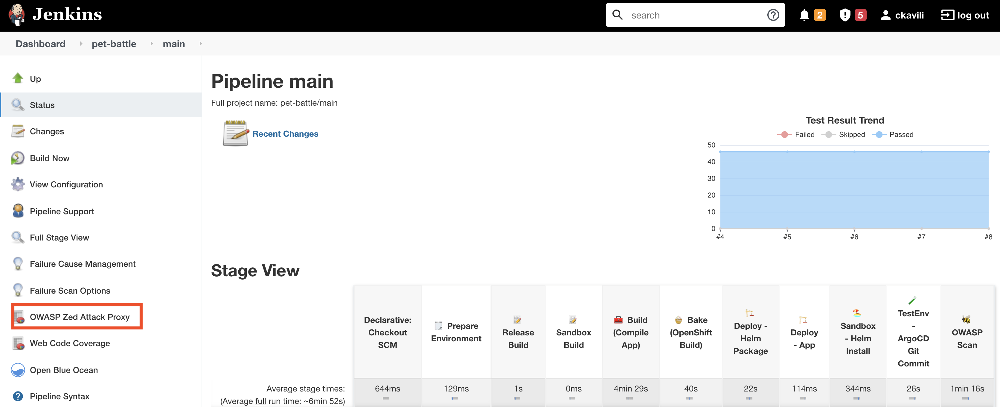
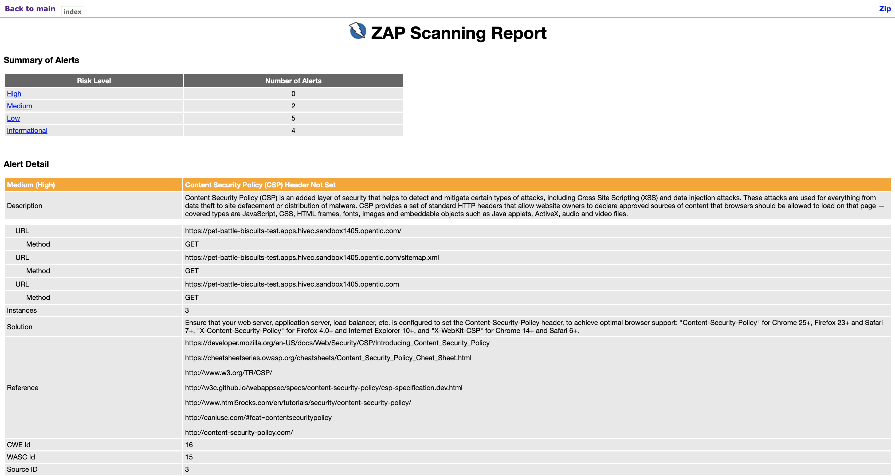

## OWASP ZapセキュリティスキャンによるJenkinsパイプラインの拡張

1. `zap`コマンドラインを含む新しい Jenkins エージェントを追加します。 `ubiquitous-journey/values-tooling.yaml`を開き、 `Jenkins`下に`jenkins-agent-zap`リストに追加します。

    ```yaml
            # default names, versions, repo and paths set on the template
            - name: jenkins-agent-npm
            - name: jenkins-agent-mvn
            - name: jenkins-agent-helm
            - name: jenkins-agent-argocd
            - name: jenkins-agent-zap # add this one!!
    ```

    変更を git リポジトリにプッシュします。

    ```bash
    cd /projects/tech-exercise
    git add ubiquitous-journey/values-tooling.yaml
    git commit -m  "🐝 ADD - Zap Jenkins Agent 🐝"
    git push
    ```

     <p class="warn">error <b>: failed to push some refs to..</b>のようなエラーが発生した場合は、 <b><i>git pull</i></b>を実行してから、上記のコマンドを実行して変更を再度プッシュしてください。</p>
    

2. `/projects/pet-battle/Jenkinsfile`を開き、 `// 🐝 OWASP ZAP STAGE GOES HERE`プレースホルダーがある以下のステージを追加して、Pet Battle に対する ZAP スキャンをトリガーします。この段階では、潜在的なセキュリティの脆弱性に関するレポートを作成します。

    ```groovy
            // 🐝 OWASP ZAP STAGE GOES HERE
            stage('🐝 OWASP Scan') {
                agent { label "jenkins-agent-zap" }
                options {
                     skipDefaultCheckout(true)
                }
                steps {
                sh '''
                    /zap/zap-baseline.py -r index.html -t https://pet-battle-${TEAM_NAME}-test.<CLUSTER_DOMAIN> || return_code=$?
                    echo "exit value was  - " $return_code
                ''' }
                post {
                always {
                    // publish html
                    publishHTML target: [
                        allowMissing: false,
                        alwaysLinkToLastBuild: false,
                        keepAll: true,
                        reportDir: '/zap/wrk',
                        reportFiles: 'index.html',
                        reportName: 'OWASP Zed Attack Proxy'
            ] }
            } }
    ```

3. 変更をプッシュしてから、パイプラインを観察します。

    ```bash
    cd /projects/pet-battle
    git add Jenkinsfile
    git commit -m  "🍯 ADD - OWASP ZAP scanning 🍯"
    git push
    ```

4. Jenkins では、テスト結果を確認できるはずです。左側にOWASP Zed Attack Proxyが表示されます。 
