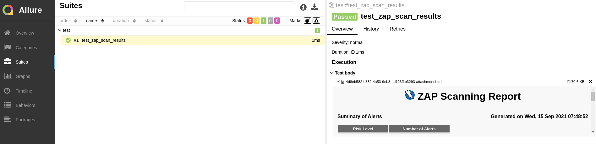
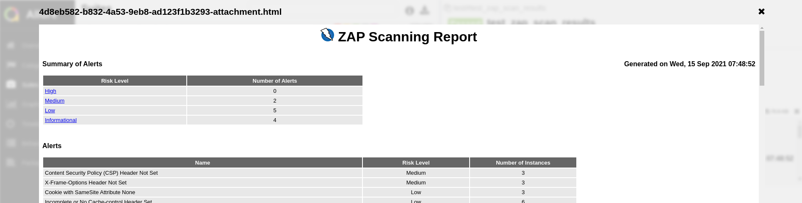

## OWASP ZapセキュリティスキャンによるTektonパイプラインの拡張

<p class="warn">このタスクを実行するには、テスト演習から *Allure* をデプロイする必要があります。仕事の優先順位を付けるときにこのタスクを実行しなかった場合は、大したことではありません。<a href="/tech-exercise/#/3-revenge-of-the-automated-testing/2b-tekton?id=part-1-allure">ここに進んで</a>、<strong>パート 1 のみ</strong>を実行してください。</p>

1. タスクをコードベースに追加して、デプロイされたアプリをテストでzapスキャンします

    ```bash
    cd /projects/tech-exercise
    cat <<'EOF' > tekton/templates/tasks/zap-proxy.yaml
    apiVersion: tekton.dev/v1beta1
    kind: Task
    metadata:
      name: zap-proxy
    spec:
      workspaces:
        - name: output
      params:
        - name: APPLICATION_NAME
          type: string
          default: "zap-scan"
        - name: APP_URL
          description: The application under test url
        - name: ALLURE_HOST
          type: string
          description: "Allure Host"
          default: "http://allure:5050"
        - name: ALLURE_SECRET
          type: string
          description: Secret containing Allure credentials
          default: allure-auth
        - name: WORK_DIRECTORY
          description: Directory to start build in (handle multiple branches)
      steps:
        - name: zap-proxy
          image: quay.io/rht-labs/zap2docker-stable:latest
          env:
            - name: PIPELINERUN_NAME
              valueFrom:
                fieldRef:
                  fieldPath: metadata.labels['tekton.dev/pipelineRun']
            - name: ALLURE_USERNAME
              valueFrom:
                secretKeyRef:
                  name: $(params.ALLURE_SECRET)
                  key: username
            - name: ALLURE_PASSWORD
              valueFrom:
                secretKeyRef:
                  name: $(params.ALLURE_SECRET)
                  key: password
          workingDir: $(workspaces.output.path)/$(params.WORK_DIRECTORY)
          script: |
            #!/usr/bin/env bash
            set -x
            echo "Make the wrk directory available to save the reports"
            cd /zap
            mkdir -p /zap/wrk
            echo "🪰🪰🪰 Starting the pen test..."
            /zap/zap-baseline.py -t $(params.APP_URL) -r $PIPELINERUN_NAME.html
            ls -lart /zap/wrk
            echo "🛸🛸🛸 Saving results..."
            # FIXME for now this works, move to script+image
            pip install pytest allure-pytest --user
            cat > test.py <<EOF
            import allure
            import glob
            import os
            def test_zap_scan_results():
                for file in list(glob.glob('/zap/wrk/*.html')):
                    allure.attach.file(file, attachment_type=allure.attachment_type.HTML)
                pass
            EOF
            export PATH=$HOME/.local/bin:$PATH
            pytest test.py --alluredir=/zap/wrk/allure-results
            curl -sLo send_results.sh https://raw.githubusercontent.com/eformat/allure/main/scripts/send_results.sh && chmod 755 send_results.sh
            ./send_results.sh $(params.APPLICATION_NAME) \
            /zap \
            ${ALLURE_USERNAME} \
            ${ALLURE_PASSWORD} \
            $(params.ALLURE_HOST) \
            wrk/allure-results
    EOF
    ```

2. これをパイプラインで試してみましょう。 `maven-pipeline.yaml`を編集し、 `pentesting-test`のステップ定義を追加します。パイプラインの現在の状態に一致するように`runAfter`を調整することを忘れないでください。

    ```yaml
        # Pen Testing
        - name: pentesting-test
          taskRef:
            name: zap-proxy
          runAfter:
            - verify-deployment
          params:
            - name: APP_URL
              value: "https://pet-battle-api-{{ .Values.team }}-test.{{ .Values.cluster_domain }}"
            - name: WORK_DIRECTORY
              value: "$(params.APPLICATION_NAME)/$(params.GIT_BRANCH)"
          workspaces:
            - name: output
              workspace: shared-workspace
    ```

3. 変更を git にチェックします。

    ```bash
    cd /projects/tech-exercise
    # git add, commit, push your changes..
    git add .
    git commit -m  "🪰 ADD - zap scan pentest 🪰"
    git push
    ```

4. パイプライン ビルドをトリガーします。

    ```bash
    cd /projects/pet-battle-api
    git commit --allow-empty -m "🩴 test zap-scan step 🩴"
    git push
    ```

5. *Allure*でレポートを確認する

    ```bash
    echo https://allure-<TEAM_NAME>-ci-cd.<CLUSTER_DOMAIN>/allure-docker-service/projects/zap-scan/reports/latest/index.html
    ```

ドリルダウンしてボディの添付ファイルをテストします。




