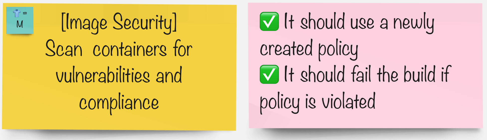
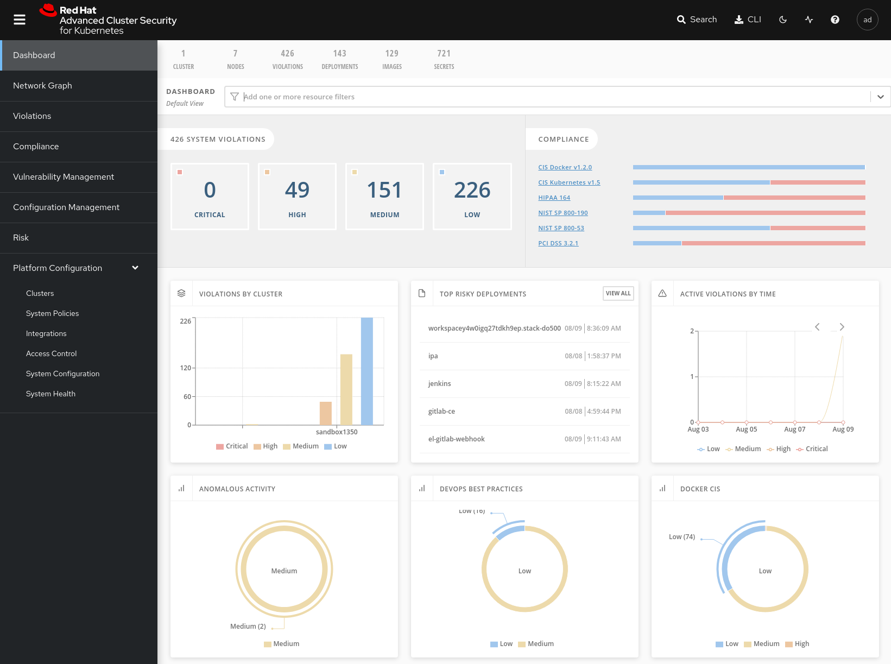
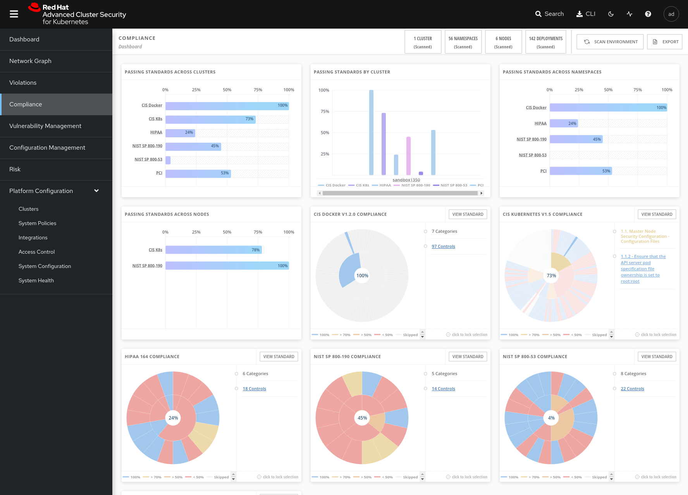
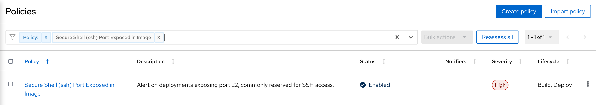
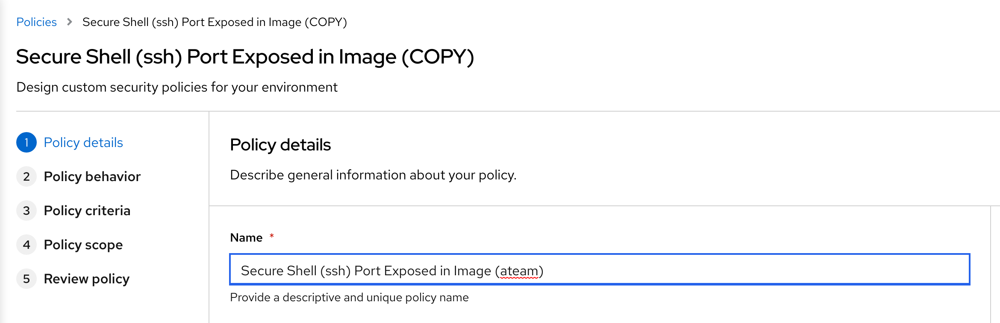
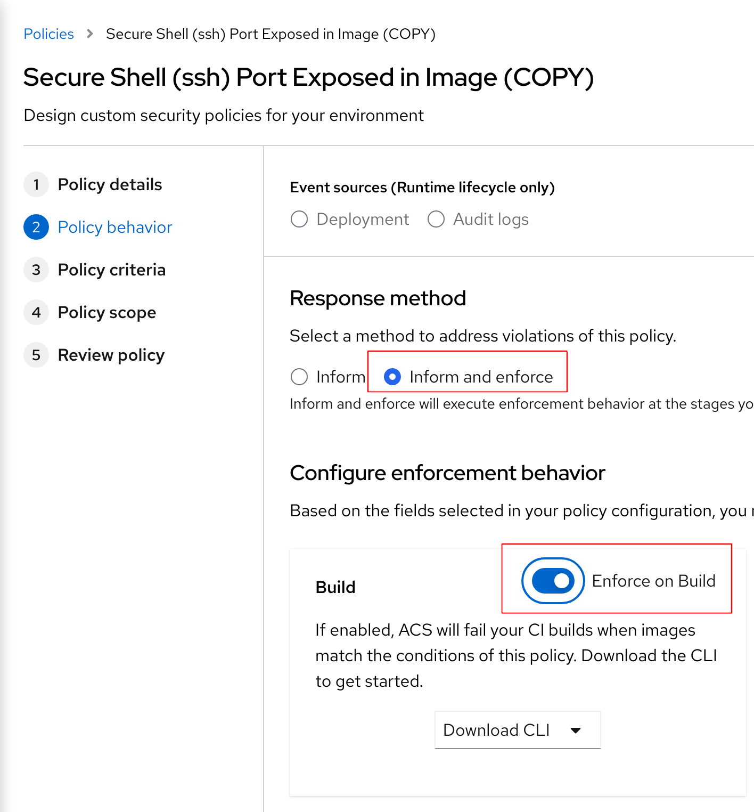
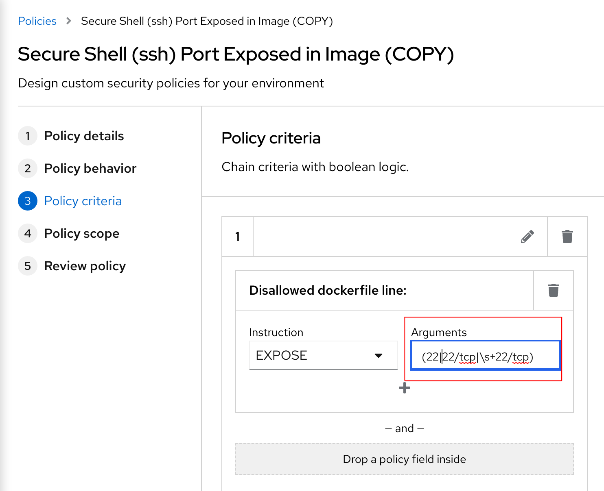
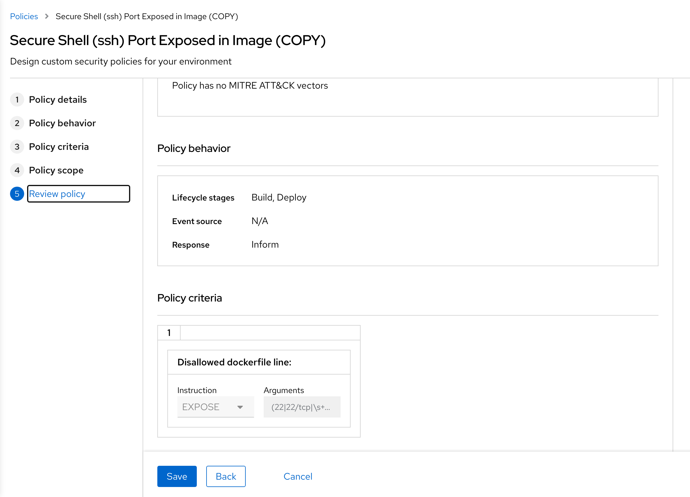
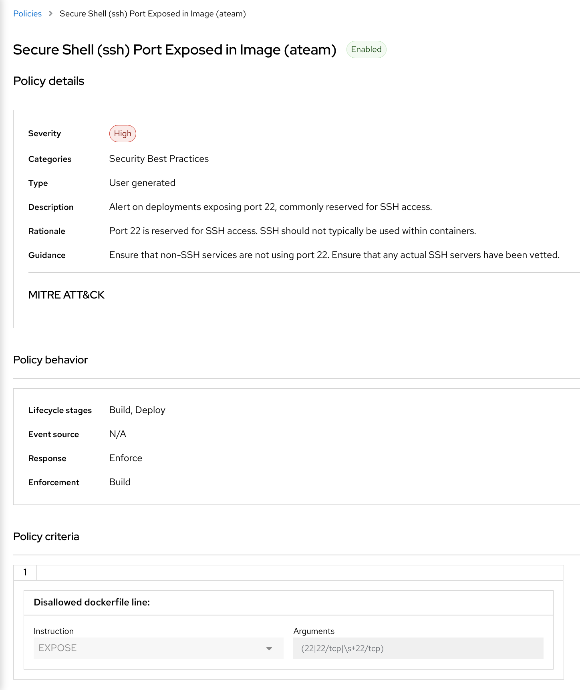

# イメージ セキュリティ (Stack Rox)

> いくつかの準備が整ったコンテナー イメージを使用して、独自のアプリケーション イメージを構築します。それらをベースとして使用し、アプリのバイナリを追加するか、それらの上にパッケージをインストールします。公開レジストリ イメージ、または古いパッケージやライブラリのエラーや脆弱性からコンテナーを保護する必要があります。パイプラインのイメージ セキュリティ ステップは、イメージを本番環境に移動する前にそれらを検出するのに役立ちます。

## タスク



## StackRox アクセスのセットアップ

StackRox / Advanced Cluster Security (ACS) は、クラスター スコープで 1 回デプロイされます。複数のクラスターを監視するために使用できます。 ACS/StackRox オペレーターは、クラスターに既にデプロイされ、構成されています。

1. ACS WebUI ルートに接続します。

    ```bash
    # get web url
    echo https://$(oc -n stackrox get route central --template='{{ .spec.host }}')
    ```

    **管理者**ユーザー名を使用:

    ```bash
    # get password to go with the "admin" username:
    echo $(oc -n stackrox get secret central-htpasswd -o go-template='{{index .data "password" | base64decode}}')
    ```

     

2. インストール構成の一部として、API トークンが作成されました。以下を使用して取得できます。

    トークンを環境変数としてエクスポートします。

    ```bash
    export ROX_API_TOKEN=$(oc -n stackrox get secret rox-api-token-tl500 -o go-template='{{index .data "token" | base64decode}}')
    ```

    StackRox エンドポイントをエクスポートします。

    ```bash
    export ROX_ENDPOINT=central-stackrox.<CLUSTER_DOMAIN>
    ```

3. **roxctl**を実行してトークンを確認します

    ```bash
    roxctl central whoami --insecure-skip-tls-verify -e $ROX_ENDPOINT:443
    ```

4. この API トークンは、パイプラインで使用されます。そのための SealedSecret 定義を作成しましょう。

    ```bash
    cat << EOF > /tmp/rox-auth.yaml
    apiVersion: v1
    data:
      password: "$(echo -n ${ROX_API_TOKEN} | base64 -w0)"
      username: "$(echo -n ${ROX_ENDPOINT} | base64 -w0)"
    kind: Secret
    metadata:
      labels:
        credential.sync.jenkins.openshift.io: "true"
      name: rox-auth
    EOF
    ```

    `kubeseal`コマンドラインを使用して、シークレットの定義を封印します。

    ```bash
    kubeseal < /tmp/rox-auth.yaml > /tmp/sealed-rox-auth.yaml \
        -n ${TEAM_NAME}-ci-cd \
        --controller-namespace tl500-shared \
        --controller-name sealed-secrets \
        -o yaml
    ```

    いつものように、この封印 アクティビティの結果、特に`encryptedData`取得します。これは GitOps であるため、Git リポジトリに保存します :)

    ```bash
    cat /tmp/sealed-rox-auth.yaml | grep -E 'username|password'
    ```

     <div class="highlight" style="background: #f7f7f7">
     <pre><code class="language-yaml">
            username: AgAj3JQj+EP23pnzu...
            password: AgAtnYz8U0AqIIaqYrj...
        </code></pre>
    </div>

    `ubiquitous-journey/values-tooling.yaml`ファイルを開き、Sealed Secrets エントリを拡張します。前のコマンドからの`username`と`password`の出力をコピーし、値を更新します。データを正しくインデントしていることを確認してください。

    ```yaml
            - name: rox-auth
              type: kubernetes.io/basic-auth
              labels:
                credential.sync.jenkins.openshift.io: "true"
              data:
                username: AgAj3JQj+EP23pnzu...
                password: AgAtnYz8U0AqIIaqYrj...
    ```

    変更を git にチェックします。

    ```bash
    cd /projects/tech-exercise
    # git add, commit, push your changes..
    git add .
    git commit -m  "🔒 ADD - stackrox sealed secret 🔒"
    git push
    ```

5. チームとして、後で演習で使用する*Build*ポリシーを更新します。 *Platform Configuration -&gt; Policy Management*ビューを参照します。 *Policy*を入力してから*secure shell*を入力し、 **Secure Shell (ssh) Port Exposed in Image**ポリシーを選択します。

    

6. 右側の 3 つのドットをクリックしてこのポリシーをクローンして、編集して新しい名前を付けます。

    

7. <strong>Policy Behavior</strong>に到達するまで<em>Next</em>をクリックします。 **Inform and enforce**を選択し、 **Build**動作を**Enforce on Build**に構成します。ポリシー条件が一致する場合、これはビルドに失敗します。

    

8. <strong>Policy Criteria</strong>に到達するまで<em>Next</em>をクリックします。Disallowed Dockerfile lineの<em>Arguments</em>の正規表現に<strong>22</strong>を追加します。

    

9. <strong>Review Policy</strong>に到達するまで*Next*と<em>Next を</em>押し、*ビルド*時にポリシーの適用が有効になっていることを確認します。

    

10. ポリシー*を保存します*。今はこのようになっているはずです。

    

    <p class="tip">🐌 これは GITOPS ではありません - ポリシーとセットアップを手動で構成することは、StackRox で遊ぶには良い方法です。ポリシーをコードとして作成および保存するための高度な演習を参照してください。 🐎</p>

#### グループで、パイプラインを統合するツールを選択します。

これで、ACSを使って、ビルドパイプラインでセキュリティを**左**に移動させることができるようになりました。各グループでは、以下のようにします。

|🐈‍⬛ **Jenkinsグループ** 🐈‍⬛ | 🐅 **Tekton グループ** 🐅|
|--- | ---|
|* ビルド時のポリシー違反を`check`ようにパイプラインを構成する | * ビルド時のポリシー違反を`check`ようにパイプラインを構成する|
|* CVE/CVSS のイメージを`scan`ようにパイプラインを構成する | * CVE/CVSS のイメージを`scan`ようにパイプラインを構成する|
|* パイプラインを壊す/直す | * パイプラインを壊す/直す|
|<span style="color:blue;"><p><a href="3-revenge-of-the-automated-testing/7a-jenkins.md">jenkins</a></p></span> | <span style="color:blue;"><p><a href="3-revenge-of-the-automated-testing/7b-tekton.md">tekton</a></p></span>|
