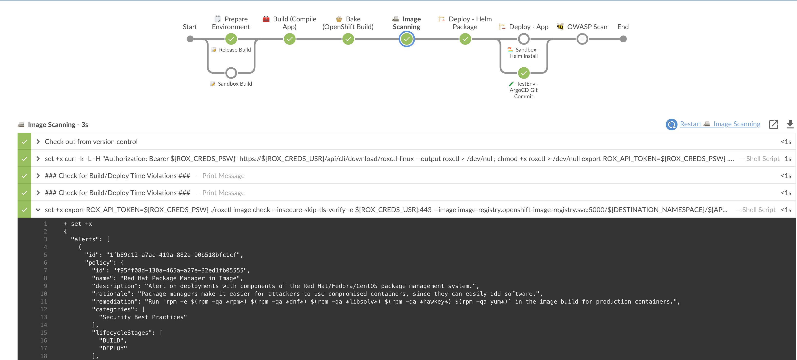
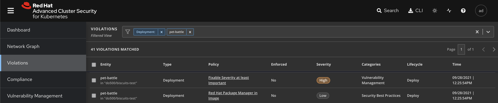

# StackroxによるJenkinsパイプラインの拡張

## イメージスキャン

1. まず、Jenkinsfile にアクセス資格情報を追加します。 `/projects/pet-battle`の下にあるファイルを開き、 `Jenkinsfile`の`environment {}`ブロック内の他の`CREDS`のリストに以下を追加します。

    ```groovy
            ROX_CREDS = credentials("${OPENSHIFT_BUILD_NAMESPACE}-rox-auth")
    ```

    その後、次のようなものが得られます。

     <div class="highlight" style="background: #f7f7f7">
     <pre><code class="language-groovy">
        environment {
            // .. other stuff ...
                // Credentials bound in OpenShift
                GIT_CREDS = credentials("${OPENSHIFT_BUILD_NAMESPACE}-git-auth")
                NEXUS_CREDS = credentials("${OPENSHIFT_BUILD_NAMESPACE}-nexus-password")
                SONAR_CREDS = credentials("${OPENSHIFT_BUILD_NAMESPACE}-sonar-auth")
                ROX_CREDS = credentials("${OPENSHIFT_BUILD_NAMESPACE}-rox-auth")
            // .. more stuff ...
        }
        </code></pre>
    </div>
    

2. `// IMAGE SCANNING`プレースホルダーがあるパイプラインに新しいステージを追加します。これは、 `bake`後と`deploy`前に行う必要があります。安全でないイメージを展開したくないため:)

    ```groovy
            // 📠 IMAGE SCANNING EXAMPLE GOES HERE
            stage("📠 Image Scanning") {
                agent { label "master" }
                steps {
                    script {
                        sh '''
                            set +x
                            curl -k -L -H "Authorization: Bearer ${ROX_CREDS_PSW}" https://${ROX_CREDS_USR}/api/cli/download/roxctl-linux --output roxctl  > /dev/null;
                            chmod +x roxctl > /dev/null
                            export ROX_API_TOKEN=${ROX_CREDS_PSW}
                            ./roxctl image scan --insecure-skip-tls-verify -e ${ROX_CREDS_USR}:443 --image image-registry.openshift-image-registry.svc:5000/${DESTINATION_NAMESPACE}/${APP_NAME}:${VERSION} -o table
                        '''

                        // BUILD & DEPLOY CHECKS
                        echo '### Check for Build/Deploy Time Violations ###'

                    }
                }
            }
    ```

3. 変更をリポジトリにプッシュすると、パイプラインもトリガーされます。

    ```bash
    # git add, commit, push your changes..
    cd /projects/pet-battle
    git add .
    git commit -m  "🎄 ADD - image scan stage 🎄"
    git push
    ```

    🪄**pet-battle**パイプラインで**image-scan**ステージが実行されている様子を観察します。

## ビルド/デプロイ時の違反を確認する

?&gt;**ヒント**出力形式を**json**に変更し、 **jq**コマンドをインストールして使用することで、以前のチェックを拡張できます。たとえば、イメージ スキャンの出力を確認し、 **riskScore**と**topCvss**が特定の値を下回ったときに結果を返すには、次のようにします。これらは、次に確認できる ACS 内の**ビルド ポリシー**としてより適切に処理されます。

1. ステージを拡張して、ビルド時間の違反をチェックしましょう。image-scanningステージ内のプレースホルダーに以下を追加します。

    ```groovy
                        // BUILD & DEPLOY CHECKS
                        echo '### Check for Build/Deploy Time Violations ###'
                        sh '''
                            set +x
                            export ROX_API_TOKEN=${ROX_CREDS_PSW}
                            ./roxctl image check --insecure-skip-tls-verify -e ${ROX_CREDS_USR}:443  --image image-registry.openshift-image-registry.svc:5000/${DESTINATION_NAMESPACE}/${APP_NAME}:${VERSION} -o json
                        '''
    ```

2. 再度、変更をリポジトリにプッシュします。これにより、パイプラインもトリガーされます。

    ```bash
    # git add, commit, push your changes..
    cd /projects/pet-battle
    git add .
    git commit -m  "🎄 ADD - image scan stage 🎄"
    git push
    ```

    🪄**pet-battle**パイプラインを観察し、イメージ スキャン ステージのログを確認し、デプロイの違反を検出します 😔😔

    

3. StackRox webUI に戻り、*Violations*ビューで失敗を確認します。

     <p class="tip">パイプラインを続行するには、パイプラインを中断し、これらの違反を修正する必要があります。詳しくは <em>ドラゴンが来た！</em>セクションを参照してください。</p>

    
