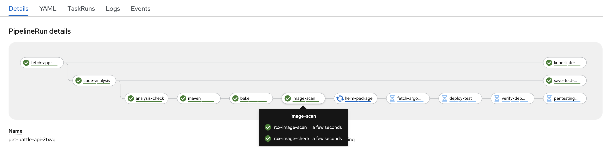
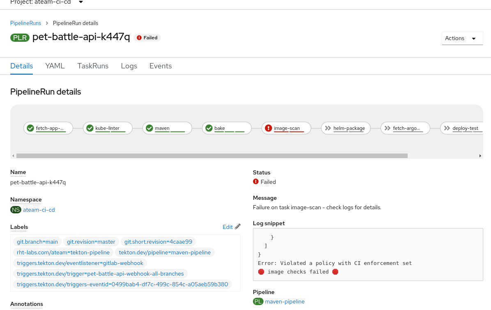
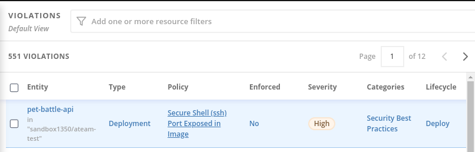

# StackroxによるTektonパイプラインの拡張

## イメージスキャン

1. ビルドしたイメージをスキャンするタスクをコードベースに追加します。

    ```bash
    cd /projects/tech-exercise
    cat <<'EOF' > tekton/templates/tasks/rox-image-scan.yaml
    apiVersion: tekton.dev/v1beta1
    kind: Task
    metadata:
      name: rox-image-scan
    spec:
      workspaces:
        - name: output
      params:
        - name: ROX_SECRET
          type: string
          description: Secret containing the Stackrox endpoint and token as (username and password)
          default: rox-auth
        - name: IMAGE
          type: string
          description: Full name of image to scan (example -- gcr.io/rox/sample:5.0-rc1)
        - name: OUTPUT_FORMAT
          type: string
          description:  Output format (json | csv | table)
          default: json
        - name: WORK_DIRECTORY
          description: Directory to start build in (handle multiple branches)
      steps:
        - name: rox-image-scan
          image: registry.access.redhat.com/ubi8/ubi-minimal:latest
          workingDir: $(workspaces.output.path)/$(params.WORK_DIRECTORY)
          env:
            - name: ROX_API_TOKEN
              valueFrom:
                secretKeyRef:
                  name: $(params.ROX_SECRET)
                  key: password
            - name: ROX_ENDPOINT
              valueFrom:
                secretKeyRef:
                  name: $(params.ROX_SECRET)
                  key: username
          script: |
            #!/usr/bin/env bash
            set +x
            export NO_COLOR="True"
            curl -k -L -H "Authorization: Bearer $ROX_API_TOKEN" https://$ROX_ENDPOINT/api/cli/download/roxctl-linux --output roxctl  > /dev/null; echo "Getting roxctl"
            chmod +x roxctl > /dev/null
            ./roxctl image scan --insecure-skip-tls-verify -e $ROX_ENDPOINT:443 --image $(params.IMAGE) -o $(params.OUTPUT_FORMAT)
    EOF
    ```

2. gitにない限り、それは本物ではありません

    ```bash
    # git add, commit, push your changes..
    cd /projects/tech-exercise
    git add .
    git commit -m  "🐡 ADD - rox-image-scan-task 🐡"
    git push
    ```

3. これをパイプラインで試してみましょう。 `maven-pipeline.yaml`を編集し、イメージの**bake**タスクの後に実行されるステップ定義を追加します。 **image-scan**タスクの後に`runAfter`来るように**helm-package**タスクを調整してください。

    ```yaml
        # Image Scan
        - name: image-scan
          runAfter:
          - bake
          taskRef:
            name: rox-image-scan
          workspaces:
            - name: output
              workspace: shared-workspace
          params:
            - name: IMAGE
              value: "$(tasks.bake.results.IMAGE)"
            - name: WORK_DIRECTORY
              value: "$(params.APPLICATION_NAME)/$(params.GIT_BRANCH)"
            - name: OUTPUT_FORMAT
              value: table
    ```

    したがって、パイプライン定義は次のようになります。

     <div class="highlight" style="background: #f7f7f7">
     <pre><code class="language-yaml">
          ...
          # Image Scan
            - name: image-scan
              runAfter:
              - bake
              taskRef:
                name: rox-image-scan
          ...
          ...
          - name: helm-package
              taskRef:
                name: helm-package
              runAfter: &lt;- make sure you update this❗❗
                - image-scan &lt;- make sure you update this❗❗
          ...
        </code></pre>
    </div>
    

4. これらの変更をチェックインします。

    ```bash
    # git add, commit, push your changes..
    cd /projects/tech-exercise
    git add .
    git commit -m  "🔑 ADD - image-scan step to pipeline 🔑"
    git push
    ```

5. パイプライン ビルドをトリガーします。

    ```bash
    cd /projects/pet-battle-api
    git commit --allow-empty -m "🩴 test image-scan step 🩴"
    git push
    ```

    🪄 **pet-battle-api**パイプラインで**image-scan**タスクが実行されている様子を観察します。

## ビルド/デプロイ時の違反を確認する

?&gt;**ヒント**出力形式を**json**に変更し、 **jq**コマンドをインストールして使用することで、以前のチェックを拡張できます。たとえば、イメージ スキャンの出力を確認し、 **riskScore**と**topCvss **が特定の値を下回ったときに結果を返すには、次のようにします。これらは、次に確認できる ACS 内の*ビルド ポリシー*としてより適切に処理されます。

1. **rox-image-scan**タスクに別のステップを追加して、ビルド時の違反をチェックしましょう。

    ```bash
    cd /projects/tech-exercise
    cat <<'EOF' >> tekton/templates/tasks/rox-image-scan.yaml
        - name: rox-image-check
          image: registry.access.redhat.com/ubi8/ubi-minimal:latest
          workingDir: $(workspaces.output.path)/$(params.WORK_DIRECTORY)
          env:
            - name: ROX_API_TOKEN
              valueFrom:
                secretKeyRef:
                  name: $(params.ROX_SECRET)
                  key: password
            - name: ROX_ENDPOINT
              valueFrom:
                secretKeyRef:
                  name: $(params.ROX_SECRET)
                  key: username
          script: |
            #!/usr/bin/env bash
            set +x
            export NO_COLOR="True"
            curl -k -L -H "Authorization: Bearer $ROX_API_TOKEN" https://$ROX_ENDPOINT/api/cli/download/roxctl-linux --output roxctl  > /dev/null;echo "Getting roxctl"
            chmod +x roxctl > /dev/null
            ./roxctl image check --insecure-skip-tls-verify -e $ROX_ENDPOINT:443 --image $(params.IMAGE) -o json
            if [ $? -eq 0 ]; then
              echo "🦕 no issues found 🦕";
              exit 0;
            else
              echo "🛑 image checks failed 🛑";
              exit 1;
            fi
    EOF
    ```

2. gitにない限り、それは本物ではありません

    ```bash
    # git add, commit, push your changes..
    cd /projects/tech-exercise
    git add .
    git commit -m  "🐡 ADD - rox-image-check-task 🐡"
    git push
    ```

3. パイプラインの実行をトリガーする

    ```bash
    cd /projects/pet-battle-api
    git commit --allow-empty -m "🩴 test image-check step 🩴"
    git push
    ```

4. Our Pipeline should look like this now with two `image-scan` steps.

    

    🪄 **pet-battle-api**パイプラインで**image-scan**タスクが実行されている様子を観察します。

## ビルドを壊す

ビルド ポリシー違反を使用してビルドを中断/修正するシナリオを実行してみましょう。

1. 前に有効にした*ビルド ポリシーを*トリガーして、ACS 内の*ビルド*ポリシーを解除してみましょう。

2. `pet-battle-api/Dockerfile.jvm`を編集し、 `EXPOSE 8080`の下に次の行を追加します。

    ```bash
    EXPOSE 22
    ```

3. この変更をチェックインし、トリガーされるビルドを監視します。

    ```bash
    # git add, commit, push your changes..
    cd /projects/pet-battle-api
    git add .
    git commit -m  "🐉 Expose port 22 🐉"
    git push
    ```

4. これは**image-scan/rox-image-check**タスクで失敗するはずです。

    

5. ACS に戻ると、*Violations*ビューにも障害が表示されます。

    

6. `Dockerfile.jvm`から`EXPOSE 22`削除し、チェックインしてビルド パスを作成します。

    ```bash
    cd /project/pet-battle-api
    git add .
    git commit -m  "🐧 FIX - Security violation, remove port 22 exposure 🐧"
    git push
    ```

🪄 **pet-battle-api**パイプラインが再び正常に実行されていることを確認します。
