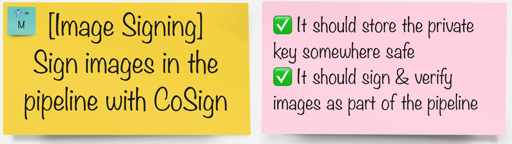

# イメージ署名

> クラスターにデプロイするコンテナー イメージが改ざんされておらず、有効なソースからのものであることを確認することが重要です。これは通常、構築後にイメージに署名し、展開前に署名を検証することによって実現されます。この演習では、コンテナー イメージの署名を作成、保存、検証するために`cosign`を使用します。

## タスク



## 開始する前に、鍵を生成します

1. イメージの署名に使用する鍵ペアを生成します。秘密鍵のパスワードを入力する必要があります。好きなものを自由に選択してください:)

    ```bash
    cd /tmp
    cosign generate-key-pair k8s://${TEAM_NAME}-ci-cd/${TEAM_NAME}-cosign
    ```

    次のような出力が得られるはずです。

     <div class="highlight" style="background: #f7f7f7">
     <pre><code class="language-bash">
        $ cosign generate-key-pair k8s://${TEAM_NAME}-ci-cd/${TEAM_NAME}-cosign
        Enter password for private key:
        Enter again:
        Successfully created secret cosign in namespace &lt;TEAM_NAME&gt;-ci-cd
        Public key written to cosign.pub
        </code></pre>
    </div>

    2 つのキー (1 つの秘密キーと 1 つの公開キー) を生成しました。秘密鍵はイメージの署名に使用され、選択したパスワードと共に`ci-cd`namespaceにシークレットとして自動的に保存されます。公開鍵は、署名されたイメージを検証するために使用されます。画像を検証するために公開鍵を共有することはできますが、秘密鍵は公開する前に共有したり、少なくとも封印したりしないでください。

    <p class="tip">🐌 これは GITOPS ではありません - 生成された秘密鍵は、<TEAM_NAME>-ci-cd プロジェクトの Kubernetes シークレットに保存されます。代わりに、これを抽出して SealedSecret として保存することは、読者の課題として残しておきます。 🐎</p>

次に、イメージ署名ステップでパイプラインを拡張しましょう。

*この手順は、外部イメージ レジストリを使用し、クラスター間またはパブリックでイメージを共有する場合に、より効果的です。*

#### グループで、パイプラインを統合するツールを選択します。

|🐈‍⬛ **Jenkinsグループ** 🐈‍⬛ | 🐅 **Tekton グループ** 🐅|
|--- | ---|
|* パイプラインにイメージ署名ステージを追加 | * イメージ署名タスクをパイプラインに追加します|
|<span style="color:blue;"><p><a href="3-revenge-of-the-automated-testing/8a-jenkins.md">jenkins</a></p></span> | <span style="color:blue;"><p><a href="3-revenge-of-the-automated-testing/8b-tekton.md">tekton</a></p></span>|
