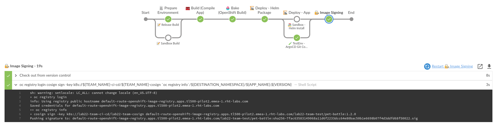
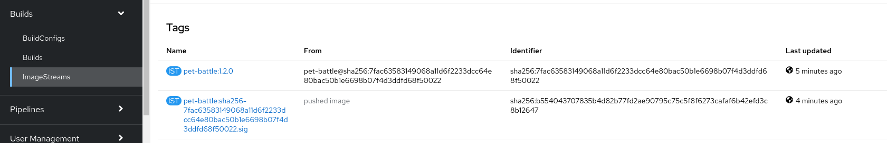

## イメージ署名によるJenkinsパイプラインの拡張

1. `cosign`コマンドラインを含む新しい Jenkins エージェントを追加します。 `ubiquitous-journey/values-tooling.yaml`を開き、 `Jenkins`下に`jenkins-agent-cosign`をリストに追加します。

    ```yaml
            # default names, versions, repo and paths set on the template
            - name: jenkins-agent-npm
            - name: jenkins-agent-mvn
            - name: jenkins-agent-helm
            - name: jenkins-agent-argocd
            - name: jenkins-agent-cosign # add this one
    ```

    ```bash
    cd /projects/tech-exercise
    git add ubiquitous-journey/values-tooling.yaml
    git commit -m  "🔒 ADD - Cosign Jenkins Agent 🔒"
    git push
    ```

     <p class="warn">error <b>: failed to push some refs to..</b>のようなエラーが発生した場合は、 <b><i>git pull</i></b>を実行してから、上記のコマンドを実行して変更を再度プッシュしてください。</p>
    

2. cosign ステップで新しいステージを Jenkinsfile に追加します。イメージ署名は、イメージのビルド後に実行する必要があります。以下のブロックを適切なプレースホルダーにコピーします。

    ```groovy
            // 🔏 IMAGE SIGN EXAMPLE GOES HERE
            stage("🔏 Image Signing") {
                agent { label "jenkins-agent-cosign" }
                options {
                        skipDefaultCheckout(true)
                }
                steps {
                    script {
                        sh '''
                        oc registry login
                        cosign sign -key k8s://${TEAM_NAME}-ci-cd/${TEAM_NAME}-cosign `oc registry info`/${DESTINATION_NAMESPACE}/${APP_NAME}:${VERSION} --allow-insecure-registry
                        '''
                    }
                }
            }
    ```

3. Jenkinsfile の変更と一緒に、イメージを確認したい人のために、公開鍵を`pet-battle`リポジトリに保存します。このプッシュにより、ビルド用の Jenkins ジョブもトリガーされます。

    ```bash
    cp /tmp/cosign.pub /projects/pet-battle/
    cd /projects/pet-battle
    git add cosign.pub Jenkinsfile
    git commit -m  "⛹️ ADD - cosign public key for image verification and Jenkinsfile updated ⛹️"
    git push
    ```

    🪄**image-sign**ステージで実行中の**pet-battle**パイプラインを観察します。  

    パイプラインが正常に終了したら、 `<TEAM_NAME>-test`namespace内の OpenShift UI &gt; Builds &gt; ImageStreams に移動し、 `pet-battle`を選択します。これがイメージ署名されていることを示す`.sig`で終わるタグが表示されます。

    

4. 署名されたイメージを公開鍵で検証しましょう。画像に適切な`APP VERSION`を使用していることを確認してください。 (この場合は`1.2.0` )

    ```bash
    cd /projects/pet-battle
    oc registry login $(oc registry info) --insecure=true
    cosign verify --key k8s://<TEAM_NAME>-ci-cd/<TEAM_NAME>-cosign default-route-openshift-image-registry.<CLUSTER_DOMAIN>/<TEAM_NAME>-test/pet-battle:1.2.0 --allow-insecure-registry
    ```

    出力は次のようになります。

     <div class="highlight" style="background: #f7f7f7">
     <pre><code class="language-bash">
        Verification for default-route-openshift-image-registry.&lt;CLUSTER_DOMAIN&gt;/&lt;TEAM_NAME&gt;-test/pet-battle:1.2.0 --
        The following checks were performed on each of these signatures:
        - The cosign claims were validated
        - The signatures were verified against the specified public key
        - Any certificates were verified against the Fulcio roots.
        {"critical":{"identity":{"docker-reference":"default-route-openshift-image-registry.&lt;CLUSTER_DOMAIN&gt;/&lt;TEAM_NAME&gt;-test/pet-battle"},"image":{"docker-manifest-digest":"sha256:7fac63583149068a11d6f2233dcc64e80bac50b1e6698b07f4d3ddfd68f50022"},"type":"cosign container image signature"},"optional":null}
        </code></pre>
    </div>
    
