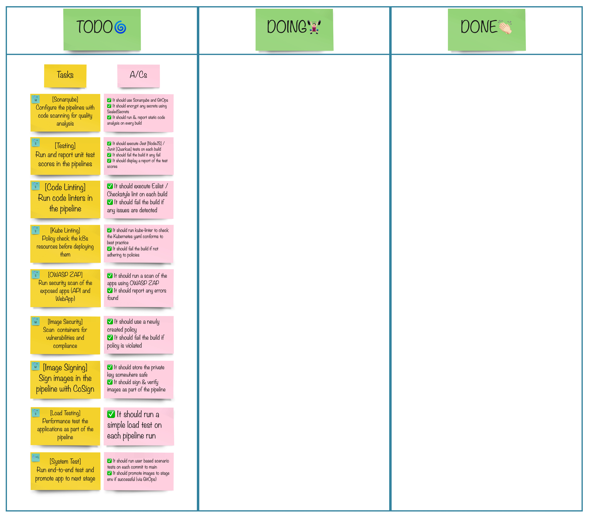
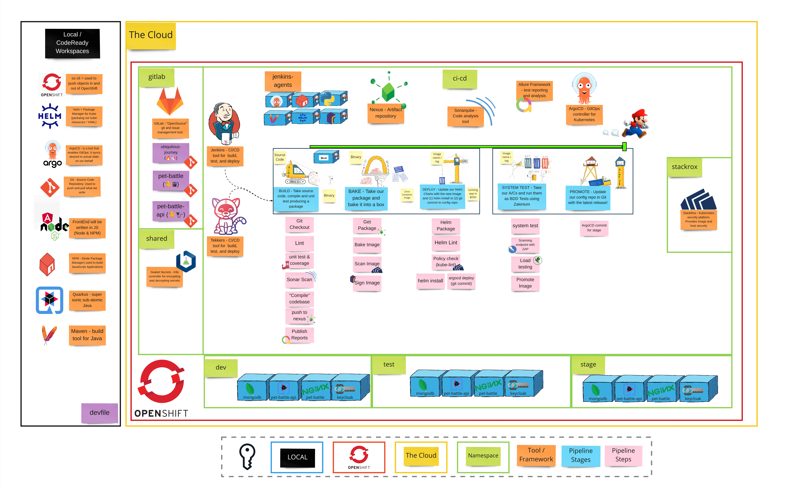

# 演習 3 - 自動テストの復讐

> 継続的なテスト - エンド ツー エンドのテストは良さそうに見えますが、すべてのバグをキャッチすることはできないため、常に悪いものです。私たちが本当に必要としているのは、継続的なテストです。

継続的デリバリーには、迅速で信頼できるフィードバックが必要です。継続的なテストへの投資は価値のある活動です。

## 👨‍🍳演習の説明

**💥 あなた自身の冒険を選んでください 💥**

`Quality Gates`の見出しの下でできることはたくさんあるので、自分で何をしたいかを決めてください。テーブル グループで、各演習のタイトルでかんばんを作成します。モブ/ペアとして、リストからタスクを取得して実行します。各セクションの終わりに、自分が達成したことを他のグループに再生します。次に、リストの次の優先項目を取得します。

## ビッグピクチャー

## 🔮 学習成果

- [ ] パイプラインにセキュリティ ゲートを追加できる
- [ ] パイプラインにテスト ゲートを追加できる
- [ ] 静的コード分析ゲートをパイプラインに追加できる
- [ ] イメージ署名をパイプラインに追加できる
- [ ] パイプラインに負荷テストを追加できる

## 🔨 Tools used in this exercise!

- <a href="https://www.sonarqube.org/">Sonar</a> - 静的コード分析をパイプラインに追加する
- テストツール -
    <a href="https://jestjs.io/">Jest</a> 、
    <a href="https://github.com/allure-framework/allure2">Allure</a> 、
    <a href="https://quarkus.io/guides/getting-started-testing">RESTassured</a> - API とフロントエンドのテストを追加
- コード リンティング -
    <a href="https://www.npmjs.com/package/lint">npm lint</a> 、
    <a href="https://checkstyle.sourceforge.io">checkstyle</a> - テストの静的コード リンターとカバレッジ レポート
- Kube Linting -
    <a href="https://github.com/stackrox/kube-linter">kubeinter</a> - ベスト プラクティスに照らして K8S yaml を検証する
- <a href="https://owasp.org/www-project-zap">ZAP - 一般的な攻撃パターンをチェックするための OWASP</a>アプリケーション スキャン
- Image Security -
    <a href="https://www.stackrox.com">StackRox</a> - StackRox を使用してイメージとホスト内の脆弱性を見つける
- 画像署名 -
    <a href="https://www.sigstore.dev">sigstore</a> - cosign でイメージに署名します
- 負荷テスト -
    <a href="https://docs.locust.io/en/stable/index.html">イナゴ</a>- パイプラインでの自動負荷テスト
- システム テスト - 次の段階に進む前にシステムをテストします。
