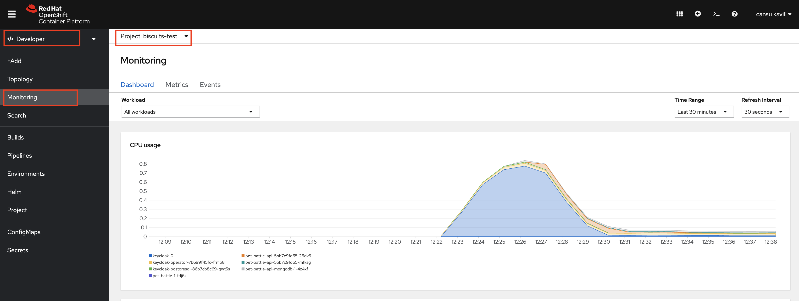
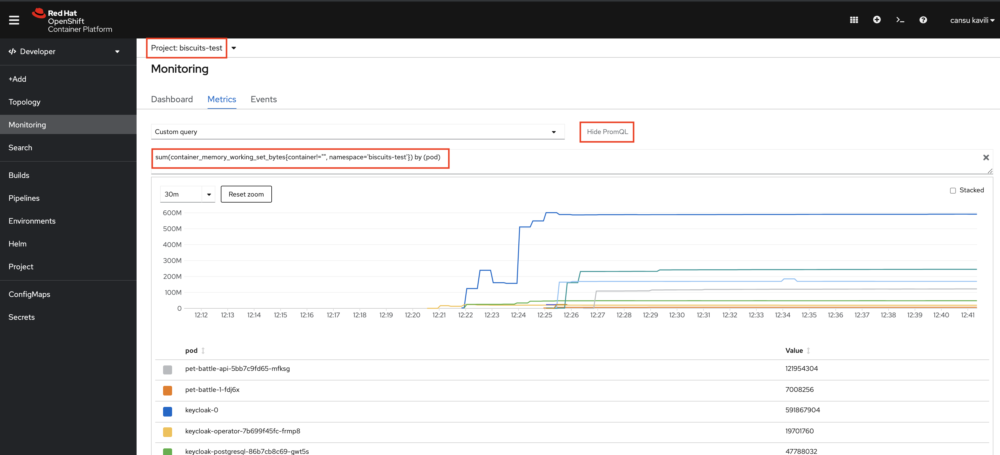
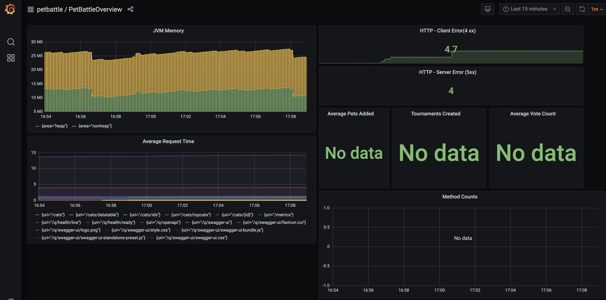
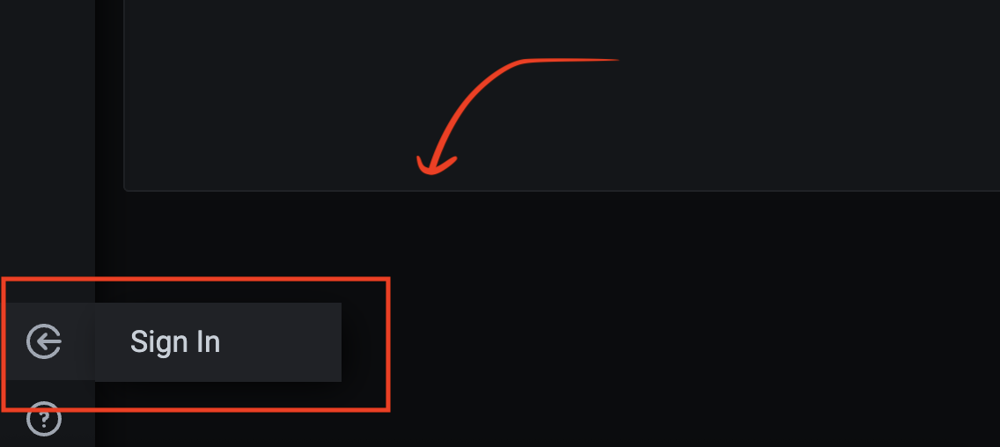
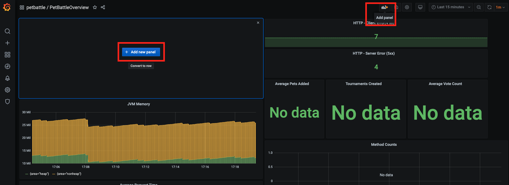
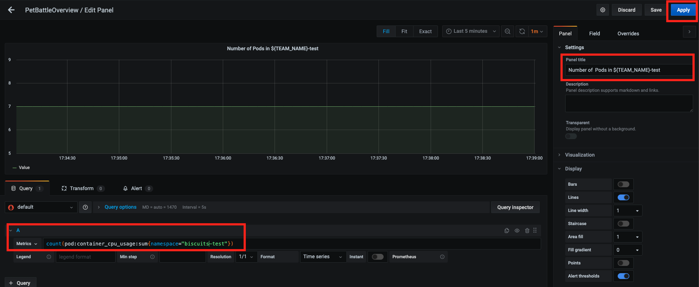

## ユーザー ワークロードの監視

> OpenShift には監視機能が組み込まれています。これは、prometheus スタックをデプロイし、クラスター メトリックを使用するために OpenShift UI に統合されています。

### OCP 開発者視点でのモニタリング (Podなど)

> OpenShift ですぐに使用できるモニタリング - これにより、メモリ使用量や CPU など、アプリの Kubernetes メトリクスが得られます。

1. ユーザー ワークロード モニタリングを有効にするには、構成マップに 1 行の変更を加える必要があります。これはクラスター全体に適用されるため、既に行われていますが、興味がある場合は、 <span style="color:blue;"><a href="https://docs.openshift.com/container-platform/4.9/monitoring/enabling-monitoring-for-user-defined-projects.html#enabling-monitoring-for-user-defined-projects_enabling-monitoring-for-user-defined-projects">ドキュメントがここにあります</a>。</span>

    OpenShift UI で*Observe*に移動すると、基本的なヘルス インジケーターが表示されます。

    

2. Prometheus のクエリ言語である`promql`を使用すると、namespace全体で簡単にクエリを実行できます。 `promql`クエリを実行して、テスト用namespaceのPodによって消費されるメモリに関する情報を取得します

    ```bash
    sum(container_memory_working_set_bytes{container!='',namespace='<TEAM_NAME>-test'}) by (pod)
    ```

    

### Grafana と Service Monitor を追加

> 猫にまつわるサービスの具体的な情報を監視を強化しましょう...

1. PetBattle アプリで ServiceMonitor を有効にします。

    OpenShift は基本メトリクスを収集して、Podの動作を確認します。アプリケーション固有のメトリック (応答時間やアクティブ ユーザーなど) を基本メトリックと共に取得するには、別のオブジェクト*ServiceMonitor*が必要です。 ServiceMonitor は、Prometheusがメトリクスをスクレイピングできるように、メトリクスが公開されているエンドポイントをPrometheusに知らせます。そして、Prometheus がメトリクスを取得したら、それらに対してクエリを実行し (以前と同じように!)、輝くダッシュボードを作成できます!

    ServiceMonitor オブジェクトの**例**:

     <div class="highlight" style="background: #f7f7f7">
     <pre><code class="language-yaml">
        ---
        apiVersion: monitoring.coreos.com/v1
        kind: ServiceMonitor
        metadata:
          name: my-app
        spec:
          endpoints:
            - interval: 30s
              port: tcp-8080 # port that metrics are exposed
              scheme: http
          selector:
            matchLabels:
              app: my-app
        </code></pre>
    </div>


    それでは、PetBattle アプリの`ServiceMonitor`を作成して追加しましょう!もちろん、これはGITOPSなので、HelmとArgoCDを介して実行します!!

    pet-battle api の Helm チャート`pet-battle/test/values.yaml`および`pet-battle/stage/values.yaml`ファイルを開きます。以下を追加して、 `pet-battle-api`の`values`更新します。

    ```yaml
          servicemonitor: true
    ```

    次に、それを git リポジトリにプッシュします。

    ```bash
    cd /projects/tech-exercise
    git add .
    git commit -m "🖥️ ServiceMonitor enabled 🖥️"
    git push
    ```

    オブジェクトが存在することを確認したい場合は、端末から実行できます。

    ```bash
    oc get servicemonitor -n ${TEAM_NAME}-test -o yaml
    ```

2. 独自のアプリケーション固有のダッシュボードを作成して、運用の使用や効率、または A/B テスト結果のライブ データを表示できます。 Grafana を使用してダッシュボードを作成します。これは別のツールになるため、 `ubiquitous-journey/values-tooling.yaml`からインストールする必要があります。

    ```yaml
      # Grafana
      - name: grafana
        enabled: true
        source: https://github.com/petbattle/pet-battle-infra.git
        source_path: grafana
    ```

3. 前に行ったように、リポジトリへの変更をコミットします

    ```bash
    cd /projects/tech-exercise
    git add .
    git commit -m "📈 Grafana added 📈"
    git push
    ```

4. この変更が同期されたら (ArgoCD で確認できます)、Grafana にログインして、Pet Battle の定義済みダッシュボードを表示します。

    ```bash
    # get the route and open it in your browser
    echo https://$(oc get route grafana-route --template='{{ .spec.host }}' -n ${TEAM_NAME}-ci-cd)
    ```

    `Log in with OpenShift`使用してログインしてダッシュボードを表示する場合、ユーザーには読み取り専用の`view`ロールしかありません。ほとんどの場合、これで問題ありませんが、ボードを編集および管理できるようにしたいと考えています。

5. ダッシュボードにはいくつかの基本的な情報が表示されているはずで、 `pet-battle-api`にいくつかのリクエストを発行することで、より多くのデータを生成できます。 IDE で、ターミナルで実行します。

    ```bash
    curl -vkL $(oc get route/pet-battle-api -n ${TEAM_NAME}-test --template='{{.spec.host}}')/dogs
    curl -vkL -X POST -d '{"OK":"🐈"}' $(oc get route/pet-battle-api -n <TEAM_NAME>-test --template='{{.spec.host}}')/cats/
    curl -vkL $(oc get route/pet-battle-api -n ${TEAM_NAME}-test --template='{{.spec.host}}')/api/dogs
    curl -vkL -X POST -d '{"OK":"🦆"}' $(oc get route/pet-battle-api -n <TEAM_NAME>-test --template='{{.spec.host}}')/cats/
    curl -vkL $(oc get route/pet-battle-api -n ${TEAM_NAME}-test --template='{{.spec.host}}')/api/dogs
    curl -vkL -X POST -d '{"OK":"🐶"}' $(oc get route/pet-battle-api -n <TEAM_NAME>-test --template='{{.spec.host}}')/cats/
    ```

6. Grafana に戻ると、 `4xx`および`5xx`ボードにいくつかのデータが取り込まれているはずです...

    

### ダッシュボードを作成する

> Pet Battle ダッシュボードを新しい`panel`で拡張して、視覚的な方法でいくつかのメトリックを取得してみましょう。 Grafana UI を使用すると、ダッシュボードを簡単に構成できます。その後、ダッシュボードは`JSON`ドキュメントとしてエクスポートできるため、簡単に共有できます。

1. OpenShift ユーザーには、デフォルトで Grafana の読み取り専用ビューがあります。クラスターから`admin`ユーザーの詳細を取得します。

    ```bash
    oc get secret grafana-admin-credentials -o=jsonpath='{.data.GF_SECURITY_ADMIN_PASSWORD}' -n ${TEAM_NAME}-ci-cd \
    | base64 -d; echo -n
    ```

2. Grafana に戻り、OpenShift Auth を使用してサインインした後、これらの資格情報で`login` します(はい、これがばかげていることはわかっていますが、Operator も同様です)。

    

3. サインインしたら、新しいパネルを追加します。

    

4. 新しいパネルで、プロジェクトに関する情報を照会するように構成しましょう。namespaceで実行されているPodの数をカウントするために、非常に単純なクエリを使用します (他のクエリを自由に使用してください)。パネル設定で、タイトルを適切なものに設定し、以下のクエリを追加します。保存を押してください！

    ```bash
    sum(kube_pod_status_ready{namespace="<TEAM_NAME>-test",condition="true"})
    ```

    

5. ダッシュボードの新しいパネルを使用して、ネームスペース内のいくつかのPodを強制終了して動作を確認しましょう

    ```bash
    oc delete pods -l app.kubernetes.io/instance=pet-battle-api -n ${TEAM_NAME}-test
    oc delete pods -l app.kubernetes.io/instance=pet-battle -n ${TEAM_NAME}-test
    ```

     <!-- -->


     <p class="tip">🐌 これは GITOPS ではありません - ダッシュボードを手動で構成することは、Grafana で遊ぶ良い方法です。ダッシュボードをコードとして作成および保存するための高度な演習を参照してください 🐎</p>
    
