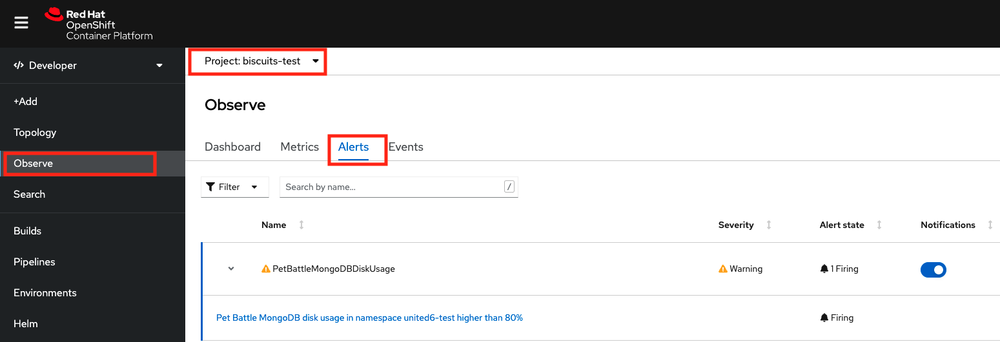

## アラートと通知

> OpenShift のビルトイン アラート....など

### Platform Alerts

1. Pet Battle API と UI チャートには、アラートを発生させる基本`rule` 1 つあります。 `/projects/pet-battle-api/chart/templates/prometheusrule.yaml`を開くと、Podが 1 分間使用できない場合にアラートを出すように構成されていることがわかります。アラート ルールは PromQL で記述されます。

     <div class="highlight" style="background: #f7f7f7">
     <pre><code class="language-yaml">
        spec:
          groups:
          - name: petbattle-api.rules
            rules:
            - alert: PetBattleApiNotAvailable
              annotations:
                message: 'Pet Battle API in namespace {{ .Release.Namespace }} is not available for the last 1 minutes.'
              expr: (1 - absent(kube_pod_status_ready{condition="true",namespace="{{ .Release.Namespace }}"} *
                    on(pod) group_left(label_app_kubernetes_io_component)
                    kube_pod_labels{label_app_kubernetes_io_component="pet-battle-api",namespace="{{ .Release.Namespace }}"})) == 0
              for: 1m
              labels:
                severity: {{ .Values.prometheusrules.severity | default "critical" }}
        </code></pre>
    </div>
    

2. MongoDB ディスクがビジー/フルになったときにアラートを出す新しいプラットフォーム タイプ ルールを追加します。

    ```bash
    cat << EOF >> /projects/pet-battle-api/chart/templates/prometheusrule.yaml
        - alert: PetBattleMongoDBDiskUsage
          annotations:
            message: 'Pet Battle MongoDB disk usage in namespace {{ .Release.Namespace }} higher than 80%'
          expr: (kubelet_volume_stats_used_bytes{persistentvolumeclaim="pet-battle-api-mongodb",namespace="{{ .Release.Namespace }}"} / kubelet_volume_stats_capacity_bytes{persistentvolumeclaim="pet-battle-api-mongodb",namespace="{{ .Release.Namespace }}"}) * 100 > 80
          labels:
            severity: {{ .Values.prometheusrules.severity | default "warning" }}
    EOF
    ```

3. API リクエストに負荷がかかっているときに警告するワークロード モニタリング タイプのルールを追加しましょう。

    ```bash
    cat << EOF >> /projects/pet-battle-api/chart/templates/prometheusrule.yaml
        - alert: PetBattleApiMaxHttpRequestTime
          annotations:
            message: 'Pet Battle Api max http request time over last 5 min in namespace {{ .Release.Namespace }} exceeds 1.5 sec.'
          expr: max_over_time(http_server_requests_seconds_max{service="pet-battle-api",namespace="{{ .Release.Namespace }}"}[5m]) > 1.5
          labels:
            severity: {{ .Values.prometheusrules.severity | default "warning" }}
    EOF
    ```

4. 新しいバージョンでパイプラインをトリガーできるようになりました。 `pet-battle-api`の `pom.xml`を編集し、 `version`番号を更新します。パイプラインは`chart/Chart.yaml`これらのバージョンで更新します。バージョン番号をインクリメントして適切に変更します。

    ```xml
        <artifactId>pet-battle-api</artifactId>
        <version>1.3.2</version>
    ```

    非常に面倒な場合は、このコードを実行して置換を行うこともできます。

    ```bash#test
    cd /projects/pet-battle-api
    mvn -ntp versions:set -DnewVersion=1.3.2
    ```

5. 変更をリポジトリにプッシュします。

    ```bash
    cd /projects/pet-battle-api
    git add .
    git commit -m  "🌳 ADD - Alerting Rules extended 🌳"
    git push
    ```

    このプッシュは`/projects/tech-exercise/pet-battle/test`の PetBattle API のチャート バージョンを更新するパイプラインをトリガーします。

    チャートのバージョンが自動的に更新されると、ArgoCD は新しい変更を検出してクラスターに適用します 🔥🔥🔥

6. アラートが期待どおりに機能しているかどうかをテストしてみましょう。1 つは HTTP 要求用、もう 1 つはディスク使用量用の 2 つのアラートを作成しました。まず、mongodb アラートをシミュレートするためにディスクをいっぱいにできるかどうかを見てみましょう。

    ```bash
    oc project ${TEAM_NAME}-test
    oc rsh `oc get po -l app.kubernetes.io/component=mongodb -o name -n ${TEAM_NAME}-test`
    ```

    ```bash
    dd if=/dev/urandom of=/var/lib/mongodb/data/rando-calrissian bs=10M count=50
    ```

    次のような出力が表示されます。

     <div class="highlight" style="background: #f7f7f7">
     <pre><code class="language-bash">
        sh-4.2$ dd if=/dev/urandom of=/var/lib/mongodb/data/rando-calrissian bs=10M count=50
        50+0 records in
        50+0 records out
        524288000 bytes (524 MB) copied, 11.2603 s, 46.6 MB/s
        </code></pre>
    </div>
    

7. OpenShift UI でアラートが発生していることを確認します。開発者ビューで、Observe &gt; Alertsに移動します。ドロップダウン メニューから適切なプロジェクトを選択してください。以下のような`PetBattleMongoDBDiskUsage`アラートが表示されます。

    
