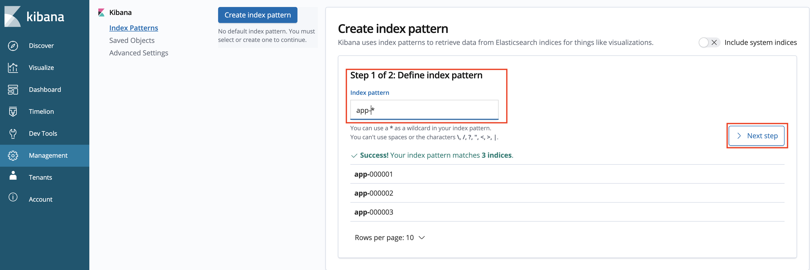
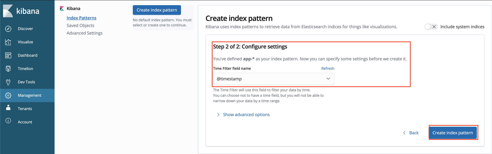
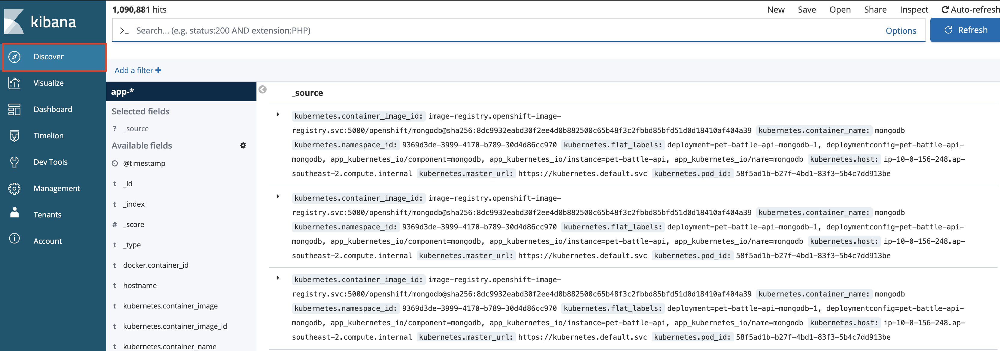
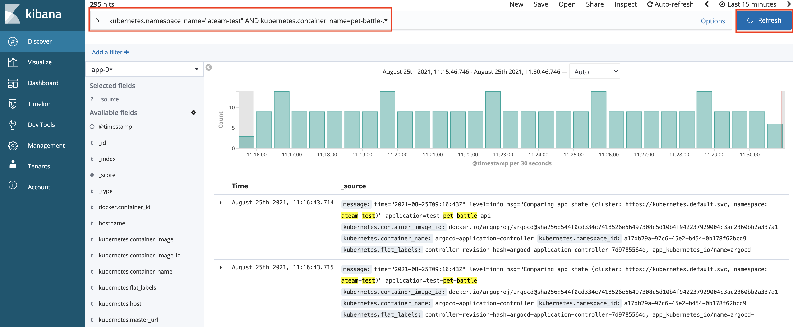
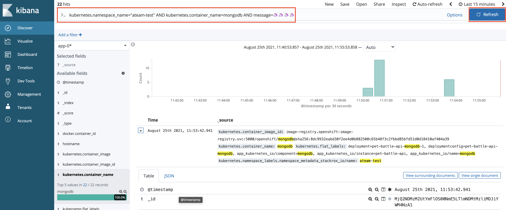

## 集約ログ

> OpenShift のビルトイン ロギング .... オペレーターが事前にインストールされている何か。非常にメモリを集中的に使用しますが、ロギングはインフラプレーンに展開できます...

1. 特定のコンテナーからログを観察します。

    ```bash
    oc project ${TEAM_NAME}-test
    oc logs `oc get po -l app.kubernetes.io/component=mongodb -o name -n ${TEAM_NAME}-test` --since 10m
    ```

    デフォルトでは、これらのログはデータベースに保存されませんが、保存する理由はいくつかあります (トラブルシューティング、法的義務など)。

2. OpenShift マジック`STDOUT` 、サービス全体でログを収集する優れた方法を提供します。STDOUT または`STDERR`に送られるものはすべて、FluentD によって収集され、Elastic Search に追加されます。これにより、ログのインデックス作成とクエリが非常に簡単になります。 Kibana がその上に追加され、データを簡単に視覚化できます。では、Kibana を見てみましょう。

    ```bash
    https://kibana-openshift-logging.<CLUSTER_DOMAIN>
    ```

3. 標準の資格情報を使用してログインします。最初のログイン時に、OpenShift がアクセス`Allow selected permissions`必要があります。

4. ログインすると、検索する`index`を作成するよう求められます。これは、Elasticsearchには多くのデータ セットがあるためです。そのため、検索したいデータ セットを選択する必要があります。この演習では、プラットフォーム ログとは対照的に、アプリケーション ログを検索します。 `app-*`のインデックス パターンを作成して、すべてのnamespaceのすべてのアプリケーション ログを検索します。

    

5. 構成設定で、 `@timestamp`を選択してフィルタリングし、インデックスを作成します。

    

6. Kibana ダッシュボードに移動します。左上隅にある`Discover`をクリックすると、すべてのPodのすべてのログが表示されます。情報量は多いですが、簡単に調べることができます。

    

7. 情報をフィルタリングしましょう。queryバーに`kubernetes.namespace_name="<TEAM_NAME>-test" AND kubernetes.container_name=pet-battle-.*を`追加して、テスト用namespaceで実行されているpet-battleアプリ専用のログを探します。

    

8. コンテナ ログは一時的なものであるため、それらが終了すると、それらが集約されてどこかに保存されない限り失われます。いくつかのメッセージを生成し、Kibana の UI からクエリを実行してみましょう。 rsh 経由でPodに接続し、ログを生成します。

    ```bash
    oc project ${TEAM_NAME}-test
    oc rsh `oc get po -l app.kubernetes.io/component=mongodb -o name -n ${TEAM_NAME}-test`
    ```

    次に、リモート ログオンしたばかりのコンテナー内で、意味のないメッセージをログに追加します。

    ```bash
    echo "🦄🦄🦄🦄" >> /tmp/custom.log
    tail -f /tmp/custom.log > /proc/1/fd/1 &
    echo "🦄🦄🦄🦄" >> /tmp/custom.log
    echo "🦄🦄🦄🦄" >> /tmp/custom.log
    echo "🦄🦄🦄🦄" >> /tmp/custom.log
    echo "🦄🦄🦄🦄" >> /tmp/custom.log
    exit
    ```

9. Kibana に戻り、これらのメッセージを別のクエリでフィルタリングして検索できます。

    ```yaml
    kubernetes.namespace_name="<TEAM_NAME>-test" AND kubernetes.container_name=mongodb AND message=🦄🦄🦄🦄
    ```

    
