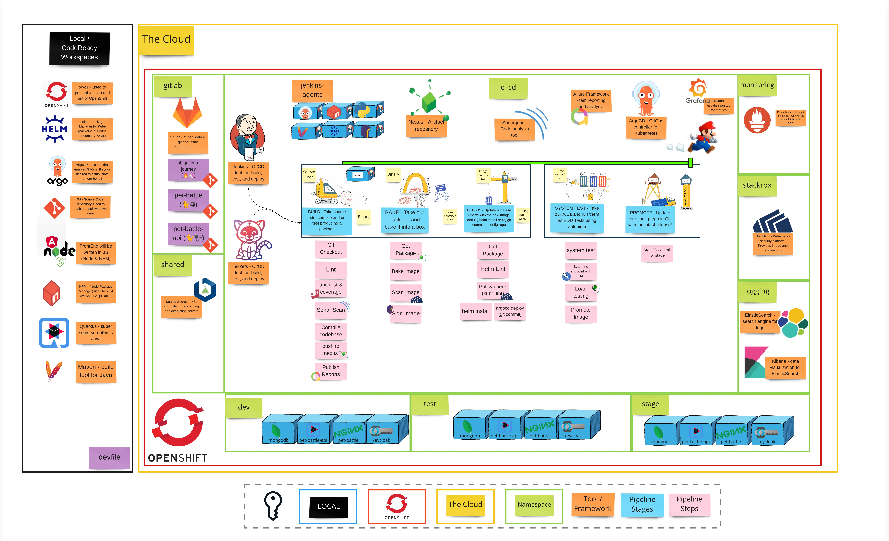

# 演習 4 - モニタリングの帰還

> メトリック主導の変革では、価値ベースのビジネス メトリックを使用して、テクノロジ関連の投資が組織のパフォーマンスにどのように影響するかを理解し、それらのメトリックの改善に役立つ特定のツールとガイダンスを提供することに重点を置いています。

ソフトウェアでは、多くの場合、2 つの競合する力が働いています。本質的にシステムの変更を伴うイノベーションと、最終顧客にサービスを提供し、システムが安定していることを意味する実行中のソフトウェア。ここで注目すべき 2 つの重要な領域を特定できます。

- チームの開発およびデリバリー プラクティスの有効性を測定するのに役立つ
- 問題の迅速な診断を可能にする活動の測定と監視を開始する

## 👨‍🍳演習の説明

この演習では、OpenShift のすぐに使えるモニタリングおよびロギング スタックを使用します。 `Prometheus`で PetBattle メトリクスを収集し、適切なしきい値でアラートを設定します。また`Grafana`を使用して PetBattle メトリックを視覚化し、PetBattle のステータスをよりよく理解できるようにします。さらに、アプリのログを収集して`ElasticSearch`に保存し、 `Kibana`を使用してそれらを視覚化します。

## ビッグピクチャー

## 🔮 学習成果

- [ ] アプリに ServiceMonitor を追加してメトリックを収集できる
- [ ] Prometheus にクエリを実行してメトリクスを確認できる
- [ ] PrometheusRule でアラートを作成できる
- [ ] Grafana をインストールしてダッシュボードを作成できます
- [ ] Kibana で検索インデックスを作成できる

## 🔨 この演習で使用するツール！

- <a href="https://prometheus.io/">Prometheus</a> - メトリクスを保存し、アラートに使用します
- <a href="https://grafana.com/">Grafana</a> - メトリクスを視覚化するために使用
- <a href="https://www.elastic.co/">ElasticSearch</a> - ログとデータを構造化されていない方法で保存します
- <a href="https://www.elastic.co/kibana/">Kibana</a> - ElasticSearch データの視覚化に使用
