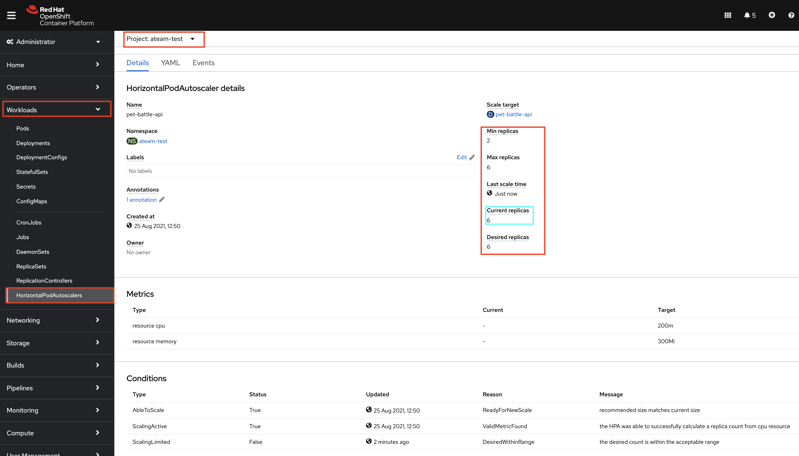
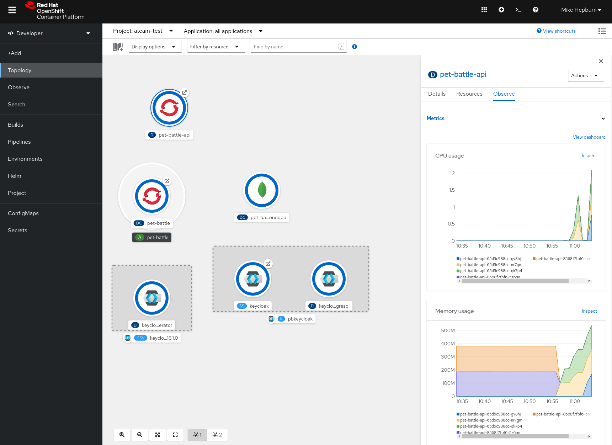
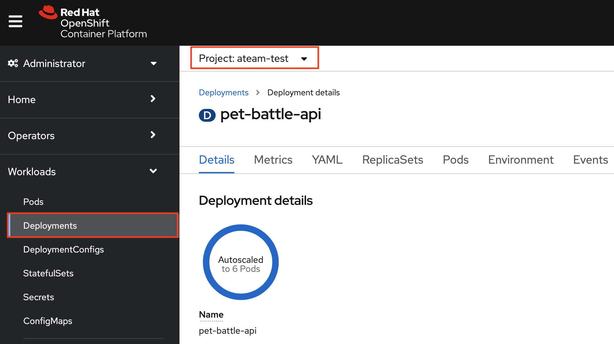
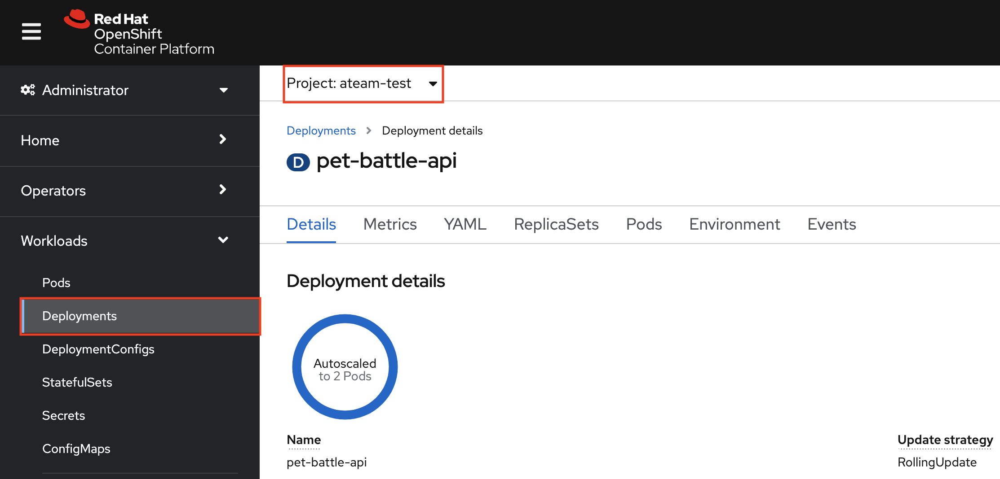

## 自動スケーリング

> 水平ポッド オートスケーラー (HPA) は、ポッドから収集されたメトリックに基づいて、OpenShift がアプリケーションのスケールを自動的に増減する方法を指定するのに役立ちます。 HPA を定義した後 (CPU および/またはメモリ使用量メトリックに基づいて)、プラットフォームは現在の使用量を計算し、それを目的の使用率と比較してから、それに応じて Pod をスケールアップまたはスケールダウンします。

1. Pet Battle API の Helm チャートには、Horizontal Pod Autoscaler yaml が含まれています。デフォルトではオフにしています。これは次のようになります。

     <div class="highlight" style="background: #f7f7f7">
     <pre><code class="language-yaml">
        # Source: pet-battle-api/templates/hpa.yaml
        apiVersion: autoscaling/v2beta2
        kind: HorizontalPodAutoscaler
        metadata:
          name: pet-battle-api
        spec:
          scaleTargetRef:
            apiVersion: apps/v1
            kind: Deployment
            name: pet-battle-api
          minReplicas: 2
          maxReplicas: 6
          metrics:
            - type: Resource
              resource:
                name: cpu
                target:
                  type: AverageValue
                  averageValue: 200m
            - type: Resource
              resource:
                name: memory
                target:
                  type: AverageValue
                  averageValue: 300Mi
        </code></pre>
    </div>
    

2. 多くの場合、ステージング環境または本番環境でのみ HPA を有効にするため、テスト時にオン/オフを構成できると便利です。特定の環境で有効にするには、アプリケーション構成に新しい値を指定するだけです。 `hpa`を`enabled:true`に設定して、 `tech-exercise/pet-battle/test/values.yaml`更新します。

    ```yaml
      # Pet Battle API
      pet-battle-api:
        name: pet-battle-api
        enabled: true
        source: http://nexus:8081/repository/helm-charts
        chart_name: pet-battle-api
        source_ref: 1.2.1
        values:
          image_name: pet-battle-api
          image_version: 1.0.0
          # ✋ ✋ ADD THIS CONFIG BELOW TO YOUR values.yaml FILE
          hpa:
            enabled: true
            cpuTarget: 200m
            memTarget: 300Mi
    ```

3. Git で変更をコミットします。これを実行するためのコマンドをここで説明する必要はないかもしれませんが、念のため... ここで再び 🐎🐎🐎 !

    ```bash
    cd /projects/tech-exercise
    git add pet-battle/test/values.yaml
    git commit -m  "🐎ADD - HPA enabled for test env 🐎 "
    git push
    ```

4. 変更が同期されると、ArgoCD とクラスターに新しいオブジェクトが表示されます。お気軽にチェックしてください。

5. Pod自動スケーラーをテストしてみましょう。これを行うには、pet-battle の API に多くの負荷をかけたいと考えています。これにより、Podの負荷が増加するため、自動スケーリングがトリガーされます。 `k6`は、コマンド ラインから実行できる単純な負荷テスト ツールであり、エンドポイントで大量の負荷を発生させます。

    最初に、実行する負荷テスト タイプを定義する load.js JavaScript ファイルを作成します。

    ```javascript
    cat << EOF > /tmp/load.js
    import http from 'k6/http';
    import { sleep } from 'k6';
    export default function () {
      http.get('https://$(oc get route/pet-battle-api -n ${TEAM_NAME}-test --template='{{.spec.host}}')/cats');
    }
    EOF
    ```

    次に、 `k6`バイナリを使用して、複数の仮想ユーザーと定義された期間を使用して負荷テストを実行します。

    ```bash
    k6 run --insecure-skip-tls-verify --vus 100 --duration 30s /tmp/load.js
    ```

    オプション:

    - --vus: 同時に実行する仮想ユーザー (VU) の数 (100)
    - --duration: テスト期間の制限 (30 秒)

6. これが実行されている間、OpenShift ランドで自動スケーラーが作動し、追加のPodを起動させていることがわかります。 pet-battle-api デプロイメントに移動すると、レプリカ数が急増していることがわかります。

      

7. しばらくすると、自動スケーラーが元に戻り、レプリカが削減されます。

    
