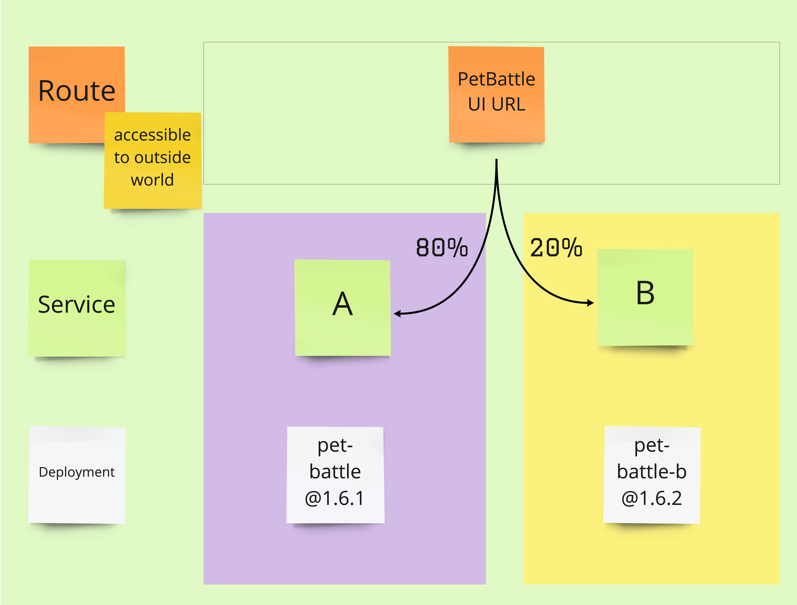

## A/B デプロイメント

> A/B デプロイは、通常、テストまたは実験目的でアプリケーションの 2 つ (またはそれ以上) のバージョンを同時に実行することを意味します。

<span style="color:blue;"><a href="https://docs.openshift.com/container-platform/4.9/applications/deployments/route-based-deployment-strategies.html#deployments-ab-testing_route-based-deployment-strategies">OpenShift Docs は、</a></span>手動で A/B デプロイメントを行う方法の例を示すのに非常に優れています。しかし実際には、いくつかのテストやその他の指標に基づいて代替サービスの負荷を増やすことで、これを自動化する必要があります。さらに、これは GITOPS です。では、このすべての自動化と新しい技術を使用して A/B を行うにはどうすればよいでしょうか。Pet Battle UI を見てみましょう!



- 図でわかるように、OpenShift はルートに来るトラフィックを分散できます。しかし、それはどのように行うのですか？ `route`定義を調べてみましょう。これは古典的な Route 定義です:

    ```yaml
        apiVersion: route.openshift.io/v1
        kind: Route
        metadata:
          name: pet-battle
        spec:
          port:
            targetPort: 8080-tcp
          to:
            kind: Service
            name: pet-battle
            weight: 100       <-- All of the traffic goes to `pet-battle` service
          ...
    ```

    トラフィックを分割するために、 `alternateBackends`と呼ばれるものを導入します。
    
    ```yaml
        apiVersion: route.openshift.io/v1
        kind: Route
        metadata:
          name: pet-battle
        spec:
          port:
            targetPort: 8080-tcp
          to:
            kind: Service
            name: pet-battle
            weight: 80
          alternateBackends: <-- This helps us to divide the traffic
          - kind: Service
            name: pet-battle-b
            weight: 20       <-- based on the percentage we give
    ```

    PetBattle UI ヘルム チャートには、既にこの機能があります。 `values`で有効にするだけです。ただし、その前に、ヘルパー ツールをインストールする必要があります。

### A/B と分析

> これらの高度なデプロイ戦略を行っている理由は、実験、新しく導入された機能がエンドユーザーに好まれるかどうか、新しいバージョンのパフォーマンスなどを確認するためです。しかし、トラフィックを分割するだけでは不十分です。変更の影響を追跡して測定する必要があります。したがって、 `Matomo`というツールを使用して、PetBattle とユーザーの行動に関する詳細なレポートを取得します。

A/B デプロイにジャンプする前に、Argo CD を介して Matomo(Piwik) をデプロイしましょう。

1. `tech-exercise/ubiquitous-journey/values-tooling.yaml`ファイルを開き、次のアプリケーション定義を追加します。

    ```yaml
      # Matomo
      - name: matomo
        enabled: true
        source: https://petbattle.github.io/helm-charts
        chart_name: matomo
        source_ref: "4.1.1+01"
    ```

    変更をプッシュします。

    ```bash
    cd /projects/tech-exercise
    git add .
    git commit -m  "📈 ADD - matomo app 📈"
    git push
    ```

    Matomoがデプロイされていることを確認してください:

    ```bash
    oc get pod -n ${TEAM_NAME}-ci-cd -w
    ```

    Matomo Podが実行されている場合、URL を取得して接続します。

    ```bash
    echo https://$(oc get route/matomo -n ${TEAM_NAME}-ci-cd --template='{{.spec.host}}')
    ```

    - Username: `admin`
    - Password: `My$uper$ecretPassword123#`

2. 現在、まだデータはありません。しかし、Pet Battle は、接続が発生するたびに Matomo にデータを送信するように設定されています。 ( `tech-exercise/pet-battle/test/values.yaml`ファイルを開き、 `matomo`を探します) A/Bデプロイの実験を開始し、途中で Matomo UI を確認してみましょう。

### A/B デプロイメント

1. 比較したい実験を展開しましょう - これを`B`と呼びましょう。作成したものと一致するように、 `source_ref` Helm チャートのバージョンと`image_version`を調整します。

    ```bash
    cat << EOF >> /projects/tech-exercise/pet-battle/test/values.yaml
      # Pet Battle UI - experiment
      pet-battle-b:
        name: pet-battle-b
        enabled: true
        source: http://nexus:8081/repository/helm-charts
        chart_name: pet-battle
        source_ref: 1.0.6 # helm chart version - may need adjusting!
        values:
          image_version: latest # container image version - may need adjusting!
          fullnameOverride: pet-battle-b
          route: false
          config_map: '{
            "catsUrl": "https://pet-battle-api-<TEAM_NAME>-test.<CLUSTER_DOMAIN>",
            "tournamentsUrl": "https://pet-battle-tournament-<TEAM_NAME>-test.<CLUSTER_DOMAIN>",
            "matomoUrl": "https://matomo-<TEAM_NAME>-ci-cd.<CLUSTER_DOMAIN>/",
            "keycloak": {
              "url": "https://keycloak-<TEAM_NAME>-test.<CLUSTER_DOMAIN>/auth/",
              "realm": "pbrealm",
              "clientId": "pbclient",
              "redirectUri": "http://localhost:4200/tournament",
              "enableLogging": true
            }
          }'
    EOF
    ```

    既存の Pet Battle デプロイメントを`A`として使用します。

2. `a_b_deploy`プロパティーを`values`セクションに追加して、既存の Pet Battle デプロイメント ( `A` ) の構成を拡張します。 `/projects/tech-exercise/pet-battle/test/values.yaml`ファイルの`pet-battle`アプリケーション定義の下にある以下の行をコピーします。

    ```yaml
          a_b_deploy:
            a_weight: 80
            b_weight: 20 # 20% of the traffic will be directed to 'A'
            svc_name: pet-battle-b
    ```

    `test/values.yaml`の`pet-battle-a`定義は次のようになります (バージョン番号は異なる場合があります)。

     <div class="highlight" style="background: #f7f7f7">
     <pre><code class="language-yaml">
          pet-battle:
            name: pet-battle
            enabled: true
            source: http://nexus:8081/repository/helm-charts
            chart_name: pet-battle
            source_ref: 1.0.6 # helm chart version
            values:
              image_version: latest # container image version
              &lt;strong&gt;a_b_deploy:
                a_weight: 80
                b_weight: 20 # 20% of the traffic will be directed to 'B'
                svc_name: pet-battle-b&lt;/strong&gt;
              config_map: ...
        </code></pre>
    </div>
    

3. Git で変更をコミットすると、OpenShift UI で 2 つの新しいデプロイが有効になっていることがわかります。

    ```bash
    cd /projects/tech-exercise
    git add pet-battle/test/values.yaml
    git commit -m  "🍿 ADD - A & B environments 🍿"
    git push
    ```

4. 両方のサービス定義があるかどうかを確認します。

    ```bash
    oc get svc -l app.kubernetes.io/instance=pet-battle -n ${TEAM_NAME}-test
    oc get svc -l app.kubernetes.io/instance=pet-battle-b -n ${TEAM_NAME}-test
    ```

5. トラフィックのリダイレクトを確認する前に、簡単なアプリケーションの変更を行って、これをより視覚的にしましょう!フロントエンドでは、アプリの上部にあるバナーを変更します。 IDE で`/projects/pet-battle/src/app/shell/header/header.component.html`を開きます。 `<!-- Green #009B00 -->`の下にある`<nav>` HTML タグのコメントを外します。

    元の<code>&lt;nav class="navbar navbar-expand-lg navbar-dark bg-dark"&gt;</code><strong>行を削除します</strong>。次のように表示されます。

    ```html
    <header>
        <!-- Green #009B00 -->
        <nav class="navbar  navbar-expand-lg navbar-dark" style="background-color: #009B00;">
    ```

6. フロントエンドのリポジトリのルートにある`package.json`のバージョンを更新して、アプリケーションの`version`を上げて新しいリリースをトリガーします。

     <div class="highlight" style="background: #f7f7f7">
     <pre><code class="language-yaml">
        "name": "pet-battle",
        "version": "1.6.1", &lt;- bump this
        "private": true,
        "scripts": ...
        </code></pre>
    </div>
    

7. これらすべての変更をコミットします。

    ```bash
    cd /projects/pet-battle
    git add .
    git commit -m "🫒 ADD - Green banner 🫒"
    git push
    ```

8. Jenkins が実行されると、ArgoCD 構成のバージョンが上がります。 `pet-battle-b`以前のバージョンでまだ実行されている間に、ArgoCD が新しいバージョンのデプロイをトリガーします。

    ブラウザで`pet-battle`を開くと、トラフィックの 20% が`b`になります。緑色のバナーを目にする機会はほとんどありません。

    ```bash
    oc get route/pet-battle -n ${TEAM_NAME}-test --template='{{.spec.host}}'
    ```

9. 次に、トラフィックの 50% を`B`にリダイレクトします。つまり、トラフィックの 50% のみが`A`に送信されます。したがって、 `tech-exercise/pet-battle/test/values.yaml`ファイルの`weight`値を更新する必要があります。そしていつものように、それを Git リポジトリにプッシュします。<strong>Gitになければ、本物ではないからです!</strong>

    ```bash
    cd /projects/tech-exercise
    yq eval -i .applications.pet-battle.values.a_b_deploy.a_weight='100' pet-battle/test/values.yaml
    yq eval -i .applications.pet-battle.values.a_b_deploy.b_weight='100' pet-battle/test/values.yaml
    git add pet-battle/test/values.yaml
    git commit -m  "🏋️‍♂️ service B weight increased to 50% 🏋️‍♂️"
    git push
    ```

10. シークレット ブラウザを開き、同じ URL に接続します。緑のバナーを獲得できる確率は 50% です。

    ```bash
    oc get route/pet-battle -n ${TEAM_NAME}-test --template='{{.spec.host}}'
    ```

11. どうやら、PetBattle UI の緑色のバナーが好きなようです。すべてのトラフィックをサービス`A`にリダイレクトしましょう。はい、そのためにはサービス`B`の重みを 0 にする必要があります。ページを更新すると、緑色のバナーのみが表示されます。

    ```bash
    cd /projects/tech-exercise
    yq eval -i .applications.pet-battle.values.a_b_deploy.a_weight='100' pet-battle/test/values.yaml
    yq eval -i .applications.pet-battle.values.a_b_deploy.b_weight='0' pet-battle/test/values.yaml
    git add pet-battle/test/values.yaml
    git commit -m  "💯 service B weight increased to 100 💯"
    git push
    ```

    ..Matomoをチェックすることを忘れないでください!
