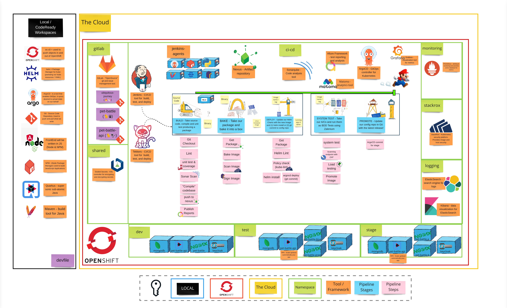

# 演習 5 - デプロイメントの逆襲

> 各アプリケーションには、デプロイ中の可用性 (およびその他の考慮事項) に関するさまざまな要件があります。 Advanced Deployment Strategies は、さまざまなデプロイシナリオをサポートするために用意されています。

ソフトウェアが作成されてからテストされてから、本番環境にデプロイされるまでの時間は、できるだけ短くする必要があります。小規模なアプリケーション スイートであっても、本番環境にデプロイするときに変更する必要がある詳細と構成項目が多すぎます。手動でのデプロイは、エラーが発生しやすく、退屈になります。私たちは、デプロイ プロセスを自動化し、OpenShift が提供するプラットフォーム機能を活用することで、この手作業の負担を軽減する努力を続けています。

## 👨‍🍳 演習の説明

この演習では、フロントエンドの自動スケーリングを有効にし、いくつかのテストを実行してスケーリングをトリガーします。次に、OpenShift の既存の機能 (デプロイ、サービス、およびルート) を使用して Blue/Green および A/B デプロイを体験します。

## ビッグピクチャー

## 🔮 学習成果

- [ ] Horizontal Pod Autoscaler を有効にできます
- [ ] Blue/Green デプロイメソッドをパイプラインに追加できる
- [ ] A/B デプロイの方法を使用して、トラフィックを 2 つの異なるバージョン間で徐々に移行できる

## 🔨 この演習で使用するツール！

- 特にありません。 OpenShift の既存の機能は、これらのメソッドをデプロイするのに役立ちます。
