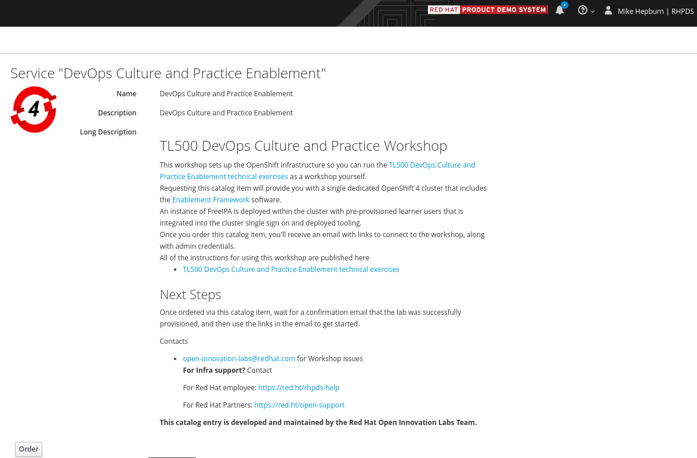

## TL500 クラスタのセットアップ

<p class="warn">⛷️<b>注</b>⛷️ - cluster-admin 権限を持つ OpenShift 4.9+ クラスターが必要です。</p>

コース全体で練習するのと同じように、クラスター構成をコードとして GitHub リポジトリーに保持します: https://github.com/rht-labs/enablement-framework

このリポジトリには 2 つの部分があります。

- 演習を実行用にクラスター全体のツールをデプロイするための Helm チャート
- Red Hat CodeReady ワークスペースのセットアップ

## ツールの Helm チャート

以下は、TL500 セットアップ用に OpenShift にデプロイするツールとオブジェクトのリストです。

- Red Hat CodeReady Workspaces - 開発者環境
- GitLab - Git サーバーとして
- SealedSecrets - シークレットを公開して安全に保存するため。
- StackRox - イメージ セキュリティの演習用
- ユーザー ワークロードの監視 - アプリケーション メトリックの収集を有効にします。 `Return of the Monitoring`に必要です。
- Loggingスタック - OpenShift ではデフォルトで有効になっていません。 `Return of the Monitoring`に対して有効にします。
- 上記のコンポーネントをインストールする共有namespace
- `student`グループの RBAC 定義

それらはすべて、リポジトリで Helm チャートとして定義されています。一部の名前を変更したり、一部のコンポーネントのインストールをスキップしたりする場合は、 `values.yaml`ファイルをローカルで更新できます。

ただし、ツールをインストールする前に、ユーザー管理について説明する必要があります。

## ユーザー管理

受講者には cluster-admin 権限がありません。演習を正常に実行するために適用された RBAC 定義を持つ、 `student`という名前の OpenShift ユーザー グループがあります。

独自のユーザー管理システムを使用して、 `student`というグループを作成し、学生を追加することができます。これにはIPAを使用しています！ IPA のヘルム チャートは[こちらに](https://github.com/redhat-cop/helm-charts/tree/master/charts/ipa)あります。

同じセットアップを使用する場合は、次の手順を実行します。 IPA が正しく機能するためには、事前にクラスター ドメインを渡す必要があります。

```bash
helm repo add redhat-cop https://redhat-cop.github.io/helm-charts
helm upgrade --install ipa . --namespace=ipa --create-namespace --set app_domain=<CLUSTER_DOMAIN> --set ocp_auth.enabled=true
```

FreeIPA は、初めて構成して起動するのに時間がかかるので、しばらくお待ちください。

インストール後、このトリックを使用してユーザーとグループを作成できます。

```bash
#!/bin/bash

IPA_NAMESPACE="${1:-ipa}"

# 1. On your host - get the admin passwd and connect to IPA
oc project ${IPA_NAMESPACE}
export IPA_ADMIN_PASSWD=$(oc get secret ipa-password --template='{{ range .data }}{{.}}{{end}}' -n ipa | base64 -D)
echo ${IPA_ADMIN_PASSWD}
oc rsh `oc get po -l deploymentconfig=ipa -o name -n ${IPA_NAMESPACE}`

# 2. on the container running IPA Server, create `student` group and add users to it.
echo ${IPA_ADMIN_PASSWD} | kinit admin
export GROUP_NAME=student
ipa group-add ${GROUP_NAME} --desc "TL500 Student Group" || true
# in a loop add random users to the group
for i in {1..24};do
  export LAB_NUMBER="lab$i"
  echo 'thisisthepassword' | ipa user-add ${LAB_NUMBER} --first=${LAB_NUMBER} --last=${LAB_NUMBER} --email=${LAB_NUMBER}@redhatlabs.dev --password
  ipa group-add-member ${GROUP_NAME} --users=$LAB_NUMBER
  printf "\n\n User ${LAB_NUMBER} is created"
done
```

## Enablementフレームワークのインストール

それでは、ツールをインストールしてみましょう!!

最初のステップは、基本オペレーターのインストールです。

```bash
git clone https://github.com/rht-labs/enablement-framework.git
cd enablement-framework/tooling/charts/tl500-base
helm dep up
helm upgrade --install tl500-base . --namespace tl500 --create-namespace
```

上記が成功したら (最大 15 分かかる場合があります)、次のコマンドを実行してインストールを完了できます。

```bash
cd ../tl500-course-content
helm dep up
helm upgrade --install tl500-course-content . --namespace tl500 --create-namespace
```

(繰り返しますが、これにも時間がかかる場合があります🙈)

## インストールの確認

UI を介してクラスターにログインし、受講者のユーザー名とパスワードで`LDAP`ログインを使用します。 `tl500-*`namespaceのみが表示されます。

また、 `tl500-teamster`というツールを使用して演習を自動的に実行し、インストールを確認することもできます。これは、ツールのインストール内に既にバンドルされています。次のコマンドから URL を取得します。

```bash
echo https://$(oc get route/tl500-base-tl500-teamsters -n tl500 --template='{{.spec.host}}')
```

[..README](https://github.com/rht-labs/tl500-teamsters)に従って使用方法を確認してください。

## 必要なリンクを取得する

演習は CodeReadyWorkspace リンクから始まります。したがって、これを取得するためのワンライナーは次のとおりです。

```bash
echo https://$(oc get route/codeready -n tl500-workspaces --template='{{.spec.host}}')
```

## CodeReady Workspacesのセットアップ

演習では、 `oc` 、 `mvn` 、 `kube-linter`などのさまざまなコマンドラインを使用します。これらの必要なすべての CLI を含むコンテナー イメージがあり、構成 (Dockerfile) は`codereadyworkspaces/stack/`フォルダーの下にあります。

このイメージを公開してビルドおよび保存するために、GitHub Actions を利用します。

ワークスペースの<em>as コード</em>定義である<code>tl500-devfile.yaml</code>があります。 [devfile](https://github.com/rht-labs/enablement-framework/blob/main/codereadyworkspaces/tl500-devfile.yaml#L29)内のコンテナー イメージを参照します。

```yaml
...
  - type: dockerimage
    alias: stack-tl500
    image: quay.io/rht-labs/stack-tl500:3.0.10
...
```

独自の CodeReady Workspaces 環境を取得する方法については[、最初の章](1-the-manual-menace/1-the-basics)で説明しています。

## Red Hat Product Demo System

これは現在、Red Hat 社員のみが利用できます。 [RHPDS](https://rhpds.redhat.com)で独自の TL500 環境を注文できます。これにより、最新の OpenShift &amp; TL500 ワークショップ環境がプロビジョニングされます。クラスターのサイズ、数、またはユーザーとリージョンを選択できます。


