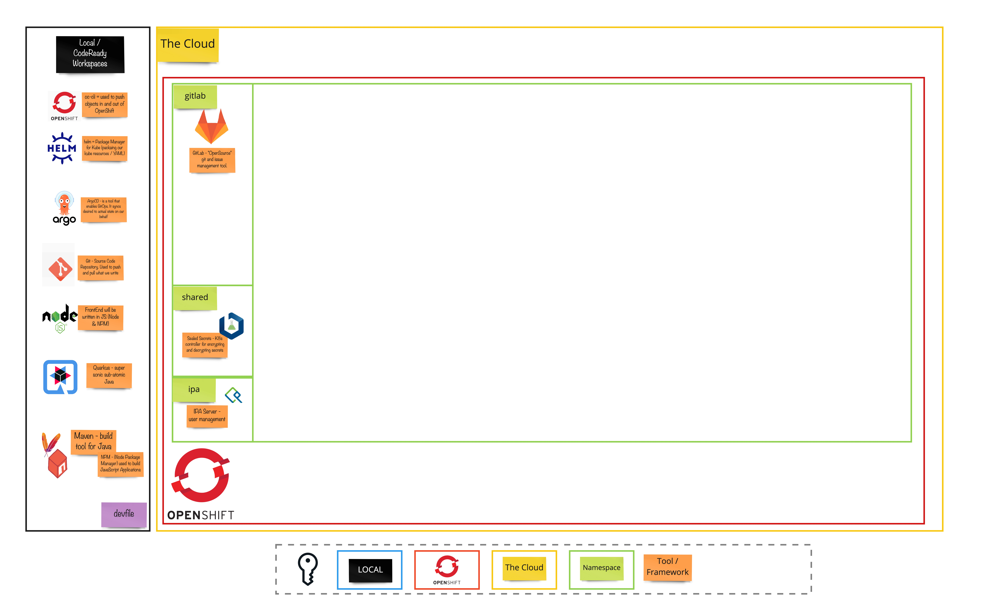

# 演習 X - クラスターの夜明け

## 👨‍🍳演習の説明

この演習では、他のすべての演習のためにクラスタを準備するために実行する手順について説明します。

## ビッグピクチャー

## 🔮 学習成果

- [ ] 演習の実行に必要なコンポーネントをインストールできる

## 🔨 この演習で使用するツール!

- Openshift 4.9+
- <a href="https://helm.sh/">Helm</a> - Kubernetes アプリケーションの定義、インストール、およびアップグレードを支援します。
