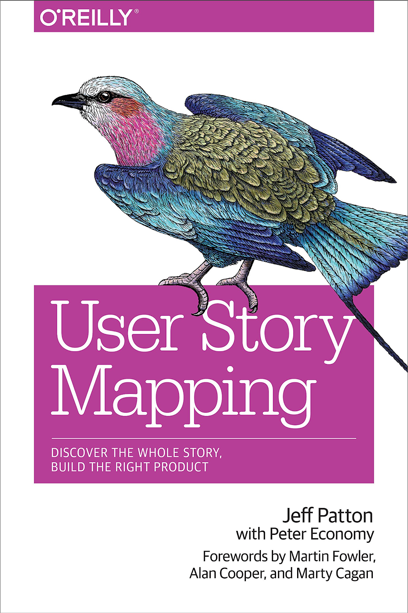
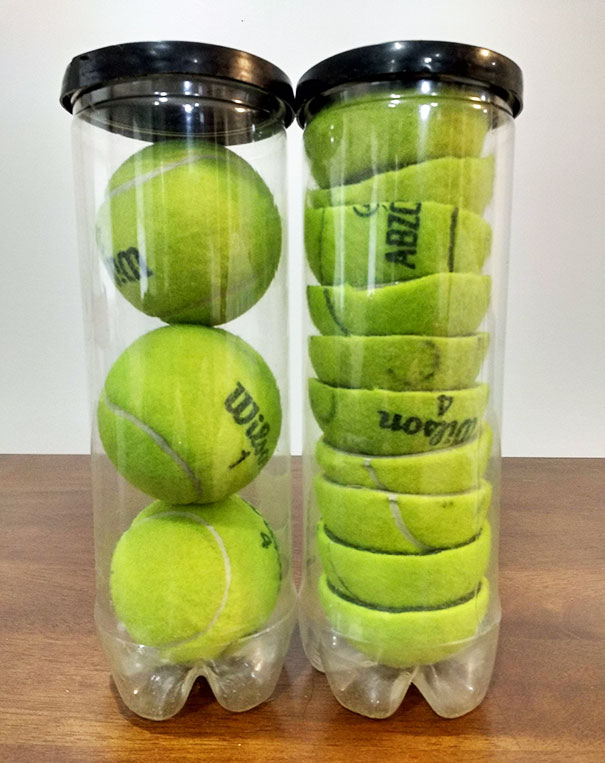
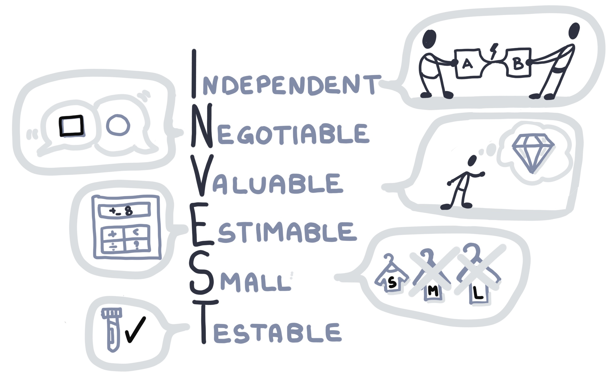
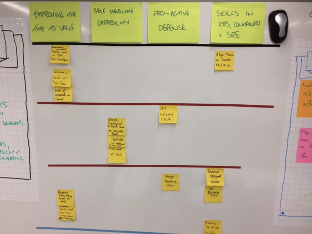
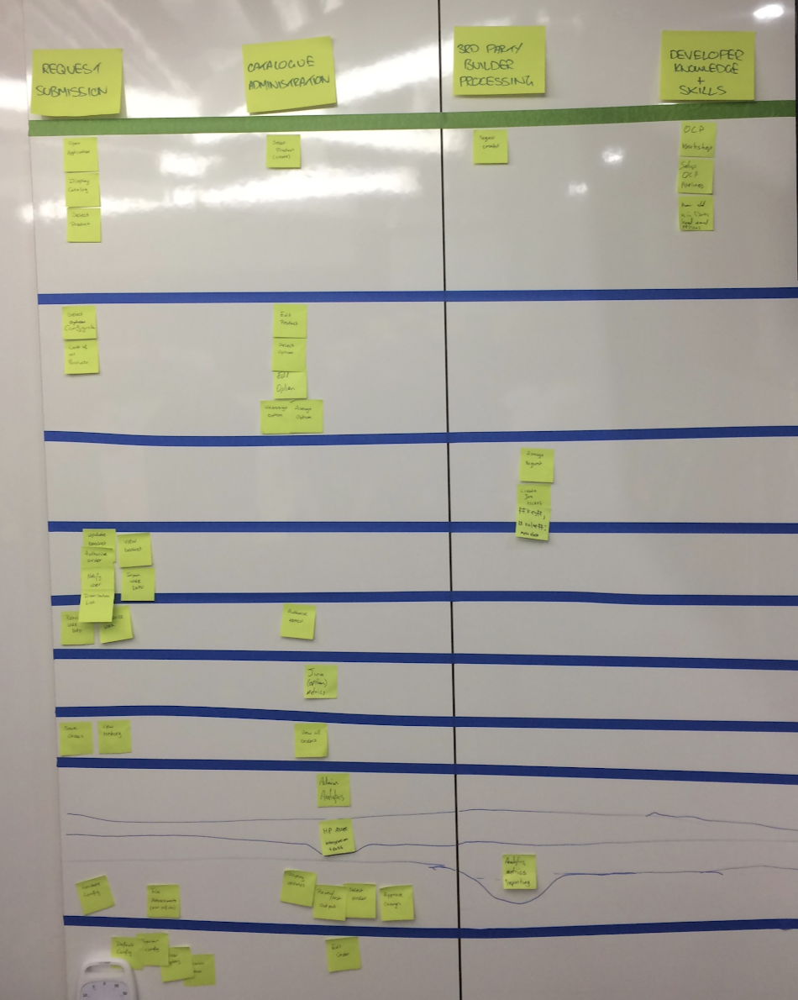
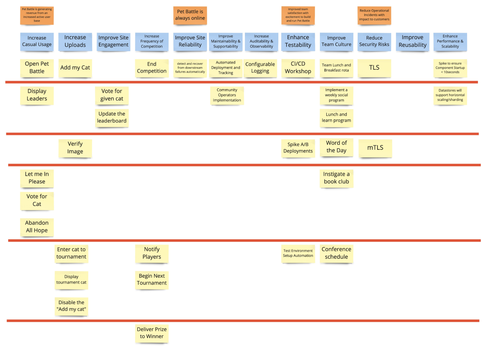
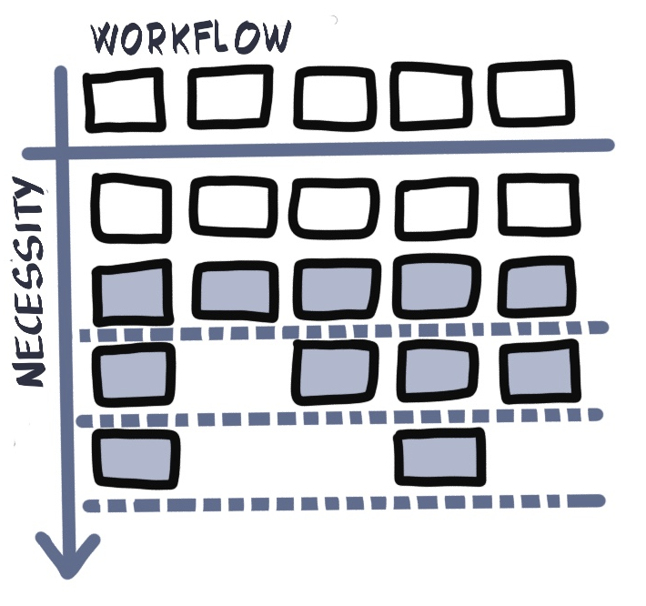

<!-- .slide: data-background-image="images/RH_NewBrand_Background.png" -->
## DevOps Culture and Practice <!-- {.element: class="course-title"} -->
### User Story Mapping and Value Slicing <!-- {.element: class="title-color"} -->
TL500 <!-- {.element: class="title-color"} -->

<!-- .slide: data-background-size="stretch" data-background-image="images/opl-logo.png", class="white-style" -->

  <h2>Open Practice Library</h2>
  

  <h2>User Story Mapping & Value Slicing</h2>
  

##### Example - WHO<!-- .element: class="title-bottom-left" -->
<!-- .slide: data-background-size="contain" data-background-image="images/user-story-mapping-and-value-slicing/example-who.png", class="white-style" -->

### User Stories
As a < type of user >, I want < some goal > so that < some reason >
#### As a learner, I want to stay awake so that I can be attentive and listen to the teacher.

User Story Mapping is an effective practice for creating lightweight release plans that can drive standard Agile delivery practices. At the end of User Story Mapping, you should have:
<!-- .element: class="image-no-shadow image-full-width" -->

#### Shared Documentation &#8800; Shared Understanding

<!-- {.element: class="" style="border:none; box-shadow:none; max-width:100%; float:left;" } -->

User Story Mapping

* Frame the opportunity, goal, outcome, and value.
* Tell the story of the product from left to right (user steps).
* Go back to talk about and capture the details of each step.
* Use value-driven outcomes to slice out valuable release plans.

#### User Story Mapping

<!-- {.element: class="" style="border:none; box-shadow:none; max-width:80%; float:left;" } -->

 
 
"User Story Mapping is about having a good old-fashioned conversation and then organizing it in the form of a map."

~ Jeff Patton

 
"User Story Mapping is a visualization tool that drives groups towards a shared understanding."

~ Tim Beattie

#### Value Slicing
_The goal of value slicing is to divide user stories into slices that form the outline of a plan. Usually the first slice builds a minimally viable product._

#### Product Slicing Gone Bad!

#### _Why use it?_
* No one likes estimating work effort, but it's an important step in many environments. User Story Mapping presents an approach to estimation that many teams find much more tolerable than practices like planning poker or t-shirt sizing.
* Many projects have a natural progression of work from beginning, middle to end. This progression is often lost in a traditional flat backlog. User Story Mapping captures this information with a lightweight mechanism to plan out more than one iteration (i.e., an Agile release plan).
* User Story Mapping presents backlog items in the context of the overall business process so that you don't lose sight of "the big picture", a common pitfall in Scrum projects.

#### _How do we use it?_
<!-- {.element: class="" style="border:none; box-shadow:none; max-width:30%; float:right;" } -->
1) Follow the **INVEST** guidelines for good user stories.
2) Individually capture everything you do in the process that you are mapping,  and add all activities to the story map by using sticky notes. Visualize everything.
3) Identify and remove duplicates.
4) Cluster similar activities and capture a theme title.
5) Slice out high value to form an incremental release strategy. Filter and maintain focus on delivering valuable outcomes.

####  Visualization of User Story Mapping
<video width="320" height="240" controls>
  <source src="images/user-story-mapping-and-value-slicing/value_slicing.mp4" type="video/mp4">
</video>

  
 
    
  

  
 
    
  

  
 
    
  

  
 
    
  

  
 
    
  

### Class Exercise

_What are all the activities that you do in the morning to prepare for work and get there on time?_

1. As an individual, capture all the things you do from the moment you wake up until you arrive at work on individual sticky notes. <!-- {.element: class="fragment"  data-fragment-index="1"} -->
2. As a team, add all activities to the story map and remove duplicates. If some are similar but slightly different, do not remove them.<!-- {.element: class="fragment"  data-fragment-index="2"} -->
3. Cluster similar activities and capture themes above them, such as "Cleaning Routine."<!-- {.element: class="fragment"  data-fragment-index="3"} -->

### Class Exercise 🛏 ⏰

_Oh no! You slept through your alarm and woke up late! Now, you must get to a big meeting at work that you cannot miss. What  activities **must** you do to prepare for work and get there on time? You cannot join remotely!_

1. As a team, draw a line on the user story mapping board representing what
must be done.<!-- {.element: class="fragment"  data-fragment-index="1"} -->
2. Discuss which stories are absolutely necessary given the scenario. 🛏 ⏰ <!-- {.element: class="fragment"  data-fragment-index="2"} -->
3. Move stories below the line that the team agrees are not absolutely necessary.<!-- {.element: class="fragment"  data-fragment-index="3"} -->

### Real World Examples

#### In Scope / Out of Scope
<!-- {.element: class="image-no-shadow image-full-width" } -->

#### 3 Slices &#8800; 3 Sprints
<!-- {.element: class="image-no-shadow image-full-width" } -->

#### Slicing == Continuous Delivery
<!-- {.element: class="image-no-shadow image-full-width" } -->

#### Value Slice - Pet Battle 

### Facilitation Tips
<!-- {.element: class="inline-image" } -->
 
* A single slice doesn't mean in scope and out of scope.
* Same slice size doesn't mean each slice is the goal of a sprint.
* If possible, add target outcomes as groupings for the Value Slice to add the benefit of linking to business goals.

<!-- .slide: data-background-image="images/book-background.jpeg", class="black-style"  data-background-opacity="0.3" -->
### Related & Used Practices
User Story Mapping and Value Slice are connected to multiple practices including:
* [Target Outcomes](https://openpracticelibrary.com/practice/target-outcomes/)
* [Impact Mapping deliverables](https://openpracticelibrary.com/practice/impact-mapping/)
* [Empathy Mapping ideas and feedback](https://openpracticelibrary.com/practice/empathy-mapping/)
* [Non Functional Requirements](https://openpracticelibrary.com/practice/non-functional-requirements-map)
* [Big Picture workflow](https://openpracticelibrary.com/practice/the-big-picture/)
* [Event Storming commands](https://openpracticelibrary.com/practice/event-storming/)
* [Metrics Based Process Mapping continuous delivery bottlenecks](https://openpracticelibrary.com/practice/metrics-based-process-mapping/)

User Story Mapping feeds into Value Slice that generate the Product Backlog.
